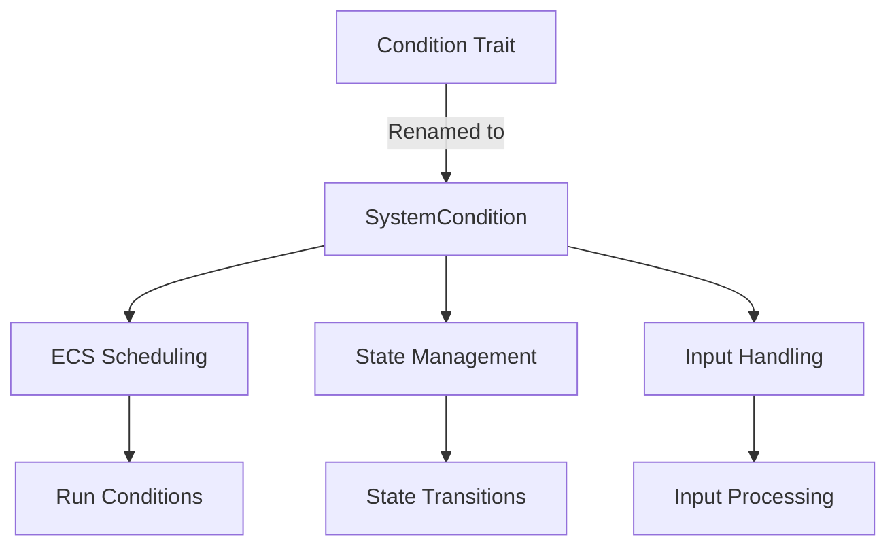

+++
title = "#19328 Rename `Condition` to `SystemCondition`"
date = "2025-05-22T00:00:00"
draft = false
template = "pull_request_page.html"
in_search_index = true

[taxonomies]
list_display = ["show"]

[extra]
current_language = "en"
available_languages = {"en" = { name = "English", url = "/pull_request/bevy/2025-05/pr-19328-en-20250522" }, "zh-cn" = { name = "中文", url = "/pull_request/bevy/2025-05/pr-19328-zh-cn-20250522" }}
labels = ["A-ECS", "C-Usability"]
+++

# Rename `Condition` to `SystemCondition`

## Basic Information
- **Title**: Rename `Condition` to `SystemCondition`
- **PR Link**: https://github.com/bevyengine/bevy/pull/19328
- **Author**: stevehello166
- **Status**: MERGED
- **Labels**: A-ECS, C-Usability, S-Ready-For-Final-Review, M-Needs-Migration-Guide
- **Created**: 2025-05-21T18:43:49Z
- **Merged**: 2025-05-22T16:08:47Z
- **Merged By**: alice-i-cecile

## Description Translation
The original PR description is already in English and is preserved verbatim:

# Objective
Fixes #19120 

## Solution
Use the find and replace token feature in VSCode to replace all the `Condition`s with `SystemCondition`s. Then look through all the documentation with find and replace to replace all the `Condition`s there.

## Testing
- Did you test these changes? If so, how?  
Yes, used cargo clippy, cargo build and cargo test.
- Are there any parts that need more testing?  
Nope
- How can other people (reviewers) test your changes? Is there anything specific they need to know?  
By compiling and running bevy
- If relevant, what platforms did you test these changes on, and are there any important ones you can't test?  
Shouldn't be, but Fedora Linux with KDE Wayland

## The Story of This Pull Request

The core issue addressed in this PR (#19120) stemmed from naming collisions with the generic term "Condition" in Bevy's ECS framework. The original `Condition` trait name caused ambiguity in larger codebases and third-party integrations due to its common English usage. 

The solution implemented a systematic rename of all `Condition` references to `SystemCondition`, preserving functionality while improving semantic clarity. This involved:

1. **Automated Code Replacement**: Using VSCode's find/replace across the codebase to update:
   - Trait definitions
   - Method signatures
   - Documentation comments
   - Type parameters

2. **Documentation Updates**: Ensuring all examples and conceptual explanations consistently used the new terminology

3. **Migration Guide Creation**: Adding clear upgrade instructions to help users adapt their existing code

Key implementation details can be seen in the trait definition changes:

```rust
// Before:
pub trait Condition<Marker, In: SystemInput = ()>: sealed::Condition<Marker, In> {}

// After: 
pub trait SystemCondition<Marker, In: SystemInput = ()>: 
    sealed::SystemCondition<Marker, In> {}
```

The rename required coordinated updates across multiple subsystems:
- ECS scheduling logic
- State management
- Input handling
- Documentation examples

Notable engineering considerations included:
- Maintaining backward compatibility through clear migration instructions
- Preserving trait semantics while renaming
- Ensuring all derived documentation remained accurate
- Verifying no functionality regressions through comprehensive testing

The change improves codebase clarity by:
- Making the trait's purpose explicit ("System" condition)
- Reducing naming collisions in user code
- Aligning with Rust naming conventions for trait specificity
- Clarifying documentation for ECS run conditions

## Visual Representation



## Key Files Changed

1. `crates/bevy_ecs/src/schedule/condition.rs` (+46/-38)
   - Core trait rename and documentation updates
   - Before:
     ```rust
     pub trait Condition<Marker, In: SystemInput = ()>: sealed::Condition<Marker, In> {}
     ```
   - After:
     ```rust
     pub trait SystemCondition<Marker, In: SystemInput = ()>:
         sealed::SystemCondition<Marker, In>
     {}
     ```

2. `crates/bevy_ecs/src/schedule/config.rs` (+15/-12)
   - Updated method signatures and error messages
   - Before:
     ```rust
     fn distributive_run_if_inner<M>(&mut self, condition: impl Condition<M> + Clone)
     ```
   - After:
     ```rust
     fn distributive_run_if_inner<M>(&mut self, condition: impl SystemCondition<M> + Clone)
     ```

3. `crates/bevy_state/src/condition.rs` (+4/-4)
   - Updated documentation references
   - Before:
     ```rust
     /// A [`Condition`](bevy_ecs::prelude::Condition)-satisfying system
     ```
   - After:
     ```rust
     /// A [`SystemCondition`](bevy_ecs::prelude::SystemCondition)-satisfying system
     ```

4. `release-content/migration-guides/rename_condition.md` (+8/-0)
   - Added migration instructions:
     ```markdown
     ---
     title: Renamed `Condition` to `SystemCondition`
     pull_requests: [19328]
     ---
     `Condition` is now `SystemCondition`. Replace all references and imports.
     ```

5. `crates/bevy_ecs/src/lib.rs` (+2/-2)
   - Updated prelude exports
   - Before:
     ```rust
     pub mod prelude {
         pub use crate::schedule::Condition;
     ```
   - After:
     ```rust
     pub mod prelude {
         pub use crate::schedule::SystemCondition;
     ```

## Further Reading
- [Rust API Guidelines on Naming](https://rust-lang.github.io/api-guidelines/naming.html)
- [Bevy ECS System Conditions Documentation](https://bevyengine.org/learn/book/next/ecs/schedules/#conditions)
- [Trait Design Patterns](https://rust-unofficial.github.io/patterns/patterns/behavioural/newtype.html)