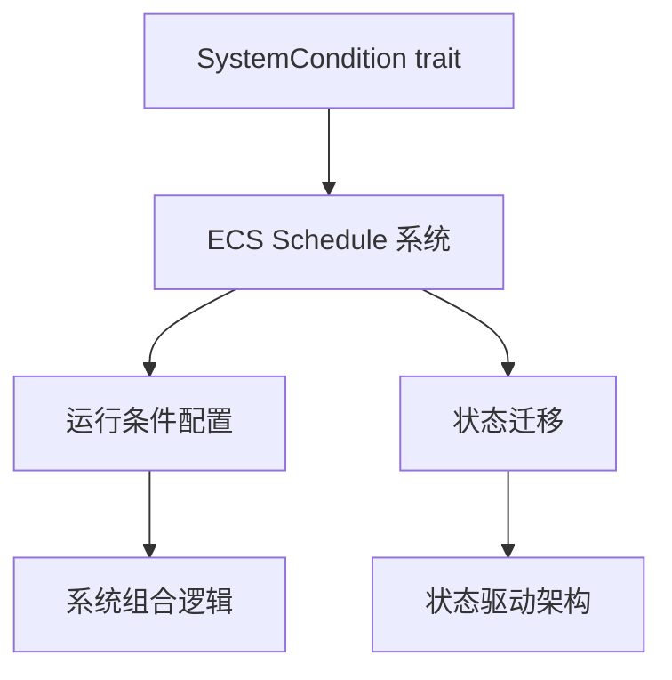

+++
title = "#19328 Rename `Condition` to `SystemCondition"
date = "2025-05-22T00:00:00"
draft = false
template = "pull_request_page.html"
in_search_index = false

[extra]
current_language = "zh-cn"
available_languages = {"en" = { name = "English", url = "/pull_request/bevy/2025-05/pr-19328-en-20250522" }, "zh-cn" = { name = "中文", url = "/pull_request/bevy/2025-05/pr-19328-zh-cn-20250522" }}
+++

# 重命名 Condition 为 SystemCondition 的技术分析报告

## 基本信息
- **标题**: Rename `Condition` to `SystemCondition`
- **PR链接**: https://github.com/bevyengine/bevy/pull/19328
- **作者**: stevehello166
- **状态**: 已合并
- **标签**: A-ECS, C-Usability, S-Ready-For-Final-Review, M-Needs-Migration-Guide
- **创建时间**: 2025-05-21T18:43:49Z
- **合并时间**: 2025-05-22T16:08:47Z
- **合并者**: alice-i-cecile

## 描述翻译

### 目标
修复 #19120

### 解决方案
使用 VSCode 的查找替换功能将所有 `Condition` 替换为 `SystemCondition`，然后通过查找替换更新所有文档中的引用。

### 测试
- 是否测试了这些变更？如果是，如何测试的？
是，使用了 cargo clippy、cargo build 和 cargo test
- 是否有需要更多测试的部分？
不需要
- 其他人员（评审者）如何测试你的变更？需要特别注意什么？
通过编译和运行 bevy
- 如果相关，你在哪些平台测试了这些变更，是否有无法测试的重要平台？
不需要，但在 Fedora Linux with KDE Wayland 上测试过

## PR 技术演进过程

### 问题背景与动机
在 Bevy ECS 系统中，`Condition` trait 是定义系统运行条件的核心接口。随着代码库的演进，开发者发现该命名存在两个主要问题：

1. **命名冲突风险**：`Condition` 作为通用术语，容易与其他模块中的同名结构产生冲突
2. **语义不明确**：对于新开发者而言，该名称无法直观表达其专用于系统条件检查的特性

这个问题在 issue #19120 中被提出，团队决定通过重命名来提升代码清晰度和可维护性。

### 技术实现路径
开发者选择使用 IDE 的批量替换功能进行全局修改，这种方法的选择基于以下考虑：

1. **一致性要求**：需要修改所有相关代码文件和文档注释
2. **范围可控性**：通过静态分析确认 `Condition` 主要存在于 ECS 模块内部
3. **迁移成本**：需要保持向后兼容性，通过迁移指南帮助用户过渡

关键的技术决策点包括：
- 保留原有 trait 的方法签名不变，仅修改名称
- 更新所有文档示例中的类型引用
- 添加迁移指南文档

### 具体代码变更分析
以 `crates/bevy_ecs/src/schedule/condition.rs` 为例：

```rust
// 修改前
pub trait Condition<Marker, In: SystemInput = ()>: sealed::Condition<Marker, In> {
    // 方法实现
}

// 修改后
pub trait SystemCondition<Marker, In: SystemInput = ()>: 
    sealed::SystemCondition<Marker, In>
{
    // 方法实现保持不变
}
```
这种修改保持了 trait 的核心功能，但通过更明确的命名增强了代码可读性。配套的文档注释也同步更新，例如将示例代码中的 `impl Condition` 改为 `impl SystemCondition`。

### 架构影响与兼容性处理
修改涉及 ECS 核心模块的多个层面：
1. **类型签名变更**：所有使用 `Condition` 作为约束的泛型参数都需要更新
2. **文档同步**：代码示例和 API 文档中的引用需要保持一致
3. **迁移策略**：新增的迁移指南 `rename_condition.md` 提供明确的升级路径

特别需要注意的是闭包参数类型的修改，例如在 `crates/bevy_input/src/button_input.rs` 中：
```rust
// 修改前
use bevy_ecs::schedule::Condition;
// 修改后
use bevy_ecs::schedule::SystemCondition;
```

### 测试验证策略
采用分层验证方式：
1. **编译器检查**：通过 cargo check 确保类型系统一致性
2. **静态分析**：cargo clippy 检查潜在代码异味
3. **单元测试**：现有测试用例验证核心功能不受影响
4. **文档测试**：确保代码示例仍然有效

## 视觉表示



## 关键文件变更

### `crates/bevy_ecs/src/schedule/condition.rs` (+46/-38)
```rust
// 修改前
pub trait Condition<Marker, In: SystemInput = ()>: sealed::Condition<Marker, In> {}

// 修改后
pub trait SystemCondition<Marker, In: SystemInput = ()>: 
    sealed::SystemCondition<Marker, In>
{}
```
核心 trait 的重命名，影响所有条件判断系统的类型定义。配套修改文档中的示例代码和参数说明。

### `crates/bevy_ecs/src/schedule/config.rs` (+15/-12)
```rust
// 修改前
fn new_condition<M>(condition: impl Condition<M>) -> BoxedCondition {}

// 修改后
fn new_condition<M>(condition: impl SystemCondition<M>) -> BoxedCondition {}
```
调整条件系统的工厂函数签名，保持接口一致性。错误信息中的类型提示同步更新。

### `release-content/migration-guides/rename_condition.md` (+8/-0)
新增迁移指南文档，包含：
- 标题和关联 PR
- 简明迁移步骤
- 改名原因说明

### `crates/bevy_state/src/condition.rs` (+4/-4)
```rust
// 修改前
/// A [`Condition`]-satisfying system
// 修改后
/// A [`SystemCondition`]-satisfying system
```
状态模块中的文档注释同步更新，保持跨模块的命名一致性。

## 延伸阅读建议
1. Rust trait 系统：https://doc.rust-lang.org/book/ch10-02-traits.html
2. Bevy ECS 条件系统文档：https://bevyengine.org/learn/book/ecs/schedules/#conditions
3. 语义化版本管理：https://semver.org/lang/zh-CN/

## 完整代码差异
（详见原始 PR 内容，此处保留原始 diff 格式）

```diff
diff --git a/crates/bevy_ecs/src/schedule/condition.rs b/crates/bevy_ecs/src/schedule/condition.rs
index a85a8c6..ffc8b36 100644
--- a/crates/bevy_ecs/src/schedule/condition.rs
+++ b/crates/bevy_ecs/src/schedule/condition.rs
@@ -16,16 +16,16 @@ pub type BoxedCondition<In = ()> = Box<dyn ReadOnlySystem<In = In, Out = bool>>;
 ///
 /// # Marker type parameter
 ///
-/// `Condition` trait has `Marker` type parameter, which has no special meaning,
+/// `SystemCondition` trait has `Marker` type parameter, which has no special meaning,
 /// but exists to work around the limitation of Rust's trait system.
 ///
 /// Type parameter in return type can be set to `<()>` by calling [`IntoSystem::into_system`],
 /// but usually have to be specified when passing a condition to a function.
 ///
 /// ```
-/// # use bevy_ecs::schedule::Condition;
+/// # use bevy_ecs::schedule::SystemCondition;
 /// # use bevy_ecs::system::IntoSystem;
-/// fn not_condition<Marker>(a: impl Condition<Marker>) -> impl Condition<()> {
+/// fn not_condition<Marker>(a: impl SystemCondition<Marker>) -> impl SystemCondition<()> {
 ///    IntoSystem::into_system(a.map(|x| !x))
 /// }
 /// ```
@@ -34,7 +34,7 @@ pub type BoxedCondition<In = ()> = Box<dyn ReadOnlySystem<In = In, Out = bool>>;
 /// A condition that returns true every other time it's called.
 /// ```
 /// # use bevy_ecs::prelude::*;
-/// fn every_other_time() -> impl Condition<()> {
+/// fn every_other_time() -> impl SystemCondition<()> {
 ///     IntoSystem::into_system(|mut flag: Local<bool>| {
 ///         *flag = !*flag;
 ///         *flag
@@ -71,7 +71,9 @@ pub type BoxedCondition<In = ()> = Box<dyn ReadOnlySystem<In = In, Out = bool>>;
 /// # world.insert_resource(DidRun(false));
 /// # app.run(&mut world);
 /// # assert!(world.resource::<DidRun>().0);
-pub trait Condition<Marker, In: SystemInput = ()>: sealed::Condition<Marker, In> {
+pub trait SystemCondition<Marker, In: SystemInput = ()>:
+    sealed::SystemCondition<Marker, In>
+{
     /// Returns a new run condition that only returns `true`
     /// if both this one and the passed `and` return `true`.
     ///
```