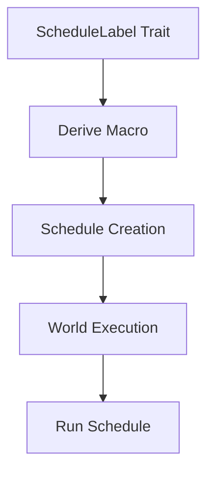

+++
title = "#19329 Add documentation and examples of [`ScheduleLabel`] usage."
date = "2025-05-22T00:00:00"
draft = false
template = "pull_request_page.html"
in_search_index = true

[taxonomies]
list_display = ["show"]

[extra]
current_language = "en"
available_languages = {"en" = { name = "English", url = "/pull_request/bevy/2025-05/pr-19329-en-20250522" }, "zh-cn" = { name = "中文", url = "/pull_request/bevy/2025-05/pr-19329-zh-cn-20250522" }}
labels = ["C-Docs", "A-ECS"]
+++

# Title: Add documentation and examples of [`ScheduleLabel`] usage.

## Basic Information
- **Title**: Add documentation and examples of [`ScheduleLabel`] usage.
- **PR Link**: https://github.com/bevyengine/bevy/pull/19329
- **Author**: kpreid
- **Status**: MERGED
- **Labels**: C-Docs, A-ECS, S-Ready-For-Final-Review
- **Created**: 2025-05-21T21:24:57Z
- **Merged**: 2025-05-22T16:13:59Z
- **Merged By**: alice-i-cecile

## Description Translation
The original description is already in English and preserved as-is.

## The Story of This Pull Request

The PR addresses documentation gaps in Bevy's ECS scheduling system, specifically around using [`ScheduleLabel`] without the `App` abstraction. Before these changes, users working directly with [`World`] and [`Schedules`] lacked clear guidance on managing schedules through labels.

The core problem stemmed from documentation that assumed `App` usage, leaving direct `World` users without examples of:
1. Schedule label derivation
2. Schedule creation/management through labels
3. Relationship between labels and schedule execution

The solution focuses on three key documentation improvements:

1. **Schedule Label Explanation**  
Added to `Schedule`'s docs:
```rust
/// # Schedule labels
/// Each schedule has a [`ScheduleLabel`] value used to uniquely identify it
/// when added to a [`World`]’s [`Schedules`].
```
This establishes label importance before code examples.

2. **Derive Macro Demonstration**  
Enhanced `ScheduleLabel` trait docs with concrete example:
```rust
#[derive(ScheduleLabel, Clone, Debug, PartialEq, Eq, Hash, Default)]
struct Update;
```
Shows proper trait implementation with common derives.

3. **World Integration Examples**  
Added third example in `Schedule` docs demonstrating:
```rust
world.get_resource_or_init::<Schedules>().add_systems(Update, system);
world.run_schedule(Update);
```
Illustrates label-based schedule management without direct `Schedule` handles.

The implementation connects related APIs through cross-references:
- Linked `World::add_schedule()` to `Schedules::add_systems()`
- Clarified `run_schedule()` vs direct `Schedule::run()` usage
- Added panic conditions documentation

Key engineering decisions:
1. **Example Progression**  
Structured examples from basic to advanced:
- Hello World → Multiple systems → Label-based workflow

2. **Type Safety Emphasis**  
Promoted `derive(ScheduleLabel)` pattern for type-safe schedule identification

3. **Resource Lifecycle Clarification**  
Documented automatic `Schedules` resource creation in `add_schedule()`

## Visual Representation



## Key Files Changed

1. `crates/bevy_ecs/src/schedule/schedule.rs` (+37/-1)
- Added schedule label documentation section
- Inserted third example showing label-based workflow
```rust
// New example demonstrating label usage
#[derive(ScheduleLabel, Clone, Debug, PartialEq, Eq, Hash, Default)]
struct Update;
world.get_resource_or_init::<Schedules>().add_systems(Update, system);
world.run_schedule(Update);
```

2. `crates/bevy_ecs/src/schedule/set.rs` (+33/-1)
- Expanded `ScheduleLabel` trait docs with derivation example
```rust
// Added derive example
#[derive(ScheduleLabel, Clone, Debug, PartialEq, Eq, Hash, Default)]
struct Update;
```

3. `crates/bevy_ecs/src/world/mod.rs` (+9/-1)
- Enhanced method documentation cross-linking
```rust
// Added note about automatic schedule creation
/// An alternative is to call [`Schedules::add_systems()`] with a [`ScheduleLabel`]
```

## Further Reading
- [Bevy ECS Schedule Documentation](https://bevyengine.org/learn/book/next/ecs/schedules/)
- [Rust Derive Macro Guide](https://doc.rust-lang.org/reference/procedural-macros.html#derive-macros)
- [Type-Safe ID Pattern](https://www.lurklurk.org/effective-rust/type-safety.html)