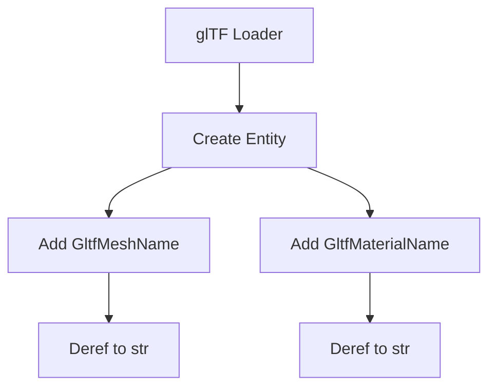

+++
title = "#19331 Add GltfMeshName Component and Deref Implementations"
date = "2025-05-23T00:00:00"
draft = false
template = "pull_request_page.html"
in_search_index = true

[taxonomies]
list_display = ["show"]

[extra]
current_language = "en"
available_languages = {"en" = { name = "English", url = "/pull_request/bevy/2025-05/pr-19331-en-20250523" }, "zh-cn" = { name = "中文", url = "/pull_request/bevy/2025-05/pr-19331-zh-cn-20250523" }}
labels = ["C-Bug", "D-Straightforward", "A-glTF"]
+++

# Title: Add GltfMeshName Component and Deref Implementations

## Basic Information
- **Title**: Add GltfMeshName component and Deref implementations
- **PR Link**: https://github.com/bevyengine/bevy/pull/19331
- **Author**: rendaoer
- **Status**: MERGED
- **Labels**: C-Bug, S-Ready-For-Final-Review, M-Needs-Migration-Guide, D-Straightforward, A-glTF
- **Created**: 2025-05-22T01:47:22Z
- **Merged**: 2025-05-23T21:14:24Z
- **Merged By**: alice-i-cecile

## Description Translation
Stores mesh names from glTF files in GltfMeshName component rather than Name component, making both GltfMeshName and GltfMaterialName behave like strings via Deref.

# Objective

Fixed the side effects of #19287
Fixes Examples that modify gltf materials are broken #19322

## Solution

Add GltfMeshName component and Deref implementations

Stores mesh names from glTF files in GltfMeshName component rather than
Name component, making both GltfMeshName and GltfMaterialName behave
like strings via Deref.

## Testing

cargo run --example depth_of_field
cargo run --example lightmaps
cargo run --example mixed_lighting
They are consistent with the situation before the error occurred.

## The Story of This Pull Request

The PR addresses a regression introduced by #19287, where glTF mesh and material name handling caused broken examples. The core issue stemmed from using Bevy's generic `Name` component for both mesh and material names from glTF assets, leading to conflicts in systems querying specific name components.

**Problem Analysis**:
- Previous implementation stored both mesh and material names in `Name` components
- Example code querying for `Name` components broke when material names overwrote mesh names
- Needed clear separation between mesh and material identifiers while maintaining string-like access

**Solution Implementation**:
1. Introduced dedicated `GltfMeshName` component mirroring existing `GltfMaterialName` structure
2. Implemented `Deref<Target = str>` for both components to preserve string-like access patterns
3. Updated glTF loader to store mesh names in `GltfMeshName` instead of `Name`
4. Modified affected examples to query specific glTF name components

Key code changes in `assets.rs`:
```rust
#[derive(Clone, Debug, Reflect, Default, Component)]
pub struct GltfMeshName(pub String);

impl Deref for GltfMeshName {
    type Target = str;

    fn deref(&self) -> &Self::Target {
        self.0.as_ref()
    }
}

// Similar implementation added for GltfMaterialName
```

The `Deref` implementations allow existing code to treat these components as strings without modification to access patterns, while the component separation prevents naming collisions.

**Loader Modification**:
In `loader/mod.rs`, the mesh name storage was updated:
```rust
if let Some(name) = mesh.name() {
    mesh_entity.insert(GltfMeshName(name.to_string()));
}
```

**Example Updates**:
Queries in multiple examples were updated to use the specific components:
```rust
// Before:
Query<(Entity, &Name, &MeshMaterial3d<StandardMaterial>)>

// After:
Query<(Entity, &GltfMeshName, &MeshMaterial3d<StandardMaterial>)>
```

**Technical Trade-offs**:
- Introduces additional components but maintains backward compatibility through `Deref`
- Requires example updates but provides clearer component semantics
- Preserves string ergonomics while adding type safety

## Visual Representation



## Key Files Changed

### `crates/bevy_gltf/src/assets.rs` (+25/-0)
- Added `GltfMeshName` component with `Deref` implementation
- Added `Deref` for existing `GltfMaterialName`
```rust
#[derive(Clone, Debug, Reflect, Default, Component)]
pub struct GltfMeshName(pub String);

impl Deref for GltfMaterialName {
    type Target = str;
    fn deref(&self) -> &Self::Target {
        self.0.as_ref()
    }
}
```

### `crates/bevy_gltf/src/loader/mod.rs` (+5/-1)
- Updated mesh entity creation to use `GltfMeshName`
```rust
if let Some(name) = mesh.name() {
    mesh_entity.insert(GltfMeshName(name.to_string()));
}
```

### Examples (`depth_of_field.rs`, `lightmaps.rs`, `mixed_lighting.rs`)
- Updated component queries to use `GltfMeshName` instead of `Name`
```rust
// Before:
Query<(Entity, &Name, &MeshMaterial3d<StandardMaterial>)>

// After:
Query<(Entity, &GltfMeshName, &MeshMaterial3d<StandardMaterial>)>
```

## Further Reading
- [Rust Deref trait documentation](https://doc.rust-lang.org/std/ops/trait.Deref.html)
- [Bevy ECS Component System](https://bevyengine.org/learn/book/getting-started/ecs/)
- [glTF 2.0 Specification](https://www.khronos.org/registry/glTF/specs/2.0/glTF-2.0.html)