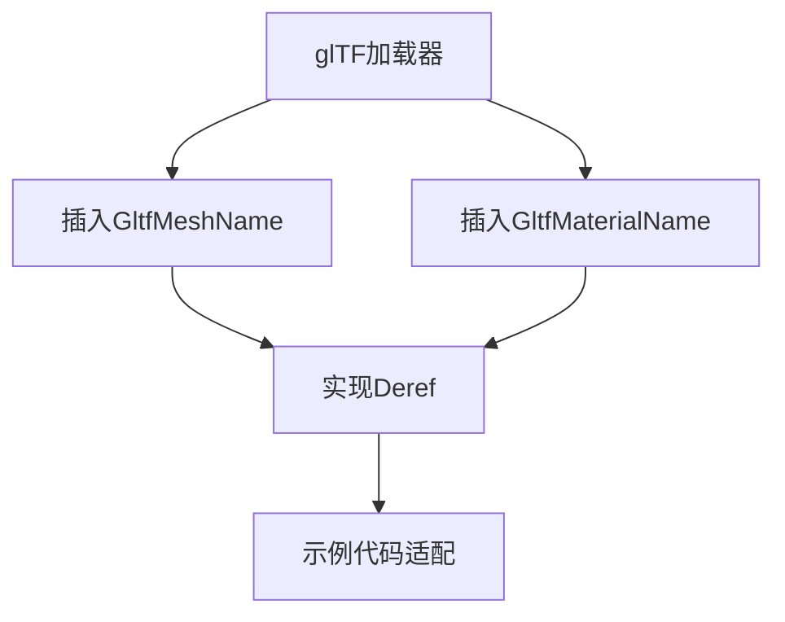

+++
title = "#19331 Add GltfMeshName component and Deref implementations"
date = "2025-05-23T00:00:00"
draft = false
template = "pull_request_page.html"
in_search_index = false

[extra]
current_language = "zh-cn"
available_languages = {"en" = { name = "English", url = "/pull_request/bevy/2025-05/pr-19331-en-20250523" }, "zh-cn" = { name = "中文", url = "/pull_request/bevy/2025-05/pr-19331-zh-cn-20250523" }}
+++

# 技术分析报告：Add GltfMeshName component and Deref implementations

## 基本信息
- **标题**: Add GltfMeshName component and Deref implementations
- **PR链接**: https://github.com/bevyengine/bevy/pull/19331
- **作者**: rendaoer
- **状态**: 已合并
- **标签**: C-Bug, S-Ready-For-Final-Review, M-Needs-Migration-Guide, D-Straightforward, A-glTF
- **创建时间**: 2025-05-22T01:47:22Z
- **合并时间**: 2025-05-23T21:14:24Z
- **合并者**: alice-i-cecile

## 问题背景
在之前的PR #19287中，修改了glTF资源加载时Name组件的生成方式，导致依赖该组件的示例（如depth_of_field、lightmaps等）出现兼容性问题。具体表现为：

1. 原始实现将网格名称存储为Name组件，格式为"MeshName.0"
2. #19287改为使用"MeshName.MaterialName"格式
3. 示例代码中的Name查询逻辑与新格式不兼容

```rust
// 问题示例代码（修改前）
Query<(Entity, &Name, &MeshMaterial3d<StandardMaterial>)>
```

## 解决方案
核心思路是将glTF特有的元数据与通用Name组件解耦：

1. **新增专用组件**：
   - 创建GltfMeshName组件存储网格名称
   - 保持GltfMaterialName组件的并行设计

2. **实现Deref特性**：
   - 允许直接通过类型转换访问底层字符串
   - 保持与字符串操作的兼容性

```rust
// 新增组件定义
#[derive(Clone, Debug, Reflect, Default, Component)]
pub struct GltfMeshName(pub String);

impl Deref for GltfMeshName {
    type Target = str;
    fn deref(&self) -> &Self::Target {
        self.0.as_ref()
    }
}
```

## 实现细节
### 资源加载层改造
在glTF加载流程中，将网格名称存储到专用组件：

```rust
// crates/bevy_gltf/src/loader/mod.rs 修改
if let Some(name) = mesh.name() {
    mesh_entity.insert(GltfMeshName(name.to_string()));
}
```

### 示例代码适配
修改受影响的示例代码，改用专用组件查询：

```rust
// examples/3d/lightmaps.rs 修改前
Query<(Entity, &Name, &MeshMaterial3d<StandardMaterial>)>

// 修改后
Query<(Entity, &GltfMeshName, &MeshMaterial3d<StandardMaterial>)>
```

### 类型系统增强
注册新组件到类型系统，确保反射功能可用：

```rust
// crates/bevy_gltf/src/lib.rs
app.register_type::<GltfMeshName>()
```

## 技术洞察
1. **组件解耦原则**：
   - 将框架通用组件（Name）与领域特定数据（glTF元数据）分离
   - 避免不同模块对通用组件的隐式依赖

2. **Deref设计模式**：
   - 通过实现Deref特性保持向后兼容
   - 允许新旧代码共存过渡期
   - 减少API使用者的迁移成本

3. **类型驱动开发**：
   - 利用Rust强类型系统表达领域概念
   - 通过类型签名明确数据来源（glTF vs 其他来源）

## 影响分析
1. **正向影响**：
   - 修复3个核心示例的运行错误
   - 提高glTF元数据访问的类型安全性
   - 减少Name组件的误用可能性

2. **迁移成本**：
   - 需要修改依赖glTF网格名称的查询逻辑
   - 新增Migration Guide条目指导迁移

```markdown
// release-content/migration-guides/rename_spawn_gltf_material_name.md
+If you were relying on the previous value of the `Name` component on meshes, 
+use the new `GltfMeshName` component instead.
```

## 可视化表示



## 关键文件变更
1. **crates/bevy_gltf/src/assets.rs**
```rust
// 新增GltfMeshName组件定义
#[derive(Clone, Debug, Reflect, Default, Component)]
pub struct GltfMeshName(pub String);

// 为GltfMaterialName添加Deref实现
impl Deref for GltfMaterialName {
    type Target = str;
    fn deref(&self) -> &Self::Target {
        self.0.as_ref()
    }
}
```

2. **crates/bevy_gltf/src/loader/mod.rs**
```rust
// 修改前：无mesh名称存储
// 修改后：插入GltfMeshName组件
if let Some(name) = mesh.name() {
    mesh_entity.insert(GltfMeshName(name.to_string()));
}
```

3. **examples/3d/lightmaps.rs**
```rust
// 修改前查询Name组件
Query<(Entity, &Name, ...)>

// 修改后查询GltfMeshName
Query<(Entity, &GltfMeshName, ...)>
```

## 延伸阅读
1. [Rust Deref特性官方文档](https://doc.rust-lang.org/std/ops/trait.Deref.html)
2. [Bevy ECS组件设计指南](https://bevy-cheatbook.github.io/programming/ecs-intro.html)
3. [glTF 2.0规范 - Mesh定义](https://registry.khronos.org/glTF/specs/2.0/glTF-2.0.html#reference-mesh)