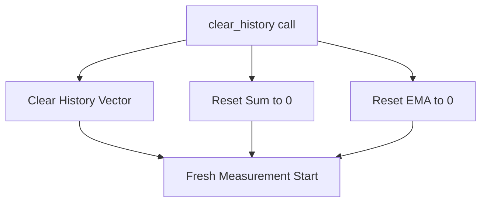

+++
title = "#19337 Diagnostic reset sum ema"
date = "2025-05-22T00:00:00"
draft = false
template = "pull_request_page.html"
in_search_index = true

[taxonomies]
list_display = ["show"]

[extra]
current_language = "en"
available_languages = {"en" = { name = "English", url = "/pull_request/bevy/2025-05/pr-19337-en-20250522" }, "zh-cn" = { name = "中文", url = "/pull_request/bevy/2025-05/pr-19337-zh-cn-20250522" }}
labels = ["C-Bug", "A-Diagnostics", "D-Straightforward"]
+++

# Title: Diagnostic reset sum ema

## Basic Information
- **Title**: Diagnostic reset sum ema
- **PR Link**: https://github.com/bevyengine/bevy/pull/19337
- **Author**: NonbinaryCoder
- **Status**: MERGED
- **Labels**: C-Bug, S-Ready-For-Final-Review, A-Diagnostics, X-Uncontroversial, D-Straightforward
- **Created**: 2025-05-22T18:18:14Z
- **Merged**: 2025-05-22T19:22:44Z
- **Merged By**: alice-i-cecile

## Description Translation
# Objective

Fix incorrect average returned by `Diagnostic` after `clear_history` is called.

## Solution

Reset sum and ema values in `Diagnostic::clear_history`.

## Testing

I have added a cargo test for `Diagnostic::clear_history` that checks average and smoothed average.  This test passes, and should not be platform dependent.

## The Story of This Pull Request

The problem stemmed from the `Diagnostic` system's handling of historical data cleanup. When calling `clear_history`, the implementation only cleared the measurement history but failed to reset accumulated statistical values. This left the diagnostic in an inconsistent state where subsequent calculations used stale summation data.

The core issue manifested in two key fields:
1. `sum`: Cumulative total of measurements
2. `ema`: Exponential moving average

Original implementation:
```rust
pub fn clear_history(&mut self) {
    self.history.clear();
}
```

This approach only addressed the visible history while leaving the underlying statistical aggregates intact. After clearance, any new measurements would combine with old sums, producing incorrect averages until enough new data overwrote the residual values.

The solution required resetting both statistical accumulators during cleanup:
```rust
pub fn clear_history(&mut self) {
    self.history.clear();
    self.sum = 0.0;
    self.ema = 0.0;
}
```

The test suite was augmented with a verification sequence:
1. Create diagnostic with history capacity
2. Add multiple measurement batches
3. Validate averages after each clearance
4. Repeat to ensure reset persistence

Test implementation highlights:
```rust
for _ in 0..3 {
    for _ in 0..5 {
        diagnostic.add_measurement(DiagnosticMeasurement {
            time: now,
            value: MEASUREMENT,
        });
        now += Duration::from_secs(1);
    }
    assert!((diagnostic.average().unwrap() - MEASUREMENT).abs() < 0.1);
    assert!((diagnostic.smoothed().unwrap() - MEASUREMENT).abs() < 0.1);
    diagnostic.clear_history();
}
```

This test pattern verifies that both immediate averages (using `sum`) and smoothed values (using `ema`) reset properly across multiple clearance cycles. The time increments ensure EMA calculations don't get skewed by identical timestamps.

## Visual Representation



## Key Files Changed

### `crates/bevy_diagnostic/src/diagnostic.rs` (+30/-0)
1. **Bug Fix Implementation**
```rust
// Before:
pub fn clear_history(&mut self) {
    self.history.clear();
}

// After:
pub fn clear_history(&mut self) {
    self.history.clear();
    self.sum = 0.0;
    self.ema = 0.0;
}
```
Resets critical accumulators to ensure clean state after history clearance.

2. **Test Validation**
```rust
#[test]
fn test_clear_history() {
    // Setup and measurement sequence
    // ...
    diagnostic.clear_history();
    assert!((diagnostic.average().unwrap() - MEASUREMENT).abs() < 0.1);
    assert!((diagnostic.smoothed().unwrap() - MEASUREMENT).abs() < 0.1);
}
```
Validates both average calculations reset properly through multiple clearance cycles.

## Further Reading
- [Exponential Moving Average (EMA) explanation](https://en.wikipedia.org/wiki/Moving_average#Exponential_moving_average)
- Rust's [Instant](https://doc.rust-lang.org/std/time/struct.Instant.html) documentation
- Bevy's [Diagnostic System Overview](https://bevyengine.org/learn/book/getting-started/diagnostics/)

# Full Code Diff
<See original PR diff in problem statement>