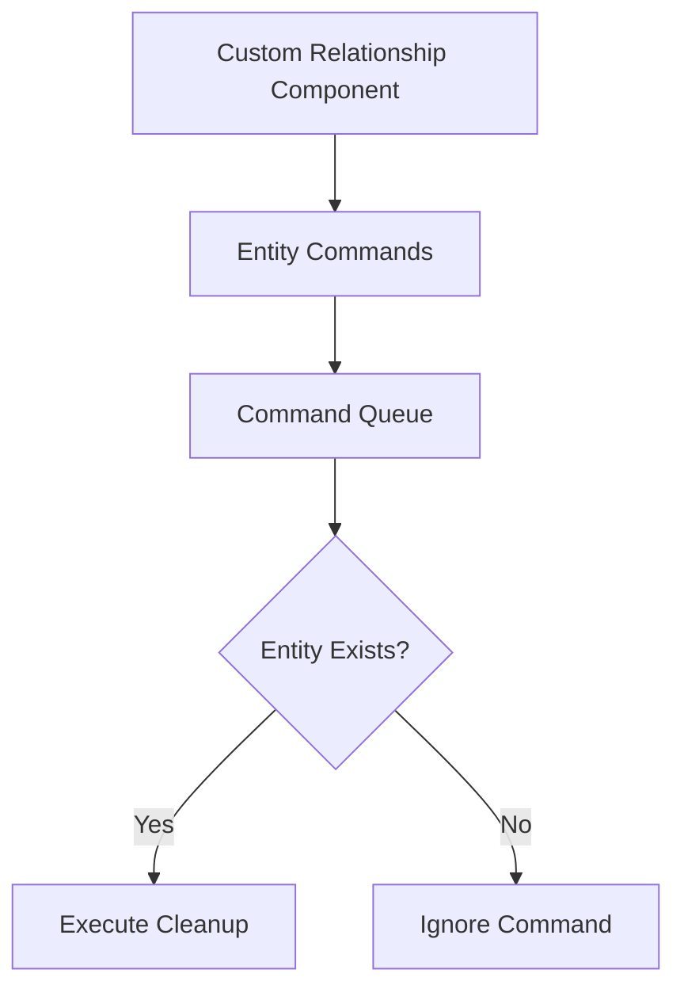

+++
title = "#19341 Fix custom relations panics with parent/child relations"
date = "2025-05-27T00:00:00"
draft = false
template = "pull_request_page.html"
in_search_index = true

[taxonomies]
list_display = ["show"]

[extra]
current_language = "en"
available_languages = {"en" = { name = "English", url = "/pull_request/bevy/2025-05/pr-19341-en-20250527" }, "zh-cn" = { name = "中文", url = "/pull_request/bevy/2025-05/pr-19341-zh-cn-20250527" }}
labels = ["C-Bug", "A-ECS"]
+++

# Title: Fix custom relations panics with parent/child relations

## Basic Information
- **Title**: Fix custom relations panics with parent/child relations
- **PR Link**: https://github.com/bevyengine/bevy/pull/19341
- **Author**: HeartofPhos
- **Status**: MERGED
- **Labels**: C-Bug, A-ECS, S-Ready-For-Final-Review
- **Created**: 2025-05-23T03:04:11Z
- **Merged**: 2025-05-27T21:26:34Z
- **Merged By**: alice-i-cecile

## Description Translation
# Objective

Fixes #18905

## Solution

`world.commands().entity(target_entity).queue(command)` calls `commands.with_entity` without an error handler, instead queue on `Commands` with an error handler

## Testing

Added unit test

## The Story of This Pull Request

The PR addresses a critical issue where combining custom relationships with Bevy's built-in parent/child relationships could lead to panics during entity despawns. This occurred when relationship components were left in invalid states after entity removal.

The core problem stemmed from how relationship cleanup operations were queued. The original implementation used direct entity access through `world.commands().get_entity()`, which could fail if the target entity was already despawned. This missing error handling caused panics when commands tried to operate on nonexistent entities.

The solution restructures the command queueing mechanism to properly handle potential errors. Instead of directly accessing the entity through the commands pipeline, the fix:

1. Encapsulates the cleanup logic in a closure
2. Uses `Commands::queue` with error handling
3. Applies `handle_error_with(ignore)` to safely skip operations on invalid entities

Key code changes in `relationship/mod.rs` show this transition:

```rust
// Before:
if let Ok(mut entity) = world.commands().get_entity(target_entity) {
    entity.queue(|mut entity: EntityWorldMut| {
        // Removal logic
    });
}

// After:
let command = |mut entity: EntityWorldMut| {
    // Removal logic
};
world.commands()
    .queue(command.with_entity(target_entity).handle_error_with(ignore));
```

This approach ensures relationship cleanup operations only execute when the target entity still exists, preventing panics from invalid entity access. The error handler safely ignores cases where the entity has already been removed.

The implementation maintains Bevy's ECS invariants while preserving the flexibility of custom relationships. By using command queueing with proper error handling, it aligns with Bevy's deferred execution model where entity states might change between command creation and execution.

The PR adds comprehensive test coverage with four distinct scenarios:
1. Parent with custom relationship despawn
2. Child despawn with parent relationship
3. Parent despawn with child relationship
4. Child relationship component cleanup

These tests validate both the panic prevention and correct component removal behavior under different despawn orderings.

## Visual Representation



## Key Files Changed

**crates/bevy_ecs/src/relationship/mod.rs** (+71/-10)
1. Fixed relationship cleanup command queueing
2. Added test cases for parent/child interactions

Key code snippet from the test suite:
```rust
#[test]
fn parent_child_relationship_with_custom_relationship() {
    // Test setup with custom Rel/RelTarget components
    // Four test scenarios covering different despawn orders
    // Assertions verify proper entity removal and component cleanup
}
```

## Further Reading

- Bevy ECS Relationships Guide: https://bevyengine.org/learn/ecs-relationships/
- Command Queue Documentation: https://docs.rs/bevy_ecs/latest/bevy_ecs/system/struct.Commands.html
- Entity Commands Error Handling: https://bevy-cheatbook.github.io/programming/commands.html#error-handling

## Full Code Diff
```diff
diff --git a/crates/bevy_ecs/src/relationship/mod.rs b/crates/bevy_ecs/src/relationship/mod.rs
index 9a2a2a2d5a39a..3522118fbc820 100644
--- a/crates/bevy_ecs/src/relationship/mod.rs
+++ b/crates/bevy_ecs/src/relationship/mod.rs
@@ -158,19 +158,21 @@ pub trait Relationship: Component + Sized {
             {
                 relationship_target.collection_mut_risky().remove(entity);
                 if relationship_target.len() == 0 {
-                    if let Ok(mut entity) = world.commands().get_entity(target_entity) {
+                    let command = |mut entity: EntityWorldMut| {
                         // this "remove" operation must check emptiness because in the event that an identical
                         // relationship is inserted on top, this despawn would result in the removal of that identical
                         // relationship ... not what we want!
-                        entity.queue(|mut entity: EntityWorldMut| {
-                            if entity
-                                .get::<Self::RelationshipTarget>()
-                                .is_some_and(RelationshipTarget::is_empty)
-                            {
-                                entity.remove::<Self::RelationshipTarget>();
-                            }
-                        });
-                    }
+                        if entity
+                            .get::<Self::RelationshipTarget>()
+                            .is_some_and(RelationshipTarget::is_empty)
+                        {
+                            entity.remove::<Self::RelationshipTarget>();
+                        }
+                    };
+
+                    world
+                        .commands()
+                        .queue(command.with_entity(target_entity).handle_error_with(ignore));
                 }
             }
         }
@@ -424,4 +426,63 @@ mod tests {
 
         // No assert necessary, looking to make sure compilation works with the macros
     }
+
+    #[test]
+    fn parent_child_relationship_with_custom_relationship() {
+        use crate::prelude::ChildOf;
+
+        #[derive(Component)]
+        #[relationship(relationship_target = RelTarget)]
+        struct Rel(Entity);
+
+        #[derive(Component)]
+        #[relationship_target(relationship = Rel)]
+        struct RelTarget(Entity);
+
+        let mut world = World::new();
+
+        // Rel on Parent
+        // Despawn Parent
+        let mut commands = world.commands();
+        let child = commands.spawn_empty().id();
+        let parent = commands.spawn(Rel(child)).add_child(child).id();
+        commands.entity(parent).despawn();
+        world.flush();
+
+        assert!(world.get_entity(child).is_err());
+        assert!(world.get_entity(parent).is_err());
+
+        // Rel on Parent
+        // Despawn Child
+        let mut commands = world.commands();
+        let child = commands.spawn_empty().id();
+        let parent = commands.spawn(Rel(child)).add_child(child).id();
+        commands.entity(child).despawn();
+        world.flush();
+
+        assert!(world.get_entity(child).is_err());
+        assert!(!world.entity(parent).contains::<Rel>());
+
+        // Rel on Child
+        // Despawn Parent
+        let mut commands = world.commands();
+        let parent = commands.spawn_empty().id();
+        let child = commands.spawn((ChildOf(parent), Rel(parent))).id();
+        commands.entity(parent).despawn();
+        world.flush();
+
+        assert!(world.get_entity(child).is_err());
+        assert!(world.get_entity(parent).is_err());
+
+        // Rel on Child
+        // Despawn Child
+        let mut commands = world.commands();
+        let parent = commands.spawn_empty().id();
+        let child = commands.spawn((ChildOf(parent), Rel(parent))).id();
+        commands.entity(child).despawn();
+        world.flush();
+
+        assert!(world.get_entity(child).is_err());
+        assert!(!world.entity(parent).contains::<RelTarget>());
+    }
 }
```