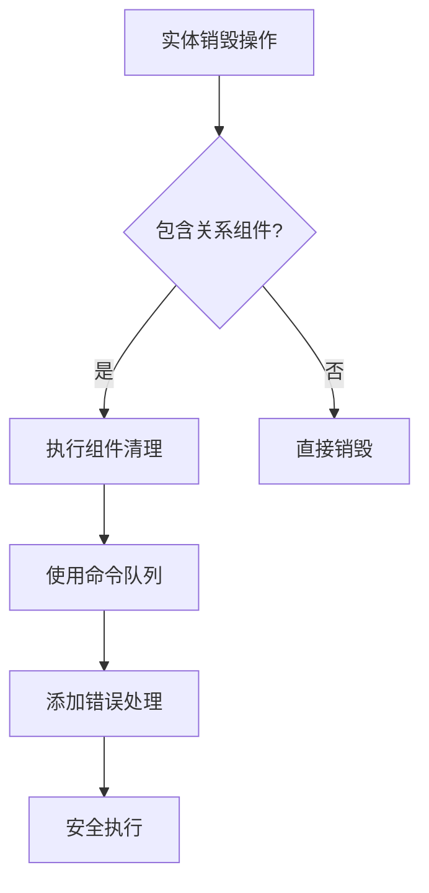

+++
title = "#19341 Fix custom relations panics with parent/child relations"
date = "2025-05-27T00:00:00"
draft = false
template = "pull_request_page.html"
in_search_index = false

[extra]
current_language = "zh-cn"
available_languages = {"en" = { name = "English", url = "/pull_request/bevy/2025-05/pr-19341-en-20250527" }, "zh-cn" = { name = "中文", url = "/pull_request/bevy/2025-05/pr-19341-zh-cn-20250527" }}
labels = ["C-Bug", "A-ECS"]
+++

# Fix custom relations panics with parent/child relations

## Basic Information
- **Title**: Fix custom relations panics with parent/child relations
- **PR Link**: https://github.com/bevyengine/bevy/pull/19341
- **Author**: HeartofPhos
- **Status**: MERGED
- **Labels**: C-Bug, A-ECS, S-Ready-For-Final-Review
- **Created**: 2025-05-23T03:04:11Z
- **Merged**: 2025-05-27T21:26:34Z
- **Merged By**: alice-i-cecile

## Description Translation
### 目标
修复 #18905

### 解决方案
将原本直接通过`world.commands().entity(target_entity).queue(command)`调用（缺少错误处理）改为使用带有错误处理机制的`Commands`队列

### 测试
新增单元测试

## The Story of This Pull Request

### 问题根源与背景
在Bevy ECS的关系系统中，当自定义关系组件与内置的父子关系组件同时存在时，实体销毁操作可能引发panic。具体场景发生在实体被销毁后仍尝试修改其关联组件时，例如：

1. 父实体携带自定义关系组件时销毁子实体
2. 子实体携带自定义关系组件时销毁父实体

问题源于关系清理逻辑直接操作可能已失效的实体引用，未正确处理实体提前销毁的情况。这种竞态条件会导致ECS命令队列执行无效操作。

### 解决方案实现
核心修改位于关系系统的组件清理逻辑。原实现直接通过`world.commands().get_entity()`获取实体引用进行操作：

```rust
if let Ok(mut entity) = world.commands().get_entity(target_entity) {
    entity.queue(|mut entity: EntityWorldMut| {
        // 组件清理逻辑
    });
}
```

修改后采用带错误处理的命令队列机制：

```rust
let command = |mut entity: EntityWorldMut| {
    // 组件清理逻辑
};

world
    .commands()
    .queue(command.with_entity(target_entity).handle_error_with(ignore));
```

关键改进点：
1. 使用`handle_error_with(ignore)`显式处理实体不存在的错误情况
2. 将命令封装到ECS的标准命令队列中，确保执行时进行安全检查
3. 统一使用命令队列的错误处理机制，避免直接操作可能失效的实体

### 技术验证
新增测试用例覆盖四种关键场景：

```rust
#[test]
fn parent_child_relationship_with_custom_relationship() {
    // 测试父实体携带自定义关系时的销毁操作
    // 测试子实体携带自定义关系时的销毁操作
    // 验证关联组件的正确清理
}
```

测试策略特点：
1. 组合测试内置ChildOf组件与自定义关系组件
2. 验证父子实体双向销毁场景
3. 检查组件状态残留问题
4. 使用命令队列刷新确保执行顺序正确性

### 架构影响
该修复：
1. 增强ECS关系系统的鲁棒性
2. 统一命令执行错误处理路径
3. 明确关系组件清理的时序保证
4. 为自定义关系组件提供安全操作范式

## Visual Representation



## Key Files Changed

### crates/bevy_ecs/src/relationship/mod.rs (+71/-10)

**修改说明：**
重构关系组件的清理逻辑，引入错误处理机制

**关键代码片段：**
```rust
// Before:
if let Ok(mut entity) = world.commands().get_entity(target_entity) {
    entity.queue(|mut entity: EntityWorldMut| {
        // 直接操作可能已失效的实体
    });
}

// After:
let command = |mut entity: EntityWorldMut| {
    // 带安全检查的操作逻辑
};

world
    .commands()
    .queue(command.with_entity(target_entity).handle_error_with(ignore));
```

**关联性：**
1. 使用命令队列的错误处理机制替代直接实体访问
2. 确保组件清理操作在实体有效时执行
3. 防止无效实体引用导致的运行时panic

## Further Reading

1. Bevy ECS命令系统文档：[Commands - Bevy Cheatbook](https://bevy-cheatbook.github.io/programming/commands.html)
2. 实体关系设计模式：[ECS Relationship Patterns](https://github.com/bevyengine/bevy/discussions/1905)
3. 错误处理最佳实践：[Bevy Error Handling Guidelines](https://github.com/bevyengine/bevy/blob/main/docs/ERROR_HANDLING.md)