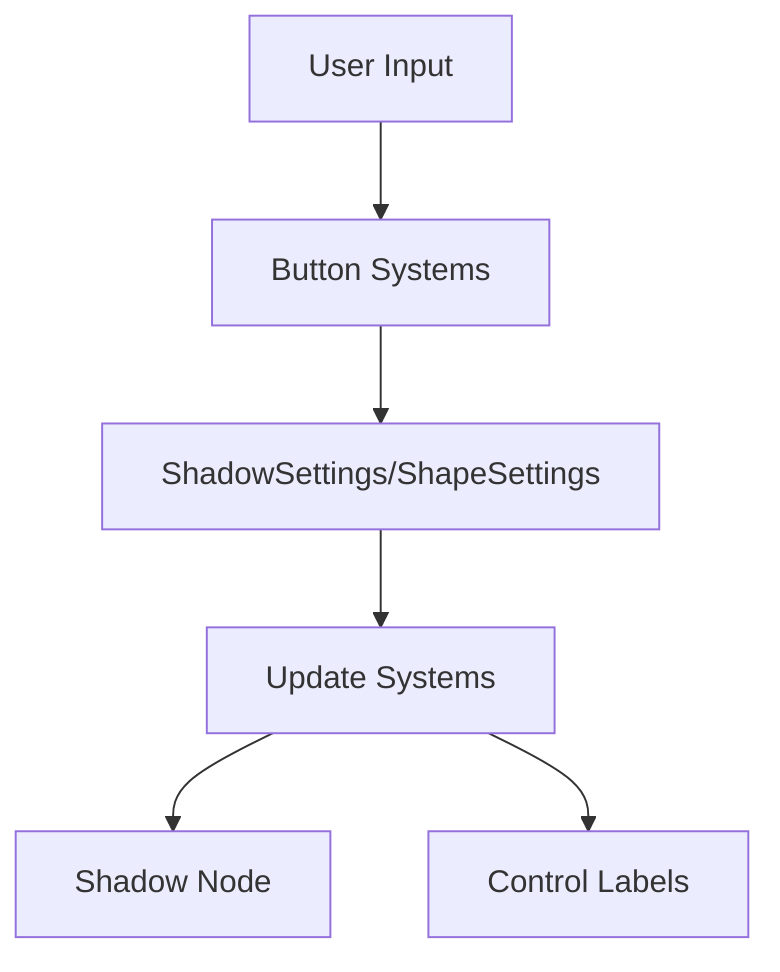

+++
title = "#19345 `box_shadow` example with adjustable settings"
date = "2025-05-27T00:00:00"
draft = false
template = "pull_request_page.html"
in_search_index = true

[taxonomies]
list_display = ["show"]

[extra]
current_language = "en"
available_languages = {"en" = { name = "English", url = "/pull_request/bevy/2025-05/pr-19345-en-20250527" }, "zh-cn" = { name = "中文", url = "/pull_request/bevy/2025-05/pr-19345-zh-cn-20250527" }}
labels = ["C-Examples", "A-UI", "X-Contentious", "S-Waiting-on-Author"]
+++

# Title

## Basic Information
- **Title**: `box_shadow` example with adjustable settings
- **PR Link**: https://github.com/bevyengine/bevy/pull/19345
- **Author**: oracle58
- **Status**: MERGED
- **Labels**: C-Examples, A-UI, X-Contentious, S-Waiting-on-Author
- **Created**: 2025-05-23T12:59:46Z
- **Merged**: 2025-05-27T20:04:20Z
- **Merged By**: alice-i-cecile

## Description Translation
# Objective

- Addresses the previous example's lack of visual appeal and clarity. It was missing labels for clear distinction of the shadow settings used on each of the shapes. The suggestion in the linked issue was to either just visually update and add labels or to collapse example to a single node with adjustable settings. 
- Fixes #19240

## Solution

- Replace the previous static example with a single, central node with adjustable settings as per issue suggestion.
- Implement button-based setting adjustments. Unfortunately slider widgets don't seem available yet and I didn't want to further bloat the example.
- Improve overall aesthetics of the example -- although color pallette could still be improved. flat gray tones are probably not the best choice as a contrast to the shadow, but the white border does help in that aspect. 
- Dynamically recolor shadows for visual clarity when increasing shadow count.
- Add Adjustable Settings:
    - Shape selection
    - Shadow X/Y offset, blur, spread, and count
- Add Reset button to restore default settings

The disadvantage of this solution is that the old example code would have probably been easier to digest as the new example is quite bloated in comparison. Alternatively I could also just implement labels and fix aesthetics of the old example without adding functionality for adjustable settings, _but_ I personally feel like interactive examples  are more engaging to users. 

## Testing

- Did you test these changes? If so, how? `cargo run --example box_shadow`  and functionality of all features of the example.  
- Are there any parts that need more testing? Not that I am aware of. 
- How can other people (reviewers) test your changes? Is there anything specific they need to know? Not really, it should be pretty straightforward just running the new example and testing the feats.

---

## Showcase


## The Story of This Pull Request

### The Problem and Context
The existing `box_shadow` example suffered from two main issues: poor visual differentiation between test cases and lack of interactivity. With multiple static nodes displaying various shadow configurations, users couldn't easily correlate visual effects with specific parameter values. The original grid layout (#19240) made it difficult to compare settings side-by-side and understand how individual parameters affected the final render.

### The Solution Approach
The author chose to implement an interactive demo centered around a single configurable node. Key decisions included:
1. Using button controls instead of sliders (unavailable in Bevy's UI at the time)
2. Implementing parameter persistence through resource structs (`ShadowSettings`, `ShapeSettings`)
3. Adding color variation for multiple shadows to improve visual distinction
4. Creating a floating control panel with incremental/decremental buttons

The implementation balances interactivity with code complexity, opting for direct button controls rather than implementing a new slider widget specifically for this example.

### The Implementation
The core changes revolve around three main systems:

1. **State Management**:
```rust
#[derive(Resource, Default)]
struct ShadowSettings {
    x_offset: f32,
    y_offset: f32,
    blur: f32,
    spread: f32,
    count: usize,
    samples: u32,
}

#[derive(Resource, Default)]
struct ShapeSettings {
    index: usize,
}
```

2. **UI Construction**:
The setup system creates a central shadow node and control panel using Bevy's UI components:
```rust
commands.spawn((
    Node {
        width: Val::Px(164.),
        height: Val::Px(164.),
        border: UiRect::all(Val::Px(1.)),
        ..default()
    },
    ShadowNode,
    BoxShadow(vec![...]),
));
```

3. **Interactive Systems**:
Button handling system with repeat functionality:
```rust
fn button_repeat_system(
    time: Res<Time>,
    mut held: ResMut<HeldButton>,
    mut shadow: ResMut<ShadowSettings>,
    mut shape: ResMut<ShapeSettings>,
    mut redraw_events: EventWriter<RequestRedraw>,
) {
    // Implements button hold-to-repeat behavior
}
```

### Technical Insights
Key implementation details include:
- **Dynamic Shadow Generation**: The `generate_shadows` function creates colored shadows based on count:
```rust
match shadow.count {
    1 => vec![make_shadow(BLACK.into(), ...)],
    2 => vec![BLUE, YELLOW shadows],
    3 => vec![BLUE, YELLOW, RED shadows]
}
```
- **Coordinated Updates**: Systems like `update_shadow` and `update_shape` react to resource changes:
```rust
fn update_shadow(
    shadow: Res<ShadowSettings>,
    mut query: Query<&mut BoxShadow, With<ShadowNode>>,
) {
    // Updates shadow node's BoxShadow component
}
```
- **Button State Management**: The `HeldButton` resource tracks pressed buttons for repeat actions:
```rust
#[derive(Resource, Default)]
struct HeldButton {
    button: Option<SettingsButton>,
    pressed_at: Option<f64>,
    last_repeat: Option<f64>,
}
```

### The Impact
This PR transforms the example from a static display to an interactive teaching tool:
1. Enables real-time parameter experimentation
2. Demonstrates complex UI construction patterns
3. Shows resource-based state management
4. Illustrates interactive system design

The trade-off comes in increased code complexity (601 lines added vs 231 removed), but provides a more engaging user experience that better demonstrates Bevy's UI capabilities.

## Visual Representation



## Key Files Changed
- `examples/ui/box_shadow.rs` (+601/-231)

Key modifications:
1. Replaced static node grid with interactive single node:
```rust
// Before: Multiple static nodes
for (size, offset, spread, blur, border_radius) in example_nodes {
    commands.spawn(box_shadow_node_bundle(...));
}

// After: Single dynamic node
commands.spawn((
    Node {...},
    ShadowNode,
    BoxShadow(vec![...]),
));
```

2. Added control panel construction:
```rust
commands.spawn((
    Node {
        position_type: PositionType::Absolute,
        left: Val::Px(24.0),
        bottom: Val::Px(24.0),
        ... 
    },
    children![
        build_setting_row("X Offset:", ...),
        build_setting_row("Y Offset:", ...),
        // Additional controls
    ]
));
```

## Further Reading
- [Bevy UI Documentation](https://docs.rs/bevy_ui/latest/bevy_ui/)
- [ECS Pattern in Bevy](https://bevy-cheatbook.github.io/programming/ecs-intro.html)
- [Rust Ownership and Resource Management](https://doc.rust-lang.org/book/ch04-00-understanding-ownership.html)