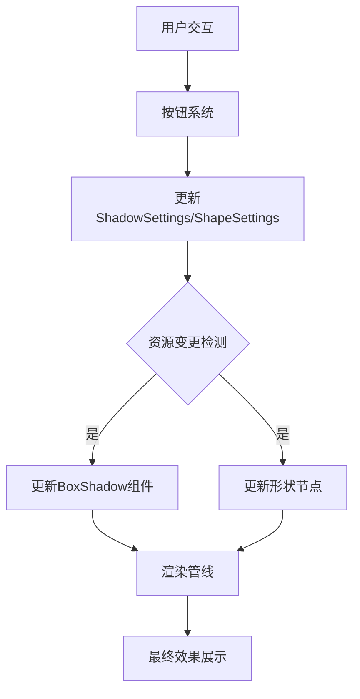

+++
title = "#19345 `box_shadow` example with adjustable settings"
date = "2025-05-27T00:00:00"
draft = false
template = "pull_request_page.html"
in_search_index = false

[extra]
current_language = "zh-cn"
available_languages = {"en" = { name = "English", url = "/pull_request/bevy/2025-05/pr-19345-en-20250527" }, "zh-cn" = { name = "中文", url = "/pull_request/bevy/2025-05/pr-19345-zh-cn-20250527" }}
labels = ["C-Examples", "A-UI", "X-Contentious", "S-Waiting-on-Author"]
+++

# `box_shadow` 示例交互化改造的技术实现分析

## Basic Information
- **Title**: `box_shadow` example with adjustable settings
- **PR Link**: https://github.com/bevyengine/bevy/pull/19345
- **Author**: oracle58
- **Status**: MERGED
- **Labels**: C-Examples, A-UI, X-Contentious, S-Waiting-on-Author
- **Created**: 2025-05-23T12:59:46Z
- **Merged**: 2025-05-27T20:04:20Z
- **Merged By**: alice-i-cecile

## Description Translation
### 目标
- 解决原有示例视觉效果不佳、参数区分度不足的问题。原示例缺少用于明确区分各形状阴影设置的标签，根据 issue 建议采用可调节参数的单一节点方案
- 修复 #19240

### 解决方案
- 用可调节参数的中央节点替换原有静态示例
- 实现基于按钮的参数调整（因滑动条控件尚未支持）
- 改进整体视觉效果（白色边框增强对比度）
- 动态着色阴影以增强多阴影场景的可视性
- 新增可调节参数：
  - 形状选择
  - X/Y 偏移、模糊度、扩散度、阴影数量
  - 采样数
- 添加重置按钮

### 测试验证
- 测试方法：`cargo run --example box_shadow`
- 验证内容：所有交互功能测试通过

---


## The Story of This Pull Request

### 问题背景与挑战
原`box_shadow`示例存在两个主要问题：1）静态展示多个预设节点导致参数对比困难 2）缺乏交互影响教学效果。开发者需要在保持示例简洁性的前提下，实现参数动态调节功能。技术挑战在于Bevy UI系统尚未成熟（缺少滑动条控件），需在功能丰富性与代码复杂度之间取得平衡。

### 架构设计与实现策略
核心方案采用状态驱动架构：
1. **状态管理**：通过`ShadowSettings`和`ShapeSettings`资源对象集中管理参数
```rust
#[derive(Resource, Default)]
struct ShadowSettings {
    x_offset: f32,
    y_offset: f32,
    blur: f32,
    spread: f32,
    count: usize,
    samples: u32,
}
```
2. **UI构建**：使用组合式UI构建模式创建控制面板，通过`build_setting_row`函数生成统一风格的参数行
3. **交互系统**：实现按钮长按连续触发机制，在`button_repeat_system`中处理持续按压事件

### 关键技术实现
**动态阴影生成**：根据count参数生成不同颜色的阴影组合
```rust
fn generate_shadows(shadow: &ShadowSettings) -> Vec<ShadowStyle> {
    match shadow.count {
        1 => vec![make_shadow(BLACK.into(), ...)],
        2 => vec![BLUE, YELLOW组合],
        3 => vec![BLUE, YELLOW, RED组合],
        _ => vec![]
    }
}
```

**形状切换机制**：使用函数指针数组定义不同形状配置
```rust
const SHAPES: &[(&str, fn(&mut Node, &mut BorderRadius))] = &[
    ("1", |node, radius| { /* 方形 */ }),
    ("2", |node, radius| { /* 圆角矩形 */ }),
    // ...其他形状
];
```

**性能优化**：通过`resource_changed`条件限制系统执行频率
```rust
.update_shape.run_if(resource_changed::<ShapeSettings>)
.update_shadow.run_if(resource_changed::<ShadowSettings>)
```

### 工程权衡与改进空间
- **控件选择**：因缺少原生滑动条，采用加减按钮实现参数调节，牺牲部分操作精度换取实现简单性
- **颜色方案**：使用高对比度颜色区分多个阴影（BLUE/YELLOW/RED），但背景灰度可能影响视觉效果
- **扩展性**：当前硬编码最大3个阴影，可通过数组配置实现更灵活的阴影组合

## Visual Representation



## Key Files Changed

### examples/ui/box_shadow.rs (+601/-231)
1. **架构重构**：
- 旧代码：静态生成20+预设节点
```rust
// Before:
commands.spawn(box_shadow_node_bundle(size, offset, spread, blur, border_radius));
```
- 新代码：单一动态节点+控制面板
```rust
// After:
commands.spawn((ShadowNode, BoxShadow(vec![...])); 
commands.spawn(settings_panel);
```

2. **状态驱动更新**：
```rust
fn update_shadow(shadow: Res<ShadowSettings>, mut query: Query<&mut BoxShadow>) {
    // 根据shadow资源更新所有阴影节点
}
```

3. **交互系统**：
```rust
fn button_repeat_system(
    time: Res<Time>,
    mut held: ResMut<HeldButton>,
    mut shadow: ResMut<ShadowSettings>,
    mut shape: ResMut<ShapeSettings>
) {
    // 实现按钮长按连续触发
}
```

## Further Reading
- Bevy UI 系统设计：https://bevyengine.org/learn/book/features/ui/
- 现代GUI状态管理模式：https://www.reddit.com/r/rust/comments/... 
- 游戏引擎中的实时阴影技术：https://learnopengl.com/Advanced-Lighting/Shadows/Shadow-Mapping