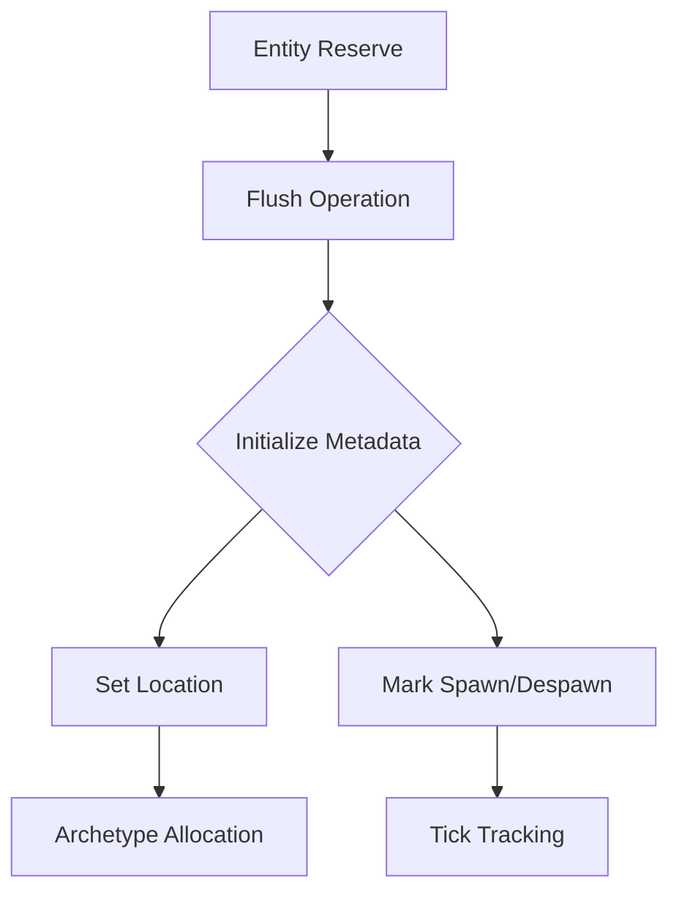

+++
title = "#19350 Fix EntityMeta.spawned_or_despawned unsoundness"
date = "2025-05-27T00:00:00"
draft = false
template = "pull_request_page.html"
in_search_index = false

[extra]
current_language = "zh-cn"
available_languages = {"en" = { name = "English", url = "/pull_request/bevy/2025-05/pr-19350-en-20250527" }, "zh-cn" = { name = "中文", url = "/pull_request/bevy/2025-05/pr-19350-zh-cn-20250527" }}
+++

# Fix EntityMeta.spawned_or_despawned Unsoundness 修复分析报告

## 基本概况
- **标题**: Fix EntityMeta.spawned_or_despawned unsoundness
- **PR链接**: https://github.com/bevyengine/bevy/pull/19350
- **作者**: SpecificProtagonist
- **状态**: 已合并
- **标签**: ECS相关、待最终评审、需要迁移指南、内存安全问题
- **创建时间**: 2025-05-24T00:50:11Z
- **合并时间**: 2025-05-27T23:02:27Z
- **合并者**: alice-i-cecile

## 问题背景
在PR #19047 引入的`EntityMeta.spawned_or_despawned`字段使用`MaybeUninit`类型时，未能保证字段在访问前完成初始化。当开发者通过以下模式操作实体时：

```rust
let mut world = World::new();
let id = world.entities().reserve_entity();
world.flush();
world.entity(id);
```

Miri静态分析工具会报未初始化内存访问错误。核心问题在于`spawned_or_despawned`字段可能在未初始化状态下被访问，导致未定义行为（Undefined Behavior）。

## 解决方案
1. **移除MaybeUninit包装**：将`spawned_or_despawned`字段类型从`MaybeUninit<SpawnedOrDespawned>`改为直接存储`SpawnedOrDespawned`
2. **强制初始化**：在`flush`操作时显式初始化该字段
3. **API调整**：重构相关方法调用链以确保初始化时序

## 关键技术实现
### 实体元数据结构改造
```rust
// 修改前
struct EntityMeta {
    spawned_or_despawned: MaybeUninit<SpawnedOrDespawned>,
}

// 修改后
struct EntityMeta {
    spawned_or_despawned: SpawnedOrDespawned,
}
```

### 初始化保障机制
在`Entities::flush`方法中添加初始化逻辑：
```rust
pub unsafe fn flush(
    &mut self,
    mut init: impl FnMut(Entity, &mut EntityLocation),
    by: MaybeLocation,
    at: Tick,
) {
    // ...初始化流程...
    meta.spawned_or_despawned = SpawnedOrDespawned { by, at };
}
```

### API调用链调整
将原来的`set_spawn_despawn`拆分为两个独立操作：
```rust
// 设置位置信息
pub unsafe fn set(&mut self, index: u32, location: EntityLocation) {
    // 更新实体位置
}

// 标记生成/销毁状态
pub unsafe fn mark_spawn_despawn(&mut self, index: u32, by: MaybeLocation, at: Tick) {
    // 更新状态元数据
}
```

## 关键文件变更
### crates/bevy_ecs/src/entity/mod.rs
1. **元数据结构重构**：
```rust
// 修改前
spawned_or_despawned: MaybeUninit<SpawnedOrDespawned>,

// 修改后
spawned_or_despawned: SpawnedOrDespawned,
```

2. **初始化保障**：
```rust
const EMPTY: EntityMeta = EntityMeta {
    spawned_or_despawned: SpawnedOrDespawned { /* 默认值 */ },
};
```

### crates/bevy_ecs/src/world/mod.rs
```rust
// 更新flush调用
self.entities.flush(
    |entity, location| {
        // 分配存储位置
    },
    by,  // 调用者位置信息
    at   // 当前世界tick
);
```

## 影响分析
1. **内存安全性**：彻底消除未初始化内存访问风险
2. **API稳定性**：调用者需确保在flush时提供正确的调用位置和tick信息
3. **诊断信息**：保留更精确的实体生命周期追踪信息
4. **兼容性**：需要更新相关迁移指南（见`release-content/migration-guides/flush.md`）

## 技术启示
1. **MaybeUninit使用边界**：需要严格保证初始化时序的字段不宜使用MaybeUninit
2. **ECS生命周期管理**：实体状态变更需要与存储位置更新解耦
3. **安全抽象设计**：通过类型系统强制保证初始化顺序比文档约定更可靠

## 后续参考
1. Rust内存模型文档：https://doc.rust-lang.org/nomicon/
2. Bevy ECS架构指南：https://bevyengine.org/learn/book/ECS/
3. Miri内存检查工具：https://github.com/rust-lang/miri

