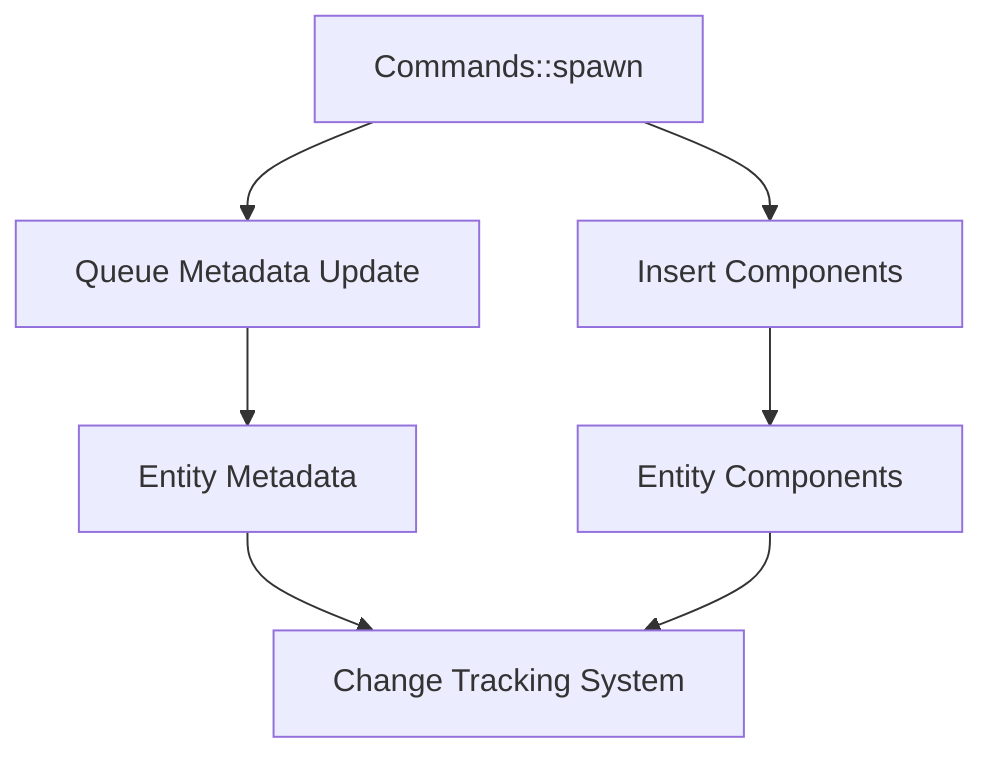

+++
title = "#19351 Fix spawn tracking for spawn commands"
date = "2025-05-26T00:00:00"
draft = false
template = "pull_request_page.html"
in_search_index = true

[taxonomies]
list_display = ["show"]

[extra]
current_language = "en"
available_languages = {"en" = { name = "English", url = "/pull_request/bevy/2025-05/pr-19351-en-20250526" }, "zh-cn" = { name = "中文", url = "/pull_request/bevy/2025-05/pr-19351-zh-cn-20250526" }}
labels = ["C-Bug", "A-ECS"]
+++

# Title: Fix spawn tracking for spawn commands

## Basic Information
- **Title**: Fix spawn tracking for spawn commands
- **PR Link**: https://github.com/bevyengine/bevy/pull/19351
- **Author**: SpecificProtagonist
- **Status**: MERGED
- **Labels**: C-Bug, A-ECS, S-Ready-For-Final-Review
- **Created**: 2025-05-24T01:24:57Z
- **Merged**: 2025-05-26T20:41:32Z
- **Merged By**: alice-i-cecile

## Description Translation
The original description is already in English and preserved as-is.

## The Story of This Pull Request

### The Problem and Context
The PR addresses a tracking issue in Bevy's ECS commands system where entity spawn metadata wasn't properly recorded when using `Commands::spawn_empty`. This metadata (spawn location and tick) is crucial for systems that need to track entity lifecycle events. The bug manifested when using empty spawns followed by component inserts, causing incorrect spawn tracking information.

### The Solution Approach
The fix centers around properly initializing spawn tracking metadata directly in the command queue operations. Key decisions included:
1. Merging spawn tracking with existing command execution to maintain performance
2. Reusing existing entity metadata structures to avoid allocation overhead
3. Adding explicit tracking in both `spawn_empty` and `spawn` methods

### The Implementation
The core changes occur in `commands/mod.rs` where spawn operations now queue metadata updates:

```rust
// In spawn_empty:
entity_commands.queue(move |entity: EntityWorldMut| {
    let index = entity.id().index();
    let world = entity.into_world_mut();
    let tick = world.change_tick();
    unsafe {
        world.entities_mut().mark_spawn_despawn(index, caller, tick);
    }
});

// In spawn (optimized version):
entity_commands.queue(move |mut entity: EntityWorldMut| {
    let index = entity.id().index();
    entity.world_scope(|world| {
        let tick = world.change_tick();
        unsafe {
            world.entities_mut().mark_spawn_despawn(index, caller, tick);
        }
    });
    entity.insert_with_caller(bundle, ...);
});
```

A new unsafe method `mark_spawn_despawn` was added to `entity/mod.rs` to handle the metadata update:

```rust
pub(crate) unsafe fn mark_spawn_despawn(&mut self, index: u32, by: MaybeLocation, at: Tick) {
    let meta = unsafe { self.meta.get_unchecked_mut(index as usize) };
    meta.spawned_or_despawned = MaybeUninit::new(SpawnedOrDespawned { by, at });
}
```

### Technical Insights
The implementation demonstrates several important ECS patterns:
1. **Command Batching**: Metadata updates are queued as commands to maintain consistency with other operations
2. **Change Tracking**: Uses the world's change tick to accurately record when spawns occur
3. **Safety Management**: Carefully constrained unsafe blocks with clear invariants (valid entity indices)

### The Impact
- Fixes incorrect spawn tracking for command-created entities
- Maintains performance through batched command execution
- Adds validation via new test `track_spawn_ticks`
- Introduces benchmarking for spawn operations with varying entity counts

## Visual Representation



## Key Files Changed

1. `crates/bevy_ecs/src/system/commands/mod.rs`
- Modified spawn methods to queue metadata updates
- Added direct tick tracking in command closures
- Key change: Merged spawn tracking with component insertion

2. `crates/bevy_ecs/src/entity/mod.rs`
- Added `mark_spawn_despawn` method
- Enables safe metadata updates for command-created entities

3. `benches/benches/bevy_ecs/world/commands.rs`
- Added `nonempty_spawn_commands` benchmark
- Tests performance with alternating spawn patterns

Example benchmark addition:
```rust
group.bench_function(format!("{}_entities", entity_count), |bencher| {
    let mut world = World::default();
    let mut command_queue = CommandQueue::default();
    
    bencher.iter(|| {
        let mut commands = Commands::new(&mut command_queue, &world);
        for i in 0..entity_count {
            if black_box(i % 2 == 0) {
                commands.spawn(A);
            }
        }
        command_queue.apply(&mut world);
    });
});
```

## Further Reading
- Bevy ECS Command System Documentation
- Entity Lifecycle Tracking RFC
- Rust Unsafe Code Guidelines (for understanding safety annotations)
- Bevy Change Detection System Overview