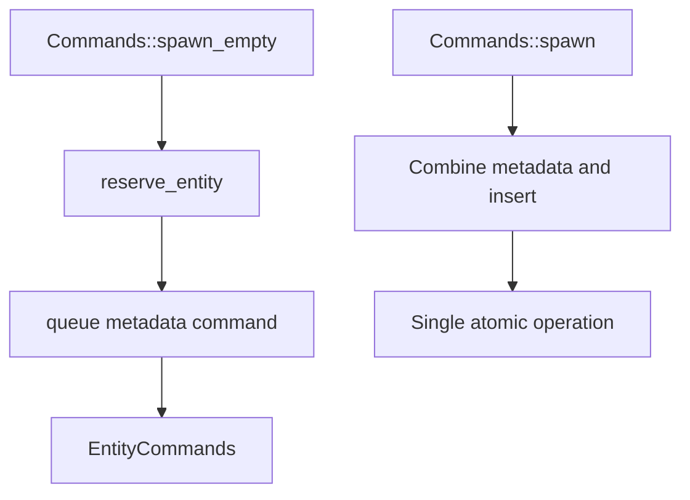

+++
title = "#19351 Fix spawn tracking for spawn commands"
date = "2025-05-26T00:00:00"
draft = false
template = "pull_request_page.html"
in_search_index = false

[extra]
current_language = "zh-cn"
available_languages = {"en" = { name = "English", url = "/pull_request/bevy/2025-05/pr-19351-en-20250526" }, "zh-cn" = { name = "中文", url = "/pull_request/bevy/2025-05/pr-19351-zh-cn-20250526" }}
labels = ["C-Bug", "A-ECS"]
+++

# Fix spawn tracking for spawn commands

## Basic Information
- **Title**: Fix spawn tracking for spawn commands
- **PR Link**: https://github.com/bevyengine/bevy/pull/19351
- **Author**: SpecificProtagonist
- **Status**: MERGED
- **Labels**: C-Bug, A-ECS, S-Ready-For-Final-Review
- **Created**: 2025-05-24T01:24:57Z
- **Merged**: 2025-05-26T20:41:32Z
- **Merged By**: alice-i-cecile

## Description Translation
### 目标
修复命令生成实体的生成追踪问题，详见 [Discord 讨论](https://discord.com/channels/691052431525675048/1374187654425481266/1375553989185372292)。

### 解决方案
在 `Commands::spawn_empty` 中设置生成信息，并新增 `Commands::spawn` 的基准测试。

### 测试验证
参见新增的测试用例。

## The Story of This Pull Request

### 问题背景与上下文
在 Bevy 的 ECS 系统中，使用 `Commands::spawn_empty` 生成的实体未正确记录生成时的 tick（逻辑时间戳）。这会影响需要追踪实体生成时间的系统，例如：
- 实体生命周期管理
- 变更检测机制
- 调试工具的时间线追踪

问题根源在于生成空实体时，没有调用记录生成元数据的相关方法。

### 解决方案与技术实现
核心修改集中在两个关键方法：

1. **`spawn_empty` 方法增强**
```rust
// crates/bevy_ecs/src/system/commands/mod.rs
#[track_caller]
pub fn spawn_empty(&mut self) -> EntityCommands {
    let entity = self.entities.reserve_entity();
    let mut entity_commands = EntityCommands {
        entity,
        commands: self.reborrow(),
    };
    let caller = MaybeLocation::caller();
    entity_commands.queue(move |entity: EntityWorldMut| {
        let index = entity.id().index();
        let world = entity.into_world_mut();
        let tick = world.change_tick();
        // SAFETY: Entity has been flushed
        unsafe {
            world.entities_mut().mark_spawn_despawn(index, caller, tick);
        }
    });
    entity_commands
}
```
新增的闭包命令通过 `mark_spawn_despawn` 方法记录生成位置和当前 tick。

2. **`spawn` 方法优化**
将原有的分步操作合并为原子操作：
```rust
entity_commands.queue(move |mut entity: EntityWorldMut| {
    // 合并元数据记录和组件插入操作
    let index = entity.id().index();
    entity.world_scope(|world| {
        let tick = world.change_tick();
        unsafe {
            world.entities_mut().mark_spawn_despawn(index, caller, tick);
        }
    });
    entity.insert_with_caller(...);
});
```
这种合并减少命令队列操作次数，提升性能。

### 关键技术点
1. **实体元数据管理**
新增的 `mark_spawn_despawn` 方法：
```rust
// crates/bevy_ecs/src/entity/mod.rs
pub(crate) unsafe fn mark_spawn_despawn(&mut self, index: u32, by: MaybeLocation, at: Tick) {
    let meta = unsafe { self.meta.get_unchecked_mut(index as usize) };
    meta.spawned_or_despawned = MaybeUninit::new(SpawnedOrDespawned { by, at });
}
```
该方法直接操作实体元数据，记录生成时的调用位置（caller）和逻辑时间（tick）。

2. **性能保障**
新增基准测试验证不同实体规模下的生成性能：
```rust
// benches/benches/bevy_ecs/world/commands.rs
group.bench_function(format!("{}_entities", entity_count), |bencher| {
    // 测试逻辑包含交替生成实体
    if black_box(i % 2 == 0) {
        commands.spawn(A);
    }
});
```
通过 100/1k/10k 三种实体规模的测试，确保修改不会引入性能回退。

### 影响与验证
1. **测试用例**
```rust
#[test]
fn track_spawn_ticks() {
    let mut world = World::default();
    world.increment_change_tick();
    let expected = world.change_tick();
    let id = world.commands().spawn_empty().id();
    world.flush();
    assert_eq!(
        Some(expected),
        world.entities().entity_get_spawned_or_despawned_at(id)
    );
}
```
该测试验证生成的实体能正确记录当前的 change tick。

2. **架构影响**
- 所有通过命令生成的实体现在都具备完整的生成元数据
- 命令系统的性能保持稳定（基准测试验证）
- 为后续的实体生命周期追踪奠定基础

## Visual Representation



## Key Files Changed

1. **crates/bevy_ecs/src/system/commands/mod.rs**
- 修改 `spawn_empty` 和 `spawn` 方法实现
- 新增元数据记录逻辑
- 添加集成测试用例

2. **crates/bevy_ecs/src/entity/mod.rs**
- 新增 `mark_spawn_despawn` 方法
- 直接操作实体元数据存储

3. **benches/benches/bevy_ecs/world/commands.rs**
- 新增非空生成基准测试
- 验证不同规模下的命令执行性能

典型代码变更示例：
```rust
// Before:
pub fn spawn_empty(&mut self) -> EntityCommands {
    let entity = self.entities.reserve_entity();
    EntityCommands { entity, commands: self.reborrow() }
}

// After: 
pub fn spawn_empty(&mut self) -> EntityCommands {
    // 添加元数据记录命令
    entity_commands.queue(|entity| {
        // 记录生成信息
        world.entities_mut().mark_spawn_despawn(...);
    });
}
```

## Further Reading
1. [Bevy ECS 设计文档](https://bevyengine.org/learn/book/ecs/)
2. [实体生命周期管理模式](https://docs.rs/bevy_ecs/latest/bevy_ecs/entity/struct.Entity.html)
3. [命令系统工作原理](https://bevyengine.org/learn/book/advanced/commands/)