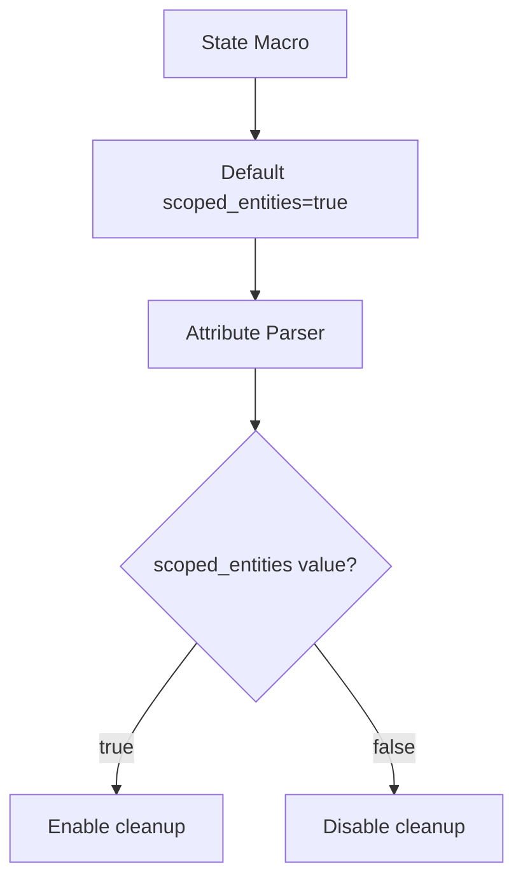

+++
title = "#19354 Enable state scoped entities by default"
date = "2025-05-26T00:00:00"
draft = false
template = "pull_request_page.html"
in_search_index = true

[taxonomies]
list_display = ["show"]

[extra]
current_language = "en"
available_languages = {"en" = { name = "English", url = "/pull_request/bevy/2025-05/pr-19354-en-20250526" }, "zh-cn" = { name = "中文", url = "/pull_request/bevy/2025-05/pr-19354-zh-cn-20250526" }}
labels = ["D-Straightforward", "A-States"]
+++

# Title: Enable state scoped entities by default

## Basic Information
- **Title**: Enable state scoped entities by default
- **PR Link**: https://github.com/bevyengine/bevy/pull/19354
- **Author**: mockersf
- **Status**: MERGED
- **Labels**: S-Ready-For-Final-Review, D-Straightforward, A-States
- **Created**: 2025-05-24T08:49:52Z
- **Merged**: 2025-05-26T21:00:43Z
- **Merged By**: alice-i-cecile

## Description Translation
# Objective

- Enable state scoped entities by default
- Provide a way to disable it when needed

## The Story of This Pull Request

### The Problem and Context
Before this PR, Bevy's state management required explicit opt-in for state-scoped entity cleanup. Developers needed to either:
1. Add `#[states(scoped_entities)]` attribute when deriving `States`
2. Call `app.enable_state_scoped_entities::<State>()` manually

This led to boilerplate code and potential errors when developers forgot to enable the feature. The manual setup was particularly problematic in larger codebases where multiple states required management.

### The Solution Approach
The PR flips the default behavior while maintaining backward compatibility:
1. Make state-scoped entities enabled by default for all types implementing `States`
2. Introduce a way to disable the feature via `#[states(scoped_entities = false)]`
3. Deprecate the explicit enablement methods
4. Update documentation and examples to reflect new defaults

### The Implementation
The core changes occur in the state macro implementation and API documentation:

**Macro Default Change** (`crates/bevy_state/macros/src/states.rs`):
```rust
// Before:
scoped_entities_enabled: false,

// After: 
scoped_entities_enabled: true,
```

**Attribute Parsing Update**:
```rust
if nested.path.is_ident(SCOPED_ENTITIES) {
    if let Ok(value) = nested.value() {
        attrs.scoped_entities_enabled = value.parse::<LitBool>()?.value();
    }
    Ok(())
}
```

This allows both enabling and disabling via the attribute:
- `#[states(scoped_entities)]` becomes invalid
- New syntax: `#[states(scoped_entities = false)]` to disable

**API Cleanup** (`crates/bevy_state/src/app.rs`):
```rust
// Before:
/// Enable state-scoped entity clearing for state `S`
fn enable_state_scoped_entities<S: States>(&mut self) -> &mut Self;

// After:
#[doc(hidden)]
fn enable_state_scoped_entities<S: States>(&mut self) -> &mut Self;
```

**Example Updates** removed all explicit enablement calls:
```rust
// Before in examples/ecs/state_scoped.rs:
.init_state::<GameState>()
.enable_state_scoped_entities::<GameState>()

// After:
.init_state::<GameState>()
```

### Technical Insights
1. **Backward Compatibility**: Existing code using `#[states(scoped_entities)]` breaks, but the migration guide provides clear upgrade path
2. **Attribute Evolution**: Transitions from a flag-style attribute to a key-value syntax while maintaining macro stability
3. **API Hygiene**: Deprecates redundant methods while keeping them for compatibility

### The Impact
- Reduces boilerplate for new state implementations
- Prevents accidental entity leakage between states
- Requires updates to existing codebases using explicit enablement
- Introduces clearer documentation about entity lifecycle management

## Visual Representation



## Key Files Changed

1. `release-content/migration-guides/state_scoped_entities_by_default.md` (+10/-0)
- New migration guide explaining the default change
- Provides upgrade instructions for existing users

2. `crates/bevy_state/macros/src/states.rs` (+5/-3)
```rust
// Before:
attrs.scoped_entities_enabled = false

// After:
attrs.scoped_entities_enabled = true
// With enhanced attribute parsing
```

3. `examples/ecs/state_scoped.rs` (+0/-1)
```rust
// Removed:
.enable_state_scoped_entities::<GameState>()
```

4. `crates/bevy_state/src/state_scoped.rs` (+1/-6)
- Updated documentation to reflect new defaults
- Removed references to explicit enablement

## Further Reading
- Bevy State Documentation: https://bevyengine.org/learn/book/features/state/
- Entity Component System Basics: https://bevyengine.org/learn/book/ecs/intro/
- State Transition Events: https://docs.rs/bevy/latest/bevy/state/struct.StateTransitionEvent.html