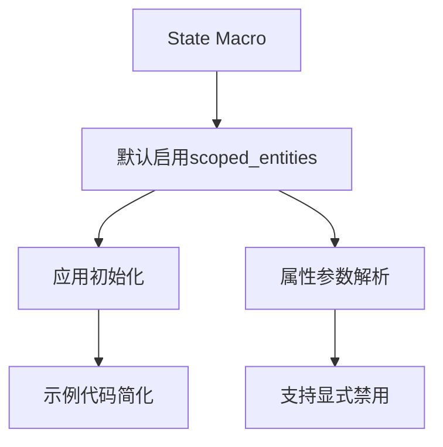

+++
title = "#19354 Enable state scoped entities by default"
date = "2025-05-26T00:00:00"
draft = false
template = "pull_request_page.html"
in_search_index = false

[extra]
current_language = "zh-cn"
available_languages = {"en" = { name = "English", url = "/pull_request/bevy/2025-05/pr-19354-en-20250526" }, "zh-cn" = { name = "中文", url = "/pull_request/bevy/2025-05/pr-19354-zh-cn-20250526" }}
labels = ["D-Straightforward", "A-States"]
+++

# Enable state scoped entities by default

## Basic Information
- **Title**: Enable state scoped entities by default
- **PR Link**: https://github.com/bevyengine/bevy/pull/19354
- **Author**: mockersf
- **Status**: MERGED
- **Labels**: S-Ready-For-Final-Review, D-Straightforward, A-States
- **Created**: 2025-05-24T08:49:52Z
- **Merged**: 2025-05-26T21:00:43Z
- **Merged By**: alice-i-cecile

## Description Translation
### 目标
- 默认启用状态作用域实体（state scoped entities）
- 提供需要时禁用的方法

## The Story of This Pull Request

### 问题背景与改进动机
在Bevy状态管理系统中，状态作用域实体（state scoped entities）功能允许自动清理与特定状态关联的实体。原实现要求开发者显式启用该功能：既需要在状态枚举上添加`#[states(scoped_entities)]`属性，又要在应用初始化时调用`enable_state_scoped_entities`方法。这种双重操作增加了使用复杂度，且容易遗漏导致功能未生效。

### 解决方案与技术实现
PR的核心策略是将该功能设为默认启用，同时保留禁用选项。主要修改点包括：

1. **宏属性默认值调整**  
在`bevy_state/macros/src/states.rs`中，将`scoped_entities_enabled`的默认值从`false`改为`true`，并支持通过`#[states(scoped_entities = false)]`显式禁用：
```rust
// Before:
attrs.scoped_entities_enabled = false;

// After:
attrs.scoped_entities_enabled = true;
// 支持属性值解析
if let Ok(value) = nested.value() {
    attrs.scoped_entities_enabled = value.parse::<LitBool>()?.value();
}
```

2. **API清理与文档更新**  
- 将`enable_state_scoped_entities`标记为`#[doc(hidden)]`，提示用户不再需要手动调用
- 更新文档说明，强调默认启用特性：
```rust
/// This is enabled by default. If you don't want this behavior, add the 
/// `#[states(scoped_entities = false)]` attribute when deriving the [`States`] trait.
```

3. **示例代码简化**  
移除所有示例中显式的`enable_state_scoped_entities`调用，共涉及5个示例文件：
```rust
// 示例修改前：
app.init_state::<GameState>();
app.enable_state_scoped_entities::<GameState>();

// 示例修改后：
app.init_state::<GameState>();
```

### 技术影响与最佳实践
- **开发者体验提升**：减少样板代码，默认行为更符合常见使用场景
- **向后兼容处理**：通过迁移指南（migration guide）指导现有用户升级：
```markdown
If you were previously adding the `#[states(scoped_entities)]` attribute, you can remove it.
To keep previous behavior: add `#[states(scoped_entities = false)]`
```
- **性能考量**：保持原有实体清理机制，未引入额外运行时开销

## Visual Representation



## Key Files Changed

### `crates/bevy_state/macros/src/states.rs`
- 修改默认启用状态作用域实体
- 添加属性值解析支持
```rust
// 修改后：
attrs.scoped_entities_enabled = true;
if let Ok(value) = nested.value() {
    attrs.scoped_entities_enabled = value.parse::<LitBool>()?.value();
}
```

### `crates/bevy_state/src/app.rs`
- 标记废弃API为文档隐藏
- 更新文档说明
```rust
#[doc(hidden)]
fn enable_state_scoped_entities<S: States>(&mut self) -> &mut Self;
```

### `examples/state/computed_states.rs`
- 移除多余的enable调用
```rust
// 修改前：
.enable_state_scoped_entities::<IsPaused>()

// 修改后：完全移除该行
```

### `release-content/migration-guides/state_scoped_entities_by_default.md`
- 新增迁移指南
```markdown
If you want to keep previous behavior:
add `#[states(scoped_entities = false)]`
```

## Further Reading
1. [Bevy状态管理文档](https://bevyengine.org/learn/book/features/states/)
2. [实体组件系统（ECS）模式](https://en.wikipedia.org/wiki/Entity_component_system)
3. [Rust属性宏开发指南](https://doc.rust-lang.org/reference/procedural-macros.html)