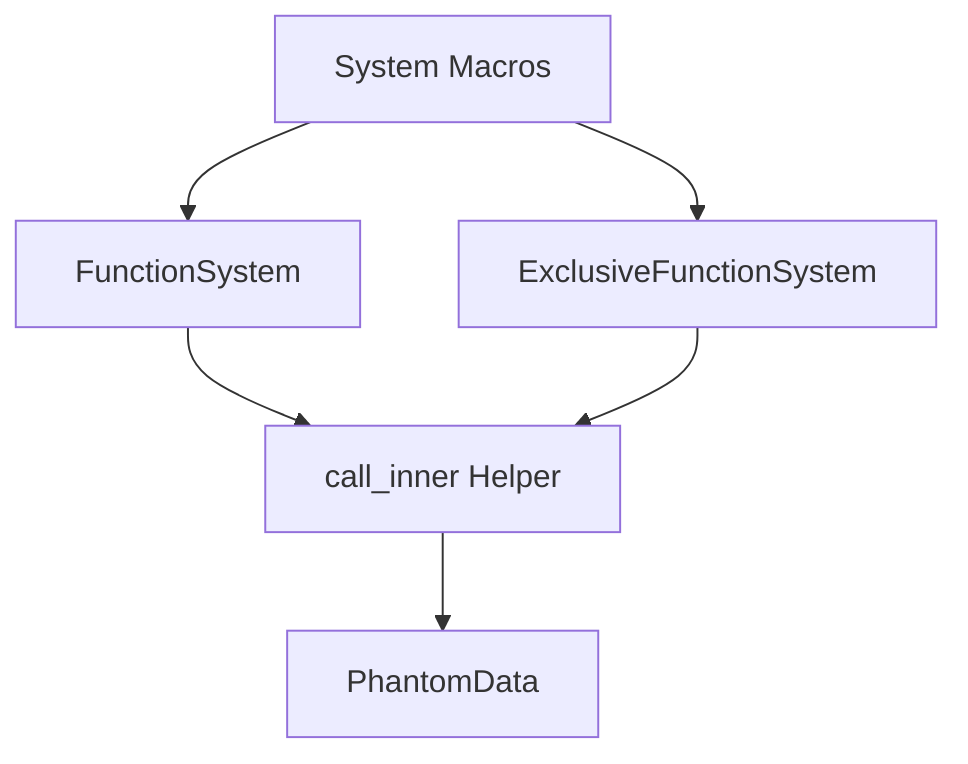

+++
title = "#19360 Backport to 0.15: Remove Reliance on a Trait Solver Bug"
date = "2025-05-25T00:00:00"
draft = false
template = "pull_request_page.html"
in_search_index = true

[taxonomies]
list_display = ["show"]

[extra]
current_language = "en"
available_languages = {"en" = { name = "English", url = "/pull_request/bevy/2025-05/pr-19360-en-20250525" }, "zh-cn" = { name = "中文", url = "/pull_request/bevy/2025-05/pr-19360-zh-cn-20250525" }}
+++

# Title: Backport to 0.15: Remove Reliance on a Trait Solver Bug

## Basic Information
- **Title**: backport to 0.15: remove reliance on a trait solver bug
- **PR Link**: https://github.com/bevyengine/bevy/pull/19360
- **Author**: lcnr
- **Status**: MERGED
- **Labels**: None
- **Created**: 2025-05-25T10:39:57Z
- **Merged**: 2025-05-25T14:26:15Z
- **Merged By**: mockersf

## Description Translation
A backport of https://github.com/bevyengine/bevy/pull/18840 to version 0.15.3. I was unsure whether I should also update the versions of all crates. Looking at previous backports this was not done.

The code which relies on the old solver behavior was introduced in https://github.com/bevyengine/bevy/pull/15184 which is from version 0.15. So this is the only version which needs a backport.

cc @mockersf

## The Story of This Pull Request

This PR addresses a subtle type inference issue in Bevy's ECS system macros that relied on a specific behavior of Rust's trait solver which was considered a bug. The original implementation worked accidentally due to this compiler behavior, but needed correction to maintain compatibility with current and future Rust versions.

The core issue stemmed from how the system macros handled generic type parameters. In both regular and exclusive function systems, the `call_inner` helper function required explicit type information about the system input (`In` type) to properly resolve trait implementations. The original code omitted this type guidance, relying instead on the trait solver's buggy behavior to infer the correct types.

The solution introduces `PhantomData<In>` as a mechanism to explicitly propagate type information through the call stack. This pattern is commonly used in Rust when type parameters need to be maintained in generic contexts without runtime values. By adding this type marker:

1. The `call_inner` function signature now includes a `PhantomData<In>` parameter
2. The macro expansion passes `PhantomData::<In>` when invoking `call_inner`

This change ensures proper type resolution without relying on compiler internals, making the code more robust against changes in Rust's trait solver implementation.

## Visual Representation



## Key Files Changed

1. `crates/bevy_ecs/src/system/exclusive_function_system.rs`
```rust
// Before:
fn call_inner<In: SystemInput, Out, $($param,)*>(
    mut f: impl FnMut(...),
    ...
) {
    // Implementation
}

// After:
fn call_inner<In: SystemInput, Out, $($param,)*>(
    _: PhantomData<In>,
    mut f: impl FnMut(...),
    ...
) {
    // Implementation
}
```
Added `PhantomData<In>` parameter to guide type inference in exclusive systems.

2. `crates/bevy_ecs/src/system/function_system.rs`
```rust
// Before:
fn call_inner<In: SystemInput, Out, $($param,)*>(
    mut f: impl FnMut(...),
    ...
)

// After:
fn call_inner<In: SystemInput, Out, $($param,)*>(
    _: PhantomData<In>,
    mut f: impl FnMut(...),
    ...
)
```
Similar change for regular function systems to ensure consistent type handling.

## Further Reading

- Rust PhantomData documentation: https://doc.rust-lang.org/std/marker/struct.PhantomData.html
- Bevy ECS System Documentation: https://bevyengine.org/learn/book/ecs/system-params/
- Rust Trait Solver Overview: https://rustc-dev-guide.rust-lang.org/traits/resolution.html

## Full Code Diff
[As provided in original request]