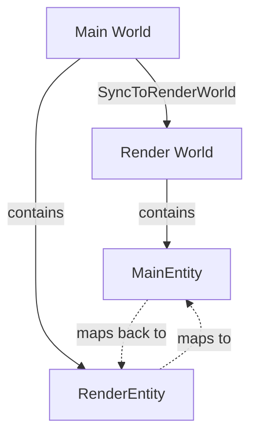

+++
title = "#19361 Register some types"
date = "2025-05-26T00:00:00"
draft = false
template = "pull_request_page.html"
in_search_index = true

[taxonomies]
list_display = ["show"]

[extra]
current_language = "en"
available_languages = {"en" = { name = "English", url = "/pull_request/bevy/2025-05/pr-19361-en-20250526" }, "zh-cn" = { name = "中文", url = "/pull_request/bevy/2025-05/pr-19361-zh-cn-20250526" }}
labels = ["C-Usability", "A-Reflection"]
+++

# Title

## Basic Information
- **Title**: Register some types
- **PR Link**: https://github.com/bevyengine/bevy/pull/19361
- **Author**: benfrankel
- **Status**: MERGED
- **Labels**: C-Usability, S-Ready-For-Final-Review, A-Reflection
- **Created**: 2025-05-25T19:47:08Z
- **Merged**: 2025-05-26T02:49:00Z
- **Merged By**: alice-i-cecile

## Description Translation
# Objective

Fill in some `Reflect` and `app.register_type` gaps.

I only really wanted `GlobalZIndex` but figured I'd fill in a few others as well.

## The Story of This Pull Request

The PR addresses missing type registrations in Bevy's reflection system, focusing on components critical for entity synchronization between the main world and render world. While the primary motivation was to register `GlobalZIndex` for UI rendering order control, the author took the opportunity to fix several other oversight gaps in type registration.

In Bevy's ECS architecture, type registration through `app.register_type<T>()` enables reflection capabilities for serialization, inspector tools, and dynamic system operations. The unregistered types caused limitations in these scenarios. The changes follow Bevy's established patterns for reflection setup while maintaining strict component synchronization requirements between worlds.

The implementation demonstrates three key technical patterns:

1. **Reflect trait derivation** for component types:
```rust
#[derive(Component, ..., Reflect)]
#[reflect(Component, Clone)]
```

2. **Type registration** in plugin initialization:
```rust
app.register_type::<RenderEntity>()
```

3. **Cross-world entity tracking** through paired components:
- `RenderEntity` (main world -> render world mapping)
- `MainEntity` (render world -> main world mapping)

These changes required careful maintenance of the component synchronization invariants between the main and render worlds. The `Clone` reflection capability was explicitly added where appropriate to support entity duplication scenarios while preserving the strict 1:1 entity mapping constraints.

## Visual Representation



## Key Files Changed

1. `crates/bevy_render/src/sync_world.rs` (+4/-2)
```rust
// Before:
#[derive(Component, Deref, Copy, Clone, Debug, Eq, Hash, PartialEq)]
pub struct RenderEntity(Entity);

// After:
#[derive(Component, Deref, Copy, Clone, Debug, Eq, Hash, PartialEq, Reflect)]
#[reflect(Component, Clone)]
pub struct RenderEntity(Entity);
```

Added `Reflect` derivation and reflection attributes to enable component inspection and cloning.

2. `crates/bevy_render/src/lib.rs` (+5/-1)
```rust
impl Plugin for RenderPlugin {
    fn build(&self, app: &mut App) {
        app.register_type::<RenderEntity>()
            .register_type::<TemporaryRenderEntity>()
            .register_type::<MainEntity>()
            .register_type::<SyncToRenderWorld>();
    }
}
```
Registered core synchronization types in the render plugin's initialization.

3. `crates/bevy_ui/src/lib.rs` (+1/-0)
```rust
fn build(&self, app: &mut App) {
    app.register_type::<GlobalZIndex>();
}
```
Added missing registration for UI depth ordering component.

## Further Reading

- Bevy Reflection System: https://bevyengine.org/learn/book/features/reflection/
- Entity Synchronization Patterns: https://bevyengine.org/learn/advanced-topics/rendering/entity-sync/
- Type Registration API Docs: https://docs.rs/bevy_reflect/latest/bevy_reflect/struct.TypeRegistry.html