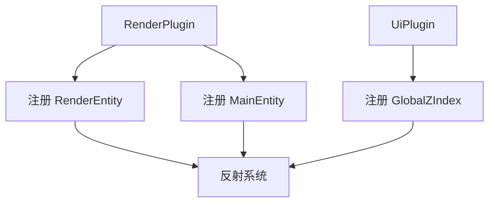

+++
title = "#19361 Register some types"
date = "2025-05-26T00:00:00"
draft = false
template = "pull_request_page.html"
in_search_index = false

[extra]
current_language = "zh-cn"
available_languages = {"en" = { name = "English", url = "/pull_request/bevy/2025-05/pr-19361-en-20250526" }, "zh-cn" = { name = "中文", url = "/pull_request/bevy/2025-05/pr-19361-zh-cn-20250526" }}
labels = ["C-Usability", "A-Reflection"]
+++

# Register some types

## Basic Information
- **Title**: Register some types
- **PR Link**: https://github.com/bevyengine/bevy/pull/19361
- **Author**: benfrankel
- **Status**: MERGED
- **Labels**: C-Usability, S-Ready-For-Final-Review, A-Reflection
- **Created**: 2025-05-25T19:47:08Z
- **Merged**: 2025-05-26T02:49:00Z
- **Merged By**: alice-i-cecile

## Description Translation
# 目的

补充一些 `Reflect` 和 `app.register_type` 的缺失注册。

最初只需要 `GlobalZIndex`，但决定补充其他几个类型的注册。

## The Story of This Pull Request

### 问题与背景
Bevy 的反射系统（Reflection System）需要显式注册类型才能支持运行时类型检查、序列化等特性。在现有代码中，部分核心类型如 `RenderEntity`、`MainEntity` 和 `GlobalZIndex` 缺少必要的反射支持，这会导致：
1. 使用反射的编辑器工具无法识别这些类型
2. 动态序列化/反序列化功能受限
3. 基于反射的 ECS 查询无法正常工作

### 解决方案
开发者采用标准反射注册模式：
1. 为类型添加 `Reflect` derive 宏
2. 补充类型元数据（如 `Component` trait 的反射支持）
3. 在对应 Plugin 的 `build` 方法中调用 `register_type`

### 关键实现
**1. 渲染世界同步组件注册**
在 `bevy_render/src/sync_world.rs` 中增强核心同步组件：
```rust
// 修改前
#[derive(Component, Deref, Copy, Clone, Debug, Eq, Hash, PartialEq)]
pub struct RenderEntity(Entity);

// 修改后
#[derive(Component, Deref, Copy, Clone, Debug, Eq, Hash, PartialEq, Reflect)]
#[reflect(Component, Clone)]
pub struct RenderEntity(Entity);
```
通过 `Reflect` derive 和 `reflect` 属性宏，为组件添加反射元数据，支持克隆行为和组件特性的反射。

**2. 类型注册集中化**
在渲染插件入口统一注册相关类型：
```rust
// crates/bevy_render/src/lib.rs
app.register_type::<RenderEntity>()
   .register_type::<TemporaryRenderEntity>()
   .register_type::<MainEntity>()
   .register_type::<SyncToRenderWorld>();
```
这种集中注册模式符合 Bevy 的插件架构设计，确保类型在系统初始化阶段完成注册。

**3. UI 层级控制补充**
在 UI 模块注册全局 Z 轴排序类型：
```rust
// crates/bevy_ui/src/lib.rs
app.register_type::<ZIndex>()
   .register_type::<GlobalZIndex>();
```
使 `GlobalZIndex` 类型可用于 UI 元素的动态层级控制。

### 技术影响
1. **反射系统完整性**：修复了核心同步组件和 UI 组件的反射支持缺失问题
2. **跨世界实体映射**：`RenderEntity` 和 `MainEntity` 的反射支持为调试工具提供了实体映射可见性
3. **架构一致性**：遵循 Bevy 的标准反射实践，降低后续维护成本

### 工程考量
- **最小化变更**：仅添加必要宏和注册调用，避免引入额外复杂度
- **特征选择**：为 `RenderEntity` 添加 `Clone` 反射支持，考虑到该类型在实体克隆场景的使用需求
- **注册位置选择**：将同步相关类型的注册放在渲染插件，保持模块化设计

## Visual Representation



## Key Files Changed

1. **crates/bevy_render/src/lib.rs**
- 添加四个核心类型的反射注册
- 影响：确保渲染世界同步组件可被反射系统识别

```rust
// 修改后注册代码
app.register_type::<primitives::CascadesFrusta>()
   .register_type::<primitives::CubemapFrusta>()
   .register_type::<primitives::Frustum>()
   .register_type::<RenderEntity>()
   .register_type::<TemporaryRenderEntity>()
   .register_type::<MainEntity>()
   .register_type::<SyncToRenderWorld>();
```

2. **crates/bevy_render/src/sync_world.rs**
- 为同步组件添加反射支持
- 影响：实现跨世界实体的反射操作能力

```rust
// RenderEntity 修改后
#[derive(Component, Deref, Copy, Clone, Debug, Eq, Hash, PartialEq, Reflect)]
#[reflect(Component, Clone)]
pub struct RenderEntity(Entity);
```

3. **crates/bevy_ui/src/lib.rs**
- 注册 GlobalZIndex 类型
- 影响：支持 UI 层级系统的动态调整

```rust
// 新增注册
.register_type::<GlobalZIndex>()
```

## Further Reading
1. [Bevy Reflection 官方文档](https://bevyengine.org/learn/book/reflection/)
2. [Rust 过程宏开发指南](https://doc.rust-lang.org/reference/procedural-macros.html)
3. [ECS 架构中的跨世界通信模式](https://github.com/bevyengine/bevy/discussions/1930)