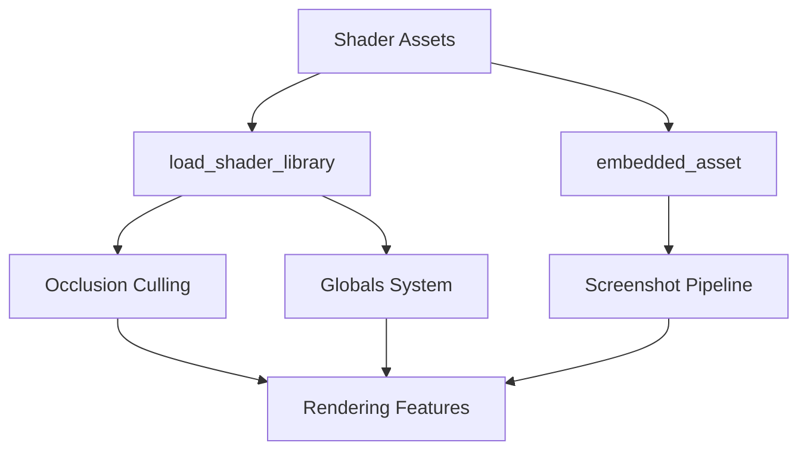

+++
title = "#19362 Remove Shader weak_handles from bevy_render"
date = "2025-05-26T00:00:00"
draft = false
template = "pull_request_page.html"
in_search_index = true

[taxonomies]
list_display = ["show"]

[extra]
current_language = "en"
available_languages = {"en" = { name = "English", url = "/pull_request/bevy/2025-05/pr-19362-en-20250526" }, "zh-cn" = { name = "中文", url = "/pull_request/bevy/2025-05/pr-19362-zh-cn-20250526" }}
labels = ["A-Rendering", "A-Assets", "D-Straightforward"]
+++

# Title: Remove Shader weak_handles from bevy_render

## Basic Information
- **Title**: Remove Shader weak_handles from bevy_render
- **PR Link**: https://github.com/bevyengine/bevy/pull/19362
- **Author**: andriyDev
- **Status**: MERGED
- **Labels**: A-Rendering, A-Assets, S-Ready-For-Final-Review, D-Straightforward
- **Created**: 2025-05-25T20:53:25Z
- **Merged**: 2025-05-26T21:00:02Z
- **Merged By**: alice-i-cecile

## Description Translation
# Objective

- Related to #19024

## Solution

- Use the new `load_shader_library` macro for the shader libraries and `embedded_asset`/`load_embedded_asset` for the "shader binaries" in bevy_render.

## Testing

- `animate_shader` example still works

P.S. I don't think this needs a migration guide. Technically users could be using the `pub` weak handles, but there's no actual good use for them, so omitting it seems fine. Alternatively, we could mix this in with the migration guide notes for #19137.

## The Story of This Pull Request

This PR addresses technical debt in Bevy's shader asset management by modernizing how internal shaders are loaded. The core issue stemmed from using legacy weak handle patterns for shader assets, which complicated asset management and created unnecessary public exposure of implementation details.

The solution leverages two key improvements from recent Bevy asset system enhancements:
1. `load_shader_library!` macro for WGSL type definitions
2. `embedded_asset` system for binary shader resources

In the occlusion culling implementation, we see a typical pattern change:
```rust
// Before: Manual weak handle management
pub const MESH_PREPROCESS_TYPES_SHADER_HANDLE: Handle<Shader> = 
    weak_handle!("7bf7bdb1-ec53-4417-987f-9ec36533287c");

load_internal_asset!(
    app,
    MESH_PREPROCESS_TYPES_SHADER_HANDLE,
    "mesh_preprocess_types.wgsl",
    Shader::from_wgsl
);

// After: Macro-based management
load_shader_library!(app, "mesh_preprocess_types.wgsl");
```

This change eliminates manual UUID handling and reduces boilerplate while maintaining type safety. The `load_shader_library` macro internally handles asset registration and type system integration, making the code more maintainable.

For screenshot functionality, the implementation shifted to embedded assets:
```rust
// Before: Weak handle declaration
const SCREENSHOT_SHADER_HANDLE: Handle<Shader> =
    weak_handle!("c31753d6-326a-47cb-a359-65c97a471fda");

// After: Embedded asset loading
embedded_asset!(app, "screenshot.wgsl");
let shader = load_embedded_asset!(render_world, "screenshot.wgsl");
```

This change centralizes shader asset management and ensures proper lifetime management through Bevy's asset system. The pipeline now explicitly loads the shader through standard asset paths rather than relying on global weak handles.

Key technical considerations included:
1. Maintaining backwards compatibility with existing examples
2. Ensuring proper shader dependency management
3. Removing public exposure of internal asset handles
4. Leveraging type system improvements from recent Bevy versions

The changes affect multiple rendering subsystems but maintain strict functional equivalence, verified by the preserved behavior of the animate_shader example. This refactoring simplifies future maintenance by:
- Reducing manual asset handle management
- Eliminating UUID-based asset identifiers
- Standardizing shader loading patterns
- Improving asset lifetime management

## Visual Representation



## Key Files Changed

1. `crates/bevy_render/src/experimental/occlusion_culling/mod.rs` (+2/-13)
```rust
// Removed weak handle declaration
- pub const MESH_PREPROCESS_TYPES_SHADER_HANDLE: Handle<Shader> = 
-    weak_handle!("7bf7bdb1-ec53-4417-987f-9ec36533287c");

// Simplified asset loading
- load_internal_asset!(...);
+ load_shader_library!(app, "mesh_preprocess_types.wgsl");
```

2. `crates/bevy_render/src/view/window/screenshot.rs` (+11/-13)
```rust
// Transition to embedded assets
- load_internal_asset!(app, SCREENSHOT_SHADER_HANDLE, ...);
+ embedded_asset!(app, "screenshot.wgsl");

// Pipeline now loads shader explicitly
+ let shader = load_embedded_asset!(render_world, "screenshot.wgsl");
- shader: SCREENSHOT_SHADER_HANDLE
+ shader: self.shader.clone()
```

3. `crates/bevy_render/src/globals.rs` (+2/-6)
```rust
// Simplified global shader loading
- load_internal_asset!(app, GLOBALS_TYPE_HANDLE, ...);
+ load_shader_library!(app, "globals.wgsl");
```

4. `crates/bevy_render/src/view/mod.rs` (+2/-5)
```rust
// Removed view-specific handle
- pub const VIEW_TYPE_HANDLE: Handle<Shader> = ...;
+ load_shader_library!(app, "view.wgsl");
```

## Further Reading

1. [Bevy Asset System Documentation](https://bevyengine.org/learn/book/assets/)
2. [WGSL Shader Programming Guide](https://bevyengine.org/learn/book/shader/)
3. [Bevy's Internal Asset Handling Patterns](https://github.com/bevyengine/bevy/wiki/Internal-Asset-Handling)
4. [PR #19137 Migration Guide](https://github.com/bevyengine/bevy/pull/19137) (Related asset system changes)