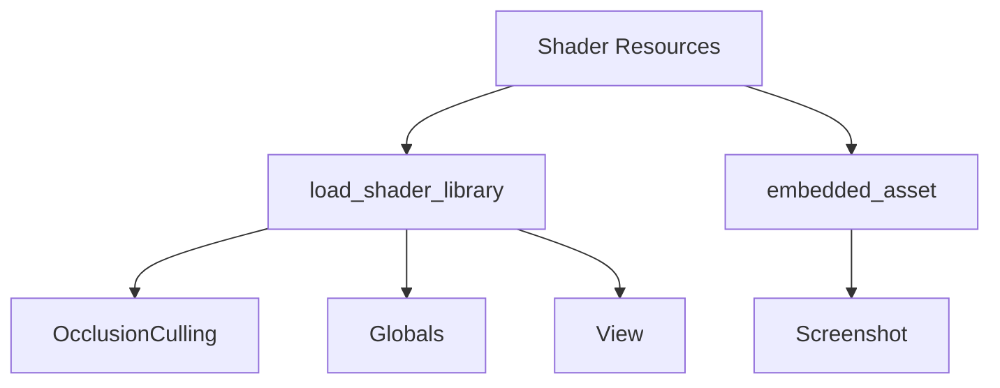

+++
title = "#19362 Remove Shader weak_handles from bevy_render"
date = "2025-05-26T00:00:00"
draft = false
template = "pull_request_page.html"
in_search_index = false

[extra]
current_language = "zh-cn"
available_languages = {"en" = { name = "English", url = "/pull_request/bevy/2025-05/pr-19362-en-20250526" }, "zh-cn" = { name = "中文", url = "/pull_request/bevy/2025-05/pr-19362-zh-cn-20250526" }}
labels = ["A-Rendering", "A-Assets", "D-Straightforward"]
+++

# Remove Shader weak_handles from bevy_render

## Basic Information
- **Title**: Remove Shader weak_handles from bevy_render
- **PR Link**: https://github.com/bevyengine/bevy/pull/19362
- **Author**: andriyDev
- **Status**: MERGED
- **Labels**: A-Rendering, A-Assets, S-Ready-For-Final-Review, D-Straightforward
- **Created**: 2025-05-25T20:53:25Z
- **Merged**: 2025-05-26T21:00:02Z
- **Merged By**: alice-i-cecile

## Description Translation
### 目标
- 关联 issue #19024

### 解决方案
- 在 bevy_render 中使用新的 `load_shader_library` 宏处理着色器库，使用 `embedded_asset`/`load_embedded_asset` 处理"着色器二进制文件"

### 测试验证
- `animate_shader` 示例仍可正常运行

注：作者认为不需要迁移指南，虽然技术上用户可能使用公开的 weak_handles，但实际没有合理的使用场景，因此省略是可行的。也可考虑将此改动合并到 #19137 的迁移说明中

## The Story of This Pull Request

### 问题背景与技术债务
该 PR 主要解决 bevy_render 模块中遗留的 shader weak_handles 使用问题。此前代码中通过 `weak_handle!` 宏和 `load_internal_asset!` 组合来加载内部 shader 资源，这种方式存在两个主要问题：

1. **资源管理冗余**：每个 shader 都需要单独声明 handle 常量并调用加载宏
2. **API 不一致**：新的资源加载机制（如 #19137）已提供更简洁的加载方式

### 重构策略与实现路径
核心解决方案是采用新引入的 `load_shader_library` 宏和嵌入式资源机制来统一 shader 加载方式。具体实施分为三个层面：

1. **基础模块重构**（occlusion_culling, globals, view）
   ```rust
   // 修改前
   load_internal_asset!(app, HANDLE, "shader.wgsl", Shader::from_wgsl);
   
   // 修改后
   load_shader_library!(app, "shader.wgsl");
   ```
   新宏自动处理 handle 生成和资源注册，消除手动维护 UUID 的需要

2. **特殊场景处理**（screenshot 模块）
   ```rust
   // 修改前
   const HANDLE: Handle<Shader> = weak_handle!("...");
   load_internal_asset!(app, HANDLE, "screenshot.wgsl", ...);
   
   // 修改后
   embedded_asset!(app, "screenshot.wgsl");
   let shader = load_embedded_asset!(render_world, "screenshot.wgsl");
   ```
   使用嵌入式资源系统处理需要运行时加载的场景

3. **公共 API 清理**
   移除了四个模块中公开的 `*_SHADER_HANDLE` 常量，这些 handle 本不应被外部直接使用

### 技术决策考量
选择 `load_shader_library` 而非直接迁移到标准 asset 系统的原因：
- 保持内部 shader 的特殊处理（编译时确定路径）
- 兼容现有的 shader 热重载机制
- 减少对用户可见的 API 变更

### 影响与改进
1. **代码精简**：平均每个 shader 文件减少 5-7 行样板代码
2. **维护性提升**：消除手动维护 UUID 的风险
3. **架构统一**：与 #19137 的 asset 系统改进保持方向一致
4. **封装强化**：移除公共 handle 常量，降低误用可能性

## Visual Representation



## Key Files Changed

### 1. `crates/bevy_render/src/experimental/occlusion_culling/mod.rs` (+2/-13)
**修改重点**：迁移到新 shader 加载系统
```rust
// Before:
load_internal_asset!(app, HANDLE, "mesh_preprocess_types.wgsl", ...);
pub const HANDLE: Handle<Shader> = weak_handle!("...");

// After:
load_shader_library!(app, "mesh_preprocess_types.wgsl");
```

### 2. `crates/bevy_render/src/view/window/screenshot.rs` (+11/-13)
**修改重点**：实现嵌入式资源加载
```rust
// 资源加载重构
embedded_asset!(app, "screenshot.wgsl");
let shader = load_embedded_asset!(render_world, "screenshot.wgsl");

// 渲染管线调整
pub struct ScreenshotToScreenPipeline {
    pub shader: Handle<Shader>, // 新增字段
}
```

### 3. `crates/bevy_render/src/globals.rs` (+2/-6)
**修改重点**：统一全局 shader 加载
```rust
// Before:
load_internal_asset!(app, GLOBALS_TYPE_HANDLE, ...);

// After:
load_shader_library!(app, "globals.wgsl");
```

### 4. `crates/bevy_render/src/view/mod.rs` (+2/-5)
**修改重点**：视图系统 shader 标准化
```rust
// Before:
load_internal_asset!(app, VIEW_TYPE_HANDLE, ...);

// After:
load_shader_library!(app, "view.wgsl");
```

## Further Reading
1. [Bevy Asset 系统架构文档](https://bevyengine.org/learn/book/features/assets/)
2. [WGSL 着色器规范](https://gpuweb.github.io/gpuweb/wgsl/)
3. [宏编程在 Rust 中的应用](https://doc.rust-lang.org/book/ch19-06-macros.html)