+++
title = "#19365 Remove Shader weak_handles from bevy_pbr (excluding meshlets)"
date = "2025-05-27T00:00:00"
draft = false
template = "pull_request_page.html"
in_search_index = true

[taxonomies]
list_display = ["show"]

[extra]
current_language = "en"
available_languages = {"en" = { name = "English", url = "/pull_request/bevy/2025-05/pr-19365-en-20250527" }, "zh-cn" = { name = "中文", url = "/pull_request/bevy/2025-05/pr-19365-zh-cn-20250527" }}
labels = ["A-Rendering", "A-Assets", "D-Straightforward"]
+++

# Title

## Basic Information
- **Title**: Remove Shader weak_handles from bevy_pbr (excluding meshlets)
- **PR Link**: https://github.com/bevyengine/bevy/pull/19365
- **Author**: andriyDev
- **Status**: MERGED
- **Labels**: A-Rendering, A-Assets, S-Ready-For-Final-Review, D-Straightforward
- **Created**: 2025-05-25T22:19:51Z
- **Merged**: 2025-05-27T22:53:47Z
- **Merged By**: alice-i-cecile

## Description Translation
The original description remains in English as per instructions:

# Objective

- Related to #19024

## Solution

- Use the new `load_shader_library` macro for the shader libraries and `embedded_asset`/`load_embedded_asset` for the "shader binaries" in `bevy_pbr` (excluding meshlets).

## Testing

- `atmosphere` example still works
- `fog` example still works
- `decal` example still works

P.S. I don't think this needs a migration guide. Technically users could be using the `pub` weak handles, but there's no actual good use for them, so omitting it seems fine. Alternatively, we could mix this in with the migration guide notes for #19137.

## The Story of This Pull Request

### The Problem and Context
The Bevy engine's rendering system previously managed shader assets using manually generated weak handles through the `weak_handle!` macro. This approach required maintaining UUIDs for each shader and explicit `load_internal_asset!` calls, leading to:

1. Boilerplate code for shader registration
2. Fragile asset management with hardcoded UUIDs
3. Difficulty in tracking shader dependencies
4. Inconsistent patterns between shader libraries and standalone assets

### The Solution Approach
The PR migrates to Bevy's newer asset infrastructure with two key changes:

1. **Shader Libraries**: Uses `load_shader_library!` for shared utility shaders
2. **Embedded Assets**: Uses `embedded_asset!`/`load_embedded_asset!` for main shader files

Key engineering decisions:
- Maintain backward compatibility with existing examples
- Avoid public API changes by keeping shader handles internal
- Leverage Bevy's improved asset pipeline for better dependency tracking

### The Implementation
The changes systematically replace weak handle declarations and manual loading with the new macros. For example in `atmosphere/mod.rs`:

**Before:**
```rust
mod shaders {
    use bevy_asset::{weak_handle, Handle};
    use bevy_render::render_resource::Shader;
    
    pub const TYPES: Handle<Shader> = weak_handle!("ef7e147e-30a0-4513-bae3-ddde2a6c20c5");
    // ... 9 other handle declarations
}

// Manual loading for each shader
load_internal_asset!(app, shaders::TYPES, "types.wgsl", Shader::from_wgsl);
// ... 8 more load_internal_asset calls
```

**After:**
```rust
load_shader_library!(app, "types.wgsl");
load_shader_library!(app, "functions.wgsl");
// ... 3 more library declarations

embedded_asset!(app, "transmittance_lut.wgsl");
// ... 4 more embedded assets
```

### Technical Insights
1. **Asset Pipeline Improvements**:
   - `load_shader_library!` handles shared utility shaders used across multiple systems
   - `embedded_asset!` embeds shader source directly in the binary, reducing runtime file I/O

2. **Code Organization**:
   - Reduces per-shader boilerplate from ~5 lines to 1
   - Groups related shaders into logical libraries (e.g., `mesh_view_types.wgsl`)

3. **Memory Management**:
   - Removes 150+ lines of weak handle declarations
   - Eliminates UUID collision risks

### The Impact
- **Maintainability**: Centralized shader management through macros
- **Performance**: Embedded assets enable faster startup times
- **Code Quality**: Reduces total codebase size by ~500 lines
- **Future-Proofing**: Aligns with Bevy's evolving asset system

## Visual Representation

```mermaid
graph TD
    A[Shader Management] --> B[load_shader_library]
    A --> C[embedded_asset]
    B --> D[Utility Shaders]
    C --> E[Main Shaders]
    D --> F[Multiple Systems]
    E --> G[Specific Features]
```



## Key Files Changed

### `crates/bevy_pbr/src/atmosphere/mod.rs` (+13/-67)
**Change**: Migrated atmospheric scattering shaders to new asset system  
**Before:**
```rust
mod shaders {
    // 10 weak handle declarations
}
// 9 load_internal_asset! calls
```

**After:**
```rust
load_shader_library!(app, "types.wgsl");
embedded_asset!(app, "transmittance_lut.wgsl");
```

### `crates/bevy_pbr/src/render/mesh.rs` (+33/-65)
**Change**: Updated core mesh shader handling  
**Key Modification:**
```rust
// Before:
load_internal_asset!(app, MESH_VIEW_TYPES_HANDLE, "mesh_view_types.wgsl", ...);

// After:
load_shader_library!(app, "mesh_view_types.wgsl", |settings| ...);
embedded_asset!(app, "mesh.wgsl");
```

### `crates/bevy_pbr/src/prepass/mod.rs` (+12/-43)
**Change**: Unified prepass shader loading  
**Impact**: Consolidated 4 separate shader loads into 3 library declarations + 1 embedded asset

### `crates/bevy_pbr/src/ssao/mod.rs` (+14/-31)
**Change**: Migrated SSAO shaders to embedded assets  
**Before/After Comparison:**
```rust
// Removed:
load_internal_asset!(app, PREPROCESS_DEPTH_SHADER_HANDLE, ...);

// Added:
embedded_asset!(app, "preprocess_depth.wgsl");
```

## Further Reading
1. [Bevy Asset System Documentation](https://bevyengine.org/learn/book/assets/)
2. [WGSL Shader Programming Guide](https://bevyengine.org/learn/book/shader-guide/)
3. [Bevy Macro System Overview](https://bevyengine.org/learn/book/macros/)