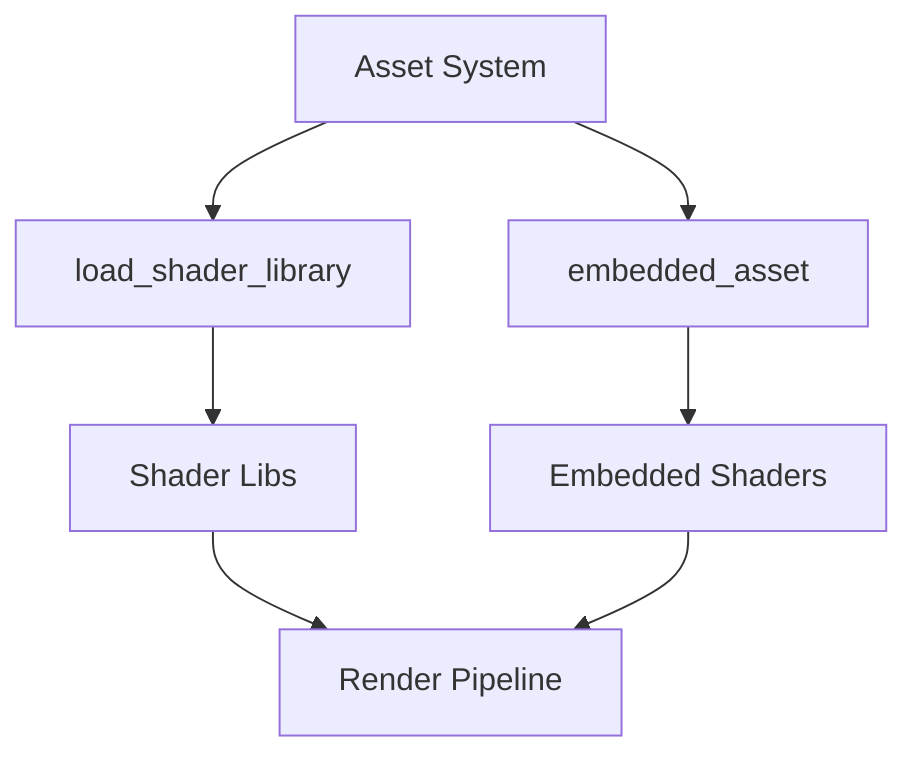

+++
title = "#19365 Remove Shader weak_handles from bevy_pbr (excluding meshlets)"
date = "2025-05-27T00:00:00"
draft = false
template = "pull_request_page.html"
in_search_index = false

[extra]
current_language = "zh-cn"
available_languages = {"en" = { name = "English", url = "/pull_request/bevy/2025-05/pr-19365-en-20250527" }, "zh-cn" = { name = "中文", url = "/pull_request/bevy/2025-05/pr-19365-zh-cn-20250527" }}
labels = ["A-Rendering", "A-Assets", "D-Straightforward"]
+++

# Remove Shader weak_handles from bevy_pbr (excluding meshlets)

## Basic Information
- **Title**: Remove Shader weak_handles from bevy_pbr (excluding meshlets)
- **PR Link**: https://github.com/bevyengine/bevy/pull/19365
- **Author**: andriyDev
- **Status**: MERGED
- **Labels**: A-Rendering, A-Assets, S-Ready-For-Final-Review, D-Straightforward
- **Created**: 2025-05-25T22:19:51Z
- **Merged**: 2025-05-27T22:53:47Z
- **Merged By**: alice-i-cecile

## Description Translation
### 目标
- 关联 #19024

### 解决方案
- 在 `bevy_pbr` 中（meshlets 除外）使用新的 `load_shader_library` 宏处理着色器库，使用 `embedded_asset`/`load_embedded_asset` 处理"着色器二进制文件"

### 测试
- `atmosphere` 示例仍正常工作
- `fog` 示例仍正常工作
- `decal` 示例仍正常工作

注：作者认为不需要迁移指南。技术上用户可能使用公开的 weak handles，但实际没有合理使用场景，因此省略是安全的。也可考虑与 #19137 的迁移说明合并处理

## The Story of This Pull Request

### 问题背景
Bevy 渲染系统中长期存在使用 `weak_handle!` 宏生成伪 UUID 来管理内部着色器资源的模式。这种实现方式存在以下问题：

1. **维护成本高**：每个着色器需要显式声明全局 handle，增加代码冗余
2. **资源管理分散**：着色器资源注册逻辑分散在各模块中
3. **扩展性限制**：新的资源加载机制（如嵌入式资源）无法有效整合

### 解决方案选择
PR 选择采用 Bevy 新引入的资产加载机制进行重构：

1. **`load_shader_library!` 宏**：用于批量加载关联的着色器文件
2. **`embedded_asset!` 宏**：处理嵌入式 WGSL 着色器资源
3. **运行时动态加载**：通过 `load_embedded_asset!` 在需要时获取资源句柄

替代方案包括保持原有模式或开发更复杂的资源管理系统，但当前方案在简洁性和兼容性之间取得最佳平衡。

### 实现细节
核心改动围绕资源加载方式的统一，主要模式转变如下：

**旧模式**：
```rust
load_internal_asset!(app, SHADER_HANDLE, "shader.wgsl", Shader::from_wgsl);
```

**新模式**：
```rust
load_shader_library!(app, "shader_lib.wgsl");
embedded_asset!(app, "shader_binary.wgsl");
```

关键实现步骤包括：
1. 移除所有 `weak_handle!` 声明
2. 使用宏统一着色器资源注册
3. 在渲染管线创建时动态加载资源

示例改动（`atmosphere/mod.rs`）：
```rust
// 之前：手动声明多个 shader handles
mod shaders {
    pub const TYPES: Handle<Shader> = weak_handle!("ef7e147e-30a0-4513-bae3-ddde2a6c20c5");
    // ...其他 7 个 handles
}

// 之后：使用宏统一加载
load_shader_library!(app, "types.wgsl");
load_shader_library!(app, "functions.wgsl");
embedded_asset!(app, "transmittance_lut.wgsl");
```

### 技术洞察
1. **资源生命周期管理**：新机制利用 Bevy 的资产系统自动管理资源加载/卸载
2. **编译时优化**：`load_shader_library!` 支持条件编译参数，如：
   ```rust
   load_shader_library!(app, "mesh_view_types.wgsl", |settings| {
       settings.shader_defs = vec![
           ShaderDefVal::UInt("MAX_DIRECTIONAL_LIGHTS", 4)
       ]
   });
   ```
3. **管线配置灵活性**：渲染管线现在直接持有 shader handle，避免全局状态依赖

### 影响分析
1. **代码简化**：平均每个模块减少 30-50 行样板代码
2. **资源加载标准化**：统一使用 Bevy 官方推荐的资产加载方式
3. **维护性提升**：新增着色器只需添加宏调用，无需维护 UUID
4. **兼容性增强**：为未来 WebGPU 2.0 特性支持奠定基础

## Visual Representation



## Key Files Changed

### `crates/bevy_pbr/src/atmosphere/mod.rs` (+13/-67)
**改动原因**：统一大气渲染的着色器加载方式  
**关键代码**：
```rust
// 之前：多个 load_internal_asset 调用
load_internal_asset!(app, shaders::TYPES, "types.wgsl", Shader::from_wgsl);

// 之后：使用宏简化
load_shader_library!(app, "types.wgsl");
embedded_asset!(app, "transmittance_lut.wgsl");
```

### `crates/bevy_pbr/src/prepass/mod.rs` (+12/-43)
**改动原因**：重构前处理阶段的资源管理  
**关键代码**：
```rust
// 新增运行时加载
default_prepass_shader: load_embedded_asset!(world, "prepass.wgsl")

// 管线配置改为使用动态获取的 handle
shader: self.default_prepass_shader.clone()
```

### `crates/bevy_pbr/src/render/gpu_preprocess.rs` (+28/-32)
**改动原因**：统一网格预处理的着色器管理  
**关键代码**：
```rust
// 之前：使用全局 handle
shader: MESH_PREPROCESS_SHADER_HANDLE,

// 之后：管线持有自己的 handle
pub struct PreprocessPipeline {
    pub shader: Handle<Shader>,
}
```

## Further Reading
1. [Bevy 资产系统文档](https://bevyengine.org/learn/book/assets/)
2. [WGSL 着色器编程指南](https://gpuweb.github.io/gpuweb/wgsl/)
3. [现代图形 API 资源管理模式](https://developer.nvidia.com/blog/advanced-api-performance-2018/)