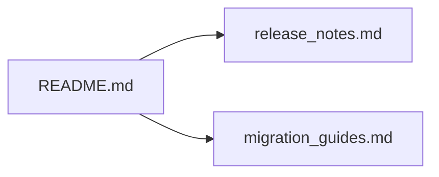

+++
title = "#19375 Fixed broken link in release content README."
date = "2025-05-26T00:00:00"
draft = false
template = "pull_request_page.html"
in_search_index = true

[taxonomies]
list_display = ["show"]

[extra]
current_language = "en"
available_languages = {"en" = { name = "English", url = "/pull_request/bevy/2025-05/pr-19375-en-20250526" }, "zh-cn" = { name = "中文", url = "/pull_request/bevy/2025-05/pr-19375-zh-cn-20250526" }}
labels = ["C-Docs"]
+++

# Title

## Basic Information
- **Title**: Fixed broken link in release content README.
- **PR Link**: https://github.com/bevyengine/bevy/pull/19375
- **Author**: AlephCubed
- **Status**: MERGED
- **Labels**: C-Docs, S-Ready-For-Final-Review
- **Created**: 2025-05-26T17:08:46Z
- **Merged**: 2025-05-26T19:49:32Z
- **Merged By**: mockersf

## Description Translation
The link went to a 404 page because it was missing an 's'.

## The Story of This Pull Request

### The Problem and Context
During routine documentation maintenance, a contributor discovered a broken link in the release-content directory's README.md file. The problematic link pointed to "./migration_guide.md" but resulted in a 404 error because the actual filename was "migration_guides.md" (plural form). This discrepancy created a poor experience for developers trying to access Bevy's migration documentation during the release cycle.

### The Solution Approach
The fix required a straightforward correction of the filename reference. The author identified the missing 's' character in the link target and proposed a singular-to-plural filename adjustment. No alternative approaches were necessary since this was a direct typo correction with no architectural implications.

### The Implementation
The implementation consisted of a one-character change in the README.md file:
```markdown
# Before:
[migration guide](./migration_guide.md)

# After: 
[migration guides](./migration_guides.md)
```
This change aligns the documentation reference with the actual file name in the repository, resolving the 404 error.

### Technical Insights
The fix demonstrates the importance of:
1. Accurate cross-referencing in documentation
2. Case sensitivity in file paths
3. Pluralization consistency in documentation assets

While simple, such corrections prevent confusion and maintain trust in project documentation. The change required no architectural considerations but highlights the value of thorough proofreading in documentation maintenance.

### The Impact
This correction:
- Restores immediate access to migration guides for contributors
- Maintains documentation integrity during release cycles
- Prevents potential support requests about missing documentation
- Demonstrates responsive maintenance of project docs

The 2-hour turnaround from creation to merge shows the project's commitment to documentation quality, even for minor fixes.

## Visual Representation



## Key Files Changed

### `release-content/README.md` (+1/-1)
**Change**: Corrected filename reference in documentation link  
**Before:**
```markdown
[migration guide](./migration_guide.md)
```

**After:**
```markdown
[migration guides](./migration_guides.md)
```

**Relationship to PR**: Directly addresses the root cause of the 404 error by matching the link target to the actual filename.

## Further Reading
1. [Markdown Linking Syntax](https://www.markdownguide.org/basic-syntax/#links)
2. [Bevy's Documentation Contribution Guide](https://github.com/bevyengine/bevy/blob/main/CONTRIBUTING.md#documentation)
3. [Semantic Versioning Specification](https://semver.org/) (Relevant for release documentation practices)

# Full Code Diff
```diff
diff --git a/release-content/README.md b/release-content/README.md
index 56fd2b8a063c9..c0cdd6a46ac9c 100644
--- a/release-content/README.md
+++ b/release-content/README.md
@@ -1,3 +1,3 @@
 # Release Content
 
-This directory contains drafts of documentation for the current development cycle, which will be published to the website during the next release. You can find more information in the [release notes](./release_notes.md) and [migration guide](./migration_guide.md) files.
+This directory contains drafts of documentation for the current development cycle, which will be published to the website during the next release. You can find more information in the [release notes](./release_notes.md) and [migration guides](./migration_guides.md) files.
```