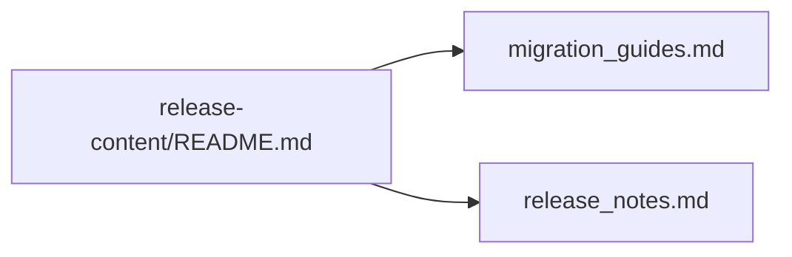

+++
title = "#19375 Fixed broken link in release content README"
date = "2025-05-26T00:00:00"
draft = false
template = "pull_request_page.html"
in_search_index = false

[extra]
current_language = "zh-cn"
available_languages = {"en" = { name = "English", url = "/pull_request/bevy/2025-05/pr-19375-en-20250526" }, "zh-cn" = { name = "中文", url = "/pull_request/bevy/2025-05/pr-19375-zh-cn-20250526" }}
labels = ["C-Docs"]
+++

# Title: Fixed broken link in release content README

## Basic Information
- **Title**: Fixed broken link in release content README.
- **PR Link**: https://github.com/bevyengine/bevy/pull/19375
- **Author**: AlephCubed
- **Status**: MERGED
- **Labels**: C-Docs, S-Ready-For-Final-Review
- **Created**: 2025-05-26T17:08:46Z
- **Merged**: 2025-05-26T19:49:32Z
- **Merged By**: mockersf

## Description Translation
原PR描述中的链接指向404页面，因为缺少了's'。

## The Story of This Pull Request

### 问题背景与上下文
在Bevy引擎的版本发布准备过程中，开发团队发现`release-content/README.md`文件中的文档链接存在断裂问题。具体表现为迁移指南(migration guide)的Markdown文件链接指向不存在的路径，导致用户访问时出现404错误。该问题直接影响开发者在准备版本升级时的体验，可能阻碍他们正确理解版本间的破坏性变更。

### 问题分析与解决思路
通过检查文件路径发现，实际存在的文件名为`migration_guides.md`（复数形式），而文档中链接使用的是`migration_guide.md`（单数形式）。这种单复数不一致属于典型的文件名拼写错误。维护团队需要确保所有文档链接的准确性，特别是在版本发布准备阶段，因为这些文档将被正式发布到官网。

### 具体实现与代码变更
修改方案直接而明确：在`release-content/README.md`文件中将错误链接的路径从`./migration_guide.md`更正为`./migration_guides.md`。该变更通过GitHub的在线编辑功能完成，仅涉及单个字符的修改（添加's'后缀）。

关键代码变更对比：
```markdown
# File: release-content/README.md
# 修改前：
[migration guide](./migration_guide.md)

# 修改后：
[migration guides](./migration_guides.md)
```

### 技术影响与改进
这个看似简单的修改直接解决了以下问题：
1. 恢复文档链接的功能性，确保用户能访问正确的迁移指南
2. 维护项目文档的专业性和可信度
3. 避免因链接失效导致的用户困惑和额外支持请求

从工程实践角度看，这次修改体现了：
- 对文档准确性的高度重视
- 快速响应和修复问题的能力
- 持续集成流程中自动化链接检查的必要性（虽然本次修复未涉及）

## Visual Representation



## Key Files Changed

### `release-content/README.md` (+1/-1)
**变更描述**：修复迁移指南文档链接的单复数拼写错误

**代码变更对比**：
```markdown
# 修改前：
[migration guide](./migration_guide.md)

# 修改后：
[migration guides](./migration_guides.md)
```

**关联性说明**：这是本PR的核心修改，直接解决文档链接失效问题。通过添加's'后缀使文件名与实际文件匹配，确保链接有效性。

## Further Reading

1. [Open Source Documentation Best Practices](https://opensource.guide/building-community/#share-your-standards)
2. [GitHub Markdown Linking Syntax](https://docs.github.com/en/get-started/writing-on-github/getting-started-with-writing-and-formatting-on-github/basic-writing-and-formatting-syntax#links)
3. [Bevy Engine Migration Guide System](https://bevyengine.org/learn/book/migration-guides/)

# Full Code Diff
```diff
diff --git a/release-content/README.md b/release-content/README.md
index 56fd2b8a063c9..c0cdd6a46ac9c 100644
--- a/release-content/README.md
+++ b/release-content/README.md
@@ -1,3 +1,3 @@
 # Release Content
 
-This directory contains drafts of documentation for the current development cycle, which will be published to the website during the next release. You can find more information in the [release notes](./release_notes.md) and [migration guide](./migration_guide.md) files.
+This directory contains drafts of documentation for the current development cycle, which will be published to the website during the next release. You can find more information in the [release notes](./release_notes.md) and [migration guides](./migration_guides.md) files.
```