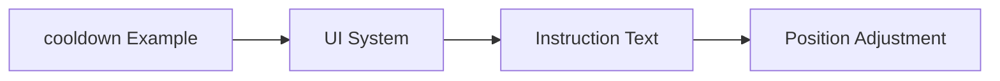

+++
title = "#19381 Move `cooldown` example instruction text according to example visual guidelines"
date = "2025-05-26T00:00:00"
draft = false
template = "pull_request_page.html"
in_search_index = true

[taxonomies]
list_display = ["show"]

[extra]
current_language = "en"
available_languages = {"en" = { name = "English", url = "/pull_request/bevy/2025-05/pr-19381-en-20250526" }, "zh-cn" = { name = "中文", url = "/pull_request/bevy/2025-05/pr-19381-zh-cn-20250526" }}
labels = ["D-Trivial", "C-Examples"]
+++

# Title

## Basic Information
- **Title**: Move `cooldown` example instruction text according to example visual guidelines
- **PR Link**: https://github.com/bevyengine/bevy/pull/19381
- **Author**: rparrett
- **Status**: MERGED
- **Labels**: D-Trivial, C-Examples, S-Ready-For-Final-Review
- **Created**: 2025-05-26T21:43:33Z
- **Merged**: 2025-05-26T22:19:46Z
- **Merged By**: alice-i-cecile

## Description Translation
# Objective

Use the same text positioning as other examples that have instruction text.

See  https://bevyengine.org/learn/contribute/helping-out/creating-examples/#visual-guidelines

## The Story of This Pull Request

The Bevy engine maintains strict visual guidelines for example presentations to ensure consistency across its documentation. This PR addresses a minor but important alignment issue in the `cooldown` example's instructional text positioning.

The problem stemmed from the example using non-standard coordinates (5px from top, 15px from left) for its help text, deviating from the established pattern of 12px offsets used in most other examples. While functionally equivalent, this inconsistency could distract users comparing different examples or following tutorial materials.

The solution involved straightforward adjustments to the UI node's positioning values. By modifying the `top` and `left` properties in the text's layout configuration, the implementation brings this example into compliance with the documented visual standards:

```rust
Node {
    position_type: PositionType::Absolute,
    top: Val::Px(12.0),  // Changed from 5.0
    left: Val::Px(12.0), // Changed from 15.0
    ..default()
}
```

This change required no architectural modifications or new dependencies. The author referenced Bevy's explicit contribution guidelines for example formatting, ensuring the adjustment aligns with the project's quality standards. No alternative approaches were necessary given the clear specification in the documentation.

The primary impact is improved visual consistency across Bevy's examples, which serves multiple purposes:
1. Reduces cognitive load for users comparing different examples
2. Maintains professional presentation standards
3. Demonstrates attention to detail in the engine's documentation
4. Makes future maintenance easier through uniform patterns

## Visual Representation



## Key Files Changed

- `examples/usage/cooldown.rs` (+2/-2)

```rust
// File: examples/usage/cooldown.rs
// Before:
Node {
    position_type: PositionType::Absolute,
    top: Val::Px(5.0),
    left: Val::Px(15.0),
    ..default()
}

// After:
Node {
    position_type: PositionType::Absolute,
    top: Val::Px(12.0),
    left: Val::Px(12.0),
    ..default()
}
```

These changes adjust the instructional text positioning to match Bevy's example style guidelines. The modifications are localized to the UI layout configuration and don't affect the example's core functionality.

## Further Reading

- Bevy Example Contribution Guidelines: https://bevyengine.org/learn/contribute/helping-out/creating-examples/
- Bevy UI Layout Documentation: https://bevyengine.org/learn/book/features/ui/#layout

# Full Code Diff
diff --git a/examples/usage/cooldown.rs b/examples/usage/cooldown.rs
index 7b86c5845e827..e8487ea9412fc 100644
--- a/examples/usage/cooldown.rs
+++ b/examples/usage/cooldown.rs
@@ -68,8 +68,8 @@ fn setup(
         Text::new("*Click some food to eat it*"),
         Node {
             position_type: PositionType::Absolute,
-            top: Val::Px(5.0),
-            left: Val::Px(15.0),
+            top: Val::Px(12.0),
+            left: Val::Px(12.0),
             ..default()
         },
     ));