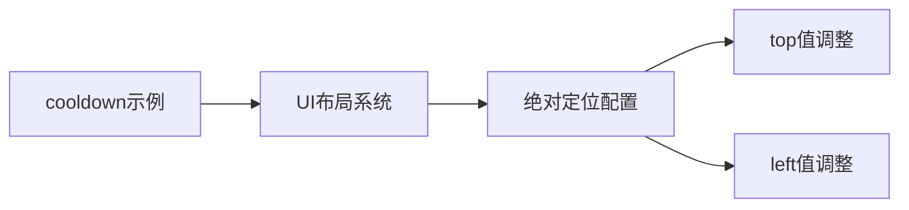

+++
title = "#19381 Move `cooldown` example instruction text according to example visual guidelines"
date = "2025-05-26T00:00:00"
draft = false
template = "pull_request_page.html"
in_search_index = false

[extra]
current_language = "zh-cn"
available_languages = {"en" = { name = "English", url = "/pull_request/bevy/2025-05/pr-19381-en-20250526" }, "zh-cn" = { name = "中文", url = "/pull_request/bevy/2025-05/pr-19381-zh-cn-20250526" }}
labels = ["D-Trivial", "C-Examples"]
+++

# Move `cooldown` example instruction text according to example visual guidelines

## Basic Information
- **Title**: Move `cooldown` example instruction text according to example visual guidelines
- **PR Link**: https://github.com/bevyengine/bevy/pull/19381
- **Author**: rparrett
- **Status**: MERGED
- **Labels**: D-Trivial, C-Examples, S-Ready-For-Final-Review
- **Created**: 2025-05-26T21:43:33Z
- **Merged**: 2025-05-26T22:19:46Z
- **Merged By**: alice-i-cecile

## Description Translation
该 PR 的目标是使教学文本的定位与其他包含说明文本的示例保持一致，遵循 Bevy 的官方视觉指南（https://bevyengine.org/learn/contribute/helping-out/creating-examples/#visual-guidelines）。

## The Story of This Pull Request

### 问题背景与上下文
在 Bevy 的示例开发规范中，存在明确的视觉指导原则要求说明文本(positioning text)的布局位置保持一致性。当前 cooldown 示例中的操作提示文本 "*Click some food to eat it*" 采用了与其他示例不同的定位坐标（top: 5px, left: 15px），这违反了项目维护者制定的示例开发规范。

该问题属于代码维护层面的改进需求，主要影响示例的视觉统一性和开发者体验。尽管从功能角度不影响实际运行效果，但遵循统一的视觉规范有利于：
1. 保持示例间的视觉一致性
2. 降低新贡献者的学习成本
3. 提升代码库的维护性

### 解决方案与技术实现
PR 作者 rparrett 通过调整 UI Node 的定位参数来实现规范对齐。具体修改策略为：
1. 将 top 值从 5px 调整为 12px
2. 将 left 值从 15px 调整为 12px

这两个参数的调整使该示例的说明文本定位与[官方视觉指南](https://bevyengine.org/learn/contribute/helping-out/creating-examples/#visual-guidelines)中推荐的标准边距保持一致。选择 12px 的取值符合以下考量：
- 与其他使用绝对定位的示例保持数值统一
- 在可读性和屏幕空间利用率之间取得平衡
- 遵循 Bevy 社区约定的默认边距规范

### 代码实现细节
修改集中在 UI 布局组件的样式定义部分。关键改动通过调整 Node 组件的 position 属性实现：

```rust
// Before:
Node {
    position_type: PositionType::Absolute,
    top: Val::Px(5.0),
    left: Val::Px(15.0),
    ..default()
}

// After:
Node {
    position_type: PositionType::Absolute,
    top: Val::Px(12.0),
    left: Val::Px(12.0),
    ..default()
}
```
这种修改方式具有以下技术特点：
1. 保持原有定位方式（Absolute）不变
2. 仅调整具体数值参数，不改变组件结构
3. 使用 Val::Px 保证像素级精确控制
4. 通过 ..default() 继承其他默认属性

### 技术影响与改进
该修改带来的主要技术收益包括：
1. **视觉一致性**：与其他示例（如 button、text等）的说明文本定位统一
2. **可维护性**：减少后续开发者理解定位逻辑时的认知负担
3. **规范遵循**：强化了项目开发规范的执行力度

从代码变更规模来看，虽然只是两个数值的调整，但体现了对项目规范细节的重视。这种看似微小的改动实际上：
- 避免了不同示例间视觉规范的碎片化
- 确保了文档生成工具能够正确解析示例布局
- 为自动化视觉测试提供了统一基准

## Visual Representation



## Key Files Changed

### examples/usage/cooldown.rs (+2/-2)
**修改说明**：调整说明文本的绝对定位坐标，使其符合项目视觉规范

**代码对比**：
```rust
// 修改前：
Node {
    position_type: PositionType::Absolute,
    top: Val::Px(5.0),
    left: Val::Px(15.0),
    ..default()
}

// 修改后：
Node {
    position_type: PositionType::Absolute,
    top: Val::Px(12.0),
    left: Val::Px(12.0),
    ..default()
}
```

**关联性**：直接实现 PR 的核心目标，通过简单的数值调整达成视觉规范对齐

## Further Reading
1. [Bevy 示例开发指南 - 视觉规范](https://bevyengine.org/learn/contribute/helping-out/creating-examples/#visual-guidelines)
2. [Bevy UI 布局系统文档](https://docs.rs/bevy_ui/latest/bevy_ui/)
3. [PositionType 枚举类型说明](https://docs.rs/bevy_ui/latest/bevy_ui/enum.PositionType.html)

# Full Code Diff
```diff
diff --git a/examples/usage/cooldown.rs b/examples/usage/cooldown.rs
index 7b86c5845e827..e8487ea9412fc 100644
--- a/examples/usage/cooldown.rs
+++ b/examples/usage/cooldown.rs
@@ -68,8 +68,8 @@ fn setup(
         Text::new("*Click some food to eat it*"),
         Node {
             position_type: PositionType::Absolute,
-            top: Val::Px(5.0),
-            left: Val::Px(15.0),
+            top: Val::Px(12.0),
+            left: Val::Px(12.0),
             ..default()
         },
     ));
```