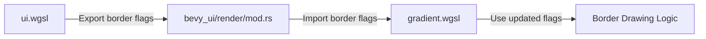

+++
title = "#19384 Fix error in gradient shader"
date = "2025-05-27T00:00:00"
draft = false
template = "pull_request_page.html"
in_search_index = true

[taxonomies]
list_display = ["show"]

[extra]
current_language = "en"
available_languages = {"en" = { name = "English", url = "/pull_request/bevy/2025-05/pr-19384-en-20250527" }, "zh-cn" = { name = "中文", url = "/pull_request/bevy/2025-05/pr-19384-zh-cn-20250527" }}
labels = ["C-Bug", "A-Rendering", "D-Straightforward", "D-Shaders"]
+++

# Fix error in gradient shader

## Basic Information
- **Title**: Fix error in gradient shader
- **PR Link**: https://github.com/bevyengine/bevy/pull/19384
- **Author**: rparrett
- **Status**: MERGED
- **Labels**: C-Bug, A-Rendering, S-Ready-For-Final-Review, D-Straightforward, D-Shaders
- **Created**: 2025-05-26T22:28:43Z
- **Merged**: 2025-05-27T21:46:23Z
- **Merged By**: mockersf

## Description Translation
# Objective

Fixes #19383

## Solution

Add missing param and flags from `ui.wgsl` to `gradients.wgsl`

## Testing

`cargo run --example gradients`
`cargo run --example stacked_gradients`
`cargo run --example radial_gradients`

## Notes

`radial_gradients` looks broken, but this appears to be a separate issue. Its appearance now is the same as in the [first screenshot](https://pixel-eagle.com/project/b25a040a-a980-4602-b90c-d480ab84076d/run/10348/compare/10342?screenshot=UI%20(User%20Interface)/radial_gradients.png) recorded in the example runner.

I will document this in a separate issue.

## The Story of This Pull Request

The PR addresses a shader inconsistency causing rendering issues in UI gradients. The root problem stemmed from mismatched border handling flags between `ui.wgsl` and `gradient.wgsl` shaders. While the UI shader had transitioned to granular border flags (BORDER_LEFT, BORDER_RIGHT, etc.), the gradient shader still used a legacy single BORDER flag.

This mismatch became apparent when rendering gradients with borders, as the gradient shader couldn't properly detect border presence. The shader's conditional logic:

```wgsl
if enabled(in.flags, BORDER) {
    return draw_uinode_border(...);
}
```

Relied on an outdated flag value that no longer reflected the actual border state. The solution required aligning the gradient shader's flag definitions with the UI shader's current implementation.

Key changes involved:
1. Removing the legacy BORDER constant
2. Adding individual border flags matching `bevy_ui/src/render/mod.rs` definitions
3. Creating a BORDER_ANY composite flag for existence checks
4. Updating the border detection conditional to use BORDER_ANY

This synchronization ensures consistent border handling across different shader types while maintaining backward compatibility with existing border rendering logic.

## Visual Representation



## Key Files Changed

### `crates/bevy_ui/src/render/gradient.wgsl` (+8/-3)

**Before:**
```wgsl
const BORDER: u32 = 8u;
// ...
if enabled(in.flags, BORDER) {
    return draw_uinode_border(...);
}
```

**After:**
```wgsl
const BORDER_LEFT: u32 = 256u;
const BORDER_TOP: u32 = 512u;
const BORDER_RIGHT: u32 = 1024u;
const BORDER_BOTTOM: u32 = 2048u;
const BORDER_ANY: u32 = BORDER_LEFT + BORDER_TOP + BORDER_RIGHT + BORDER_BOTTOM;
// ...
if enabled(in.flags, BORDER_ANY) {
    return draw_uinode_border(...);
}
```

The changes align border flag definitions with the UI shader's implementation, enabling proper border detection in gradient rendering. The BORDER_ANY composite allows checking for any border presence without individual flag inspection.

## Further Reading

1. WebGPU Shading Language (WGSL) Specification: https://www.w3.org/TR/WGSL/
2. Bevy UI Rendering Architecture: https://bevyengine.org/learn/book/implementation/ui/
3. Bit Flag Patterns in Graphics Programming: https://www.joshwcomeau.com/javascript/bit-flags/