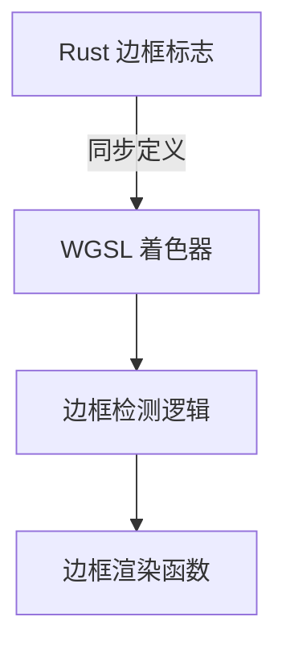

+++
title = "#19384 Fix error in gradient shader"
date = "2025-05-27T00:00:00"
draft = false
template = "pull_request_page.html"
in_search_index = false

[extra]
current_language = "zh-cn"
available_languages = {"en" = { name = "English", url = "/pull_request/bevy/2025-05/pr-19384-en-20250527" }, "zh-cn" = { name = "中文", url = "/pull_request/bevy/2025-05/pr-19384-zh-cn-20250527" }}
labels = ["C-Bug", "A-Rendering", "D-Straightforward", "D-Shaders"]
+++

# Fix error in gradient shader

## Basic Information
- **Title**: Fix error in gradient shader
- **PR Link**: https://github.com/bevyengine/bevy/pull/19384
- **Author**: rparrett
- **Status**: MERGED
- **Labels**: C-Bug, A-Rendering, S-Ready-For-Final-Review, D-Straightforward, D-Shaders
- **Created**: 2025-05-26T22:28:43Z
- **Merged**: 2025-05-27T21:46:23Z
- **Merged By**: mockersf

## Description Translation
### 目标
修复 #19383

### 解决方案
将 `ui.wgsl` 中缺失的参数和标志添加到 `gradients.wgsl`

### 测试
`cargo run --example gradients`
`cargo run --example stacked_gradients`
`cargo run --example radial_gradients`

### 备注
`radial_gradients` 目前显示异常，但这是独立问题。其当前外观与示例运行器中[首次截图](https://pixel-eagle.com/project/b25a040a-a980-4602-b90c-d480ab84076d/run/10348/compare/10342?screenshot=UI%20(User%20Interface)/radial_gradients.png)一致。将单独创建 issue 记录此问题。

## The Story of This Pull Request

### 问题定位
该 PR 的起源是发现渐变着色器存在边框渲染错误。具体表现为当 UI 节点带有边框时，渐变效果无法正确应用。问题根源在于 `gradient.wgsl` 着色器文件中的边框标志定义与 Rust 代码中的实现不同步。

### 技术分析
在 Bevy 的 UI 渲染系统中，边框处理需要精确的 flag 对齐。原代码中：
```wgsl
const BORDER: u32 = 8u;
```
这种单一标志位设计无法处理多边边框的组合情况。而对应的 Rust 代码中实际使用四个独立标志位表示各边边框：
```rust
// bevy_ui/src/render/mod.rs
const BORDER_LEFT: u32 = 0b10000000000;
const BORDER_TOP: u32 = 0b100000000000;
const BORDER_RIGHT: u32 = 0b1000000000000;
const BORDER_BOTTOM: u32 = 0b10000000000000;
```

### 解决方案实现
1. **标志位对齐**：在着色器中重建与 Rust 代码对应的标志位定义
```wgsl
const BORDER_LEFT: u32 = 256u;
const BORDER_TOP: u32 = 512u;
const BORDER_RIGHT: u32 = 1024u;
const BORDER_BOTTOM: u32 = 2048u;
const BORDER_ANY: u32 = BORDER_LEFT + BORDER_TOP + BORDER_RIGHT + BORDER_BOTTOM;
```

2. **渲染逻辑修正**：更新边框检测条件
```wgsl
if enabled(in.flags, BORDER_ANY) {
    return draw_uinode_border(gradient_color, in.point, in.size, in.radius, in.border, in.flags);
}
```

3. **参数传递修复**：向边框绘制函数添加缺失的 flags 参数，使各边边框状态可被正确识别

### 工程决策
选择保持标志位定义与 Rust 代码严格对齐而非重构整个标志系统，主要基于：
1. 最小变更原则：避免引入不必要的大范围重构
2. 向下兼容：确保现有 UI 组件的渲染行为保持一致
3. 性能考量：位运算检测保持高效执行

### 技术影响
该修复：
- 恢复正确的边框渐变渲染
- 保持跨语言（Rust/WGSL）标志位同步
- 为后续边框处理改进奠定基础

## Visual Representation



## Key Files Changed

### `crates/bevy_ui/src/render/gradient.wgsl`
**修改内容**：重构边框标志定义，修复参数传递

```wgsl
// 修改前：
const BORDER: u32 = 8u;

// 修改后：
const BORDER_LEFT: u32 = 256u;
const BORDER_TOP: u32 = 512u;
const BORDER_RIGHT: u32 = 1024u;
const BORDER_BOTTOM: u32 = 2048u;
const BORDER_ANY: u32 = BORDER_LEFT + BORDER_TOP + BORDER_RIGHT + BORDER_BOTTOM;
```

```wgsl
// 函数调用修正：
// 修改前：
return draw_uinode_border(..., in.border);

// 修改后：
return draw_uinode_border(..., in.border, in.flags);
```

## Further Reading
1. [WGSL 位运算规范](https://www.w3.org/TR/WGSL/#bit-expr)
2. [Bevy UI 渲染架构](https://bevyengine.org/learn/book/features/ui/)
3. [跨语言类型对齐最佳实践](https://rust-lang.github.io/unsafe-code-guidelines/layout.html)