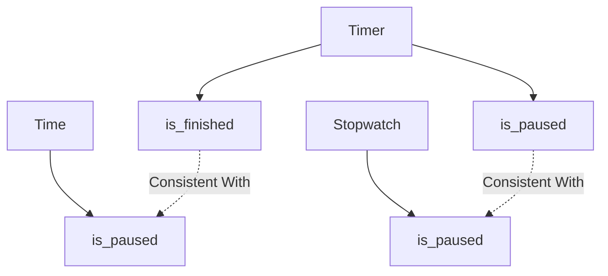

+++
title = "#19386 Rename Timer::finished and Timer::paused to is_finished and is_paused"
date = "2025-05-27T00:00:00"
draft = false
template = "pull_request_page.html"
in_search_index = true

[taxonomies]
list_display = ["show"]

[extra]
current_language = "en"
available_languages = {"en" = { name = "English", url = "/pull_request/bevy/2025-05/pr-19386-en-20250527" }, "zh-cn" = { name = "中文", url = "/pull_request/bevy/2025-05/pr-19386-zh-cn-20250527" }}
labels = ["D-Trivial", "C-Code-Quality", "C-Usability", "A-Time"]
+++

# Title: Rename Timer::finished and Timer::paused to is_finished and is_paused

## Basic Information
- **Title**: Rename Timer::finished and Timer::paused to is_finished and is_paused
- **PR Link**: https://github.com/bevyengine/bevy/pull/19386
- **Author**: FlippinBerger
- **Status**: MERGED
- **Labels**: D-Trivial, C-Code-Quality, C-Usability, S-Ready-For-Final-Review, M-Needs-Migration-Guide, A-Time
- **Created**: 2025-05-26T22:36:39Z
- **Merged**: 2025-05-27T22:43:15Z
- **Merged By**: mockersf

## Description Translation
# Objective
Renames `Timer::finished` and `Timer::paused` to `Timer::is_finished` and `Timer::is_paused` to align the public APIs for `Time`, `Timer`, and `Stopwatch`.

Fixes #19110

## The Story of This Pull Request

This PR addresses an API consistency issue in Bevy's time handling components. The core problem stemmed from inconsistent boolean accessor naming between the `Timer`, `Time`, and `Stopwatch` types. While `Time` and `Stopwatch` used `is_paused()` naming conventions, `Timer` used `paused()` and `finished()` without the `is_` prefix, creating an irregular API surface.

The solution involved a systematic rename of two key methods in the `Timer` API:
1. `Timer::finished()` → `Timer::is_finished()`
2. `Timer::paused()` → `Timer::is_paused()`

To maintain backward compatibility while transitioning users, the old methods were marked as deprecated with clear migration guidance. The implementation required:

1. Adding new methods with `is_` prefixes
2. Deprecating the old methods using Rust's `#[deprecated]` attribute
3. Updating all internal usage across the codebase
4. Modifying examples to demonstrate the new API
5. Providing a migration guide for existing users

The changes propagate through multiple layers of the engine due to `Timer`'s widespread use in gameplay logic, diagnostics, and UI systems. For example, in the log diagnostics plugin:

```rust
// Before:
if state.timer.tick(time.delta()).finished() { ... }

// After:
if state.timer.tick(time.delta()).is_finished() { ... }
```

This renaming follows Rust API guidelines that recommend using `is_` prefixes for boolean accessors. The deprecation strategy allows existing codebases to migrate gradually while immediately benefiting new users through improved API consistency.

## Visual Representation



## Key Files Changed

1. **crates/bevy_time/src/timer.rs** (+66/-17)
- Added new `is_finished` and `is_paused` methods
- Marked `finished` and `paused` as deprecated
- Updated internal logic to use new methods
- Modified test assertions to verify new behavior

```rust
// Before:
pub fn finished(&self) -> bool { ... }

// After:
#[deprecated(since = "0.17.0", note = "Use `is_finished` instead")]
pub fn finished(&self) -> bool { ... }

pub fn is_finished(&self) -> bool { ... }
```

2. **release-content/migration-guides/rename_timer_paused_and_finished.md** (+11/-0)
- Created migration guide documenting the changes
- Provided simple search-and-replace instructions

3. **examples/games/alien_cake_addict.rs** (+2/-2)
- Updated gameplay logic to use new API

```rust
// Before:
if game.player.move_cooldown.tick(time.delta()).finished()

// After:
if game.player.move_cooldown.tick(time.delta()).is_finished()
```

## Further Reading
- Rust API Guidelines: [Naming](https://rust-lang.github.io/api-guidelines/naming.html)
- Bevy Time Module Documentation
- Rust Deprecation Attributes: [std::deprecated](https://doc.rust-lang.org/std/attr/deprecated.html)

# Full Code Diff
[See original PR for complete diff]