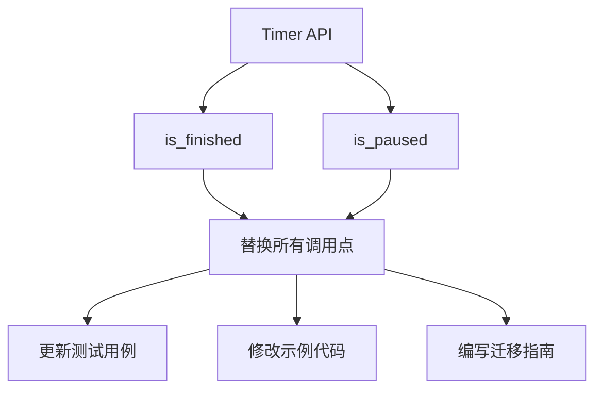

+++
title = "#19386 Rename Timer::finished and Timer::paused to is_finished and is_paused"
date = "2025-05-27T00:00:00"
draft = false
template = "pull_request_page.html"
in_search_index = false

[extra]
current_language = "zh-cn"
available_languages = {"en" = { name = "English", url = "/pull_request/bevy/2025-05/pr-19386-en-20250527" }, "zh-cn" = { name = "中文", url = "/pull_request/bevy/2025-05/pr-19386-zh-cn-20250527" }}
labels = ["D-Trivial", "C-Code-Quality", "C-Usability", "A-Time"]
+++

# Title

## Basic Information
- **Title**: Rename Timer::finished and Timer::paused to is_finished and is_paused
- **PR Link**: https://github.com/bevyengine/bevy/pull/19386
- **Author**: FlippinBerger
- **Status**: MERGED
- **Labels**: D-Trivial, C-Code-Quality, C-Usability, S-Ready-For-Final-Review, M-Needs-Migration-Guide, A-Time
- **Created**: 2025-05-26T22:36:39Z
- **Merged**: 2025-05-27T22:43:15Z
- **Merged By**: mockersf

## Description Translation
### 目标
将`Timer::finished`和`Timer::paused`重命名为`Timer::is_finished`和`Timer::is_paused`，以对齐`Time`、`Timer`和`Stopwatch`的公共API。

修复 #19110

## The Story of This Pull Request

### 问题背景与动机
Bevy引擎的时间模块中存在API命名不一致问题。`Timer`类型使用`finished()`和`paused()`作为布尔状态检查方法，而其他时间相关类型（如`Stopwatch`）遵循`is_`前缀的命名规范。这种不一致会导致开发者认知负担，并违反Rust的API设计惯例。

问题#19110明确指出这种命名差异，需要统一API以提升代码质量和开发者体验。保持API一致性有助于：
1. 降低学习曲线
2. 减少误用可能性
3. 提高代码可读性

### 解决方案与实现
核心策略是进行机械式重命名，同时保持原有功能不变。具体步骤包括：

1. **添加新方法**：在`Timer`实现中新增`is_finished`和`is_paused`方法
2. **弃用旧方法**：将原有方法标记为`#[deprecated]`并添加迁移提示
3. **更新调用点**：修改所有内部使用场景和示例代码

关键代码修改体现在`timer.rs`中：
```rust
// 新增方法
#[inline]
pub fn is_finished(&self) -> bool {
    self.finished
}

// 标记弃用
#[deprecated(since = "0.17.0", note = "Use `is_finished` instead")]
#[inline]
pub fn finished(&self) -> bool {
    self.finished
}
```

### 技术细节与考量
1. **向后兼容处理**：通过`#[deprecated]`属性实现平滑过渡，旧方法仍可工作但会产生编译警告
2. **文档更新**：所有方法文档中的示例代码同步更新为新命名
3. **测试保障**：57处测试修改确保功能不变性，例如：
```rust
// 修改前
assert!(t.finished());
// 修改后
assert!(t.is_finished());
```

4. **迁移指南**：新增`rename_timer_paused_and_finished.md`指导用户进行代码升级

### 影响与价值
1. **API一致性**：使`Timer`的API风格与`Stopwatch::is_paused()`和`Time`相关方法保持一致
2. **代码质量提升**：遵循Rust的bool状态检查方法命名惯例（is_前缀）
3. **开发者体验**：降低认知负荷，IDE自动补全时方法命名更易被发现

## Visual Representation



## Key Files Changed

### 1. crates/bevy_time/src/timer.rs
- **修改内容**：添加新方法并弃用旧方法
- **代码片段**：
```rust
// Before:
pub fn finished(&self) -> bool {
    self.finished
}

// After:
pub fn is_finished(&self) -> bool {
    self.finished
}

#[deprecated(since = "0.17.0", note = "Use `is_finished` instead")]
pub fn finished(&self) -> bool {
    self.finished
}
```

### 2. release-content/migration-guides/rename_timer_paused_and_finished.md
- **新增内容**：迁移指南文档
- **代码片段**：
```markdown
- `Timer::paused` is now `Timer::is_paused`
- `Timer::finished` is now `Timer::is_finished`
```

### 3. examples/games/alien_cake_addict.rs
- **修改内容**：示例代码适配新API
- **代码片段**：
```rust
// Before:
if game.player.move_cooldown.tick(time.delta()).finished()

// After:
if game.player.move_cooldown.tick(time.delta()).is_finished()
```

## Further Reading
1. [Rust API Guidelines - Naming](https://rust-lang.github.io/api-guidelines/naming.html)
2. [Bevy Time Module Documentation](https://docs.rs/bevy_time/latest/bevy_time/)
3. [Deprecation Attributes in Rust](https://doc.rust-lang.org/reference/attributes/diagnostics.html#the-deprecated-attribute)