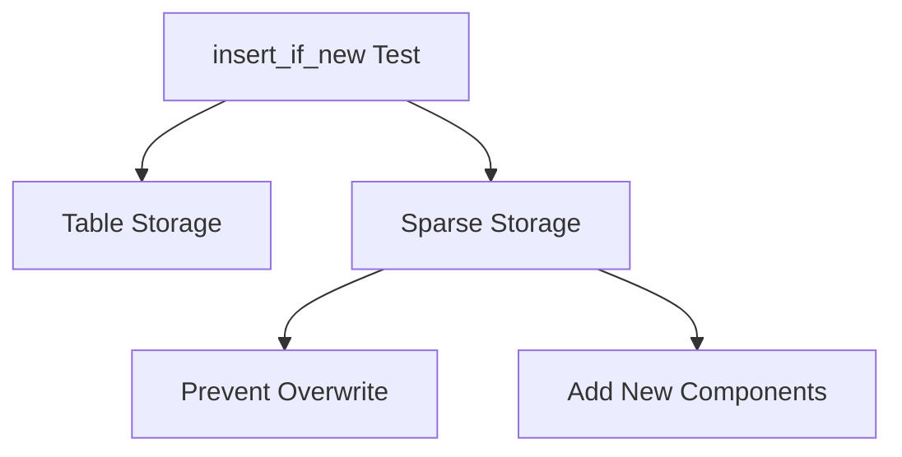

+++
title = "#19387 Add `insert_if_new` test for sparse set."
date = "2025-05-27T00:00:00"
draft = false
template = "pull_request_page.html"
in_search_index = true

[taxonomies]
list_display = ["show"]

[extra]
current_language = "en"
available_languages = {"en" = { name = "English", url = "/pull_request/bevy/2025-05/pr-19387-en-20250527" }, "zh-cn" = { name = "中文", url = "/pull_request/bevy/2025-05/pr-19387-zh-cn-20250527" }}
labels = ["D-Trivial", "A-ECS", "C-Code-Quality"]
+++

# Add `insert_if_new` test for sparse set

## Basic Information
- **Title**: Add `insert_if_new` test for sparse set.
- **PR Link**: https://github.com/bevyengine/bevy/pull/19387
- **Author**: AlephCubed
- **Status**: MERGED
- **Labels**: D-Trivial, A-ECS, C-Code-Quality, S-Ready-For-Final-Review
- **Created**: 2025-05-26T22:39:38Z
- **Merged**: 2025-05-27T03:37:12Z
- **Merged By**: alice-i-cecile

## Description Translation
Fixes #19081.
Simply created a duplicate of the existing `insert_if_new` test, but using sparse sets.

## Testing:
The test passes on main, but fails if #19059 is reverted.

## The Story of This Pull Request

This PR addresses a gap in test coverage for Bevy's Entity Component System (ECS) when working with sparse set storage. The core issue (#19081) involved potential regressions in the `insert_if_new` method's behavior with sparse components, which was previously fixed in #19059 but lacked proper test validation.

The existing test for `insert_if_new` only verified behavior with default table storage components. However, Bevy's ECS supports multiple storage types, and sparse sets require separate validation due to their different implementation characteristics. Sparse sets (稀疏集) optimize for components that are frequently added/removed or have many optional instances, using indirect lookup tables rather than dense arrays.

The solution replicates the existing test pattern but applies it to sparse components:
1. Created test components annotated with `#[component(storage = "SparseSet")]`
2. Constructed an entity with initial sparse components
3. Verified `insert_if_new` prevents overwrites while allowing new component additions

Key implementation details from the test:
```rust
#[derive(Component, Debug, Eq, PartialEq)]
#[component(storage = "SparseSet")]
pub struct SparseV(&'static str);

#[test]
fn sparse_set_insert_if_new() {
    let mut world = World::new();
    let id = world.spawn(SparseV("one")).id();
    let mut entity = world.entity_mut(id);
    entity.insert_if_new(SparseV("two"));  // Should be ignored
    entity.insert_if_new((SparseA, SparseV("three"))); // Adds SparseA
    entity.flush();
    
    let entity = world.entity(id);
    assert!(entity.contains::<SparseA>());
    assert_eq!(entity.get(), Some(&SparseV("one")));
}
```
This test ensures:
- Existing sparse components aren't overwritten
- New sparse components are properly added
- Tuple insertion works with mixed component states

The test's value is demonstrated by its failure when reverting #19059, proving it effectively guards against regressions. This approach follows Bevy's established testing patterns while extending coverage to critical sparse set functionality.

## Visual Representation



## Key Files Changed

- `crates/bevy_ecs/src/bundle.rs` (+22/-0)

Added test case for sparse set component insertion logic:
```rust
// New test components
#[derive(Component, Debug, Eq, PartialEq)]
#[component(storage = "SparseSet")]
pub struct SparseV(&'static str);

#[derive(Component, Debug, Eq, PartialEq)]
#[component(storage = "SparseSet")]
pub struct SparseA;

// Test implementation
#[test]
fn sparse_set_insert_if_new() {
    // ... test setup and assertions ...
}
```
This change directly extends test coverage to match sparse set behavior with existing table storage tests.

## Further Reading

- [Bevy ECS Storage Documentation](https://bevyengine.org/learn/book/ecs-storage/)
- [Rust Test Organization](https://doc.rust-lang.org/book/ch11-03-test-organization.html)
- [Component Storage Comparison](https://bevy-cheatbook.github.io/programming/storages.html)