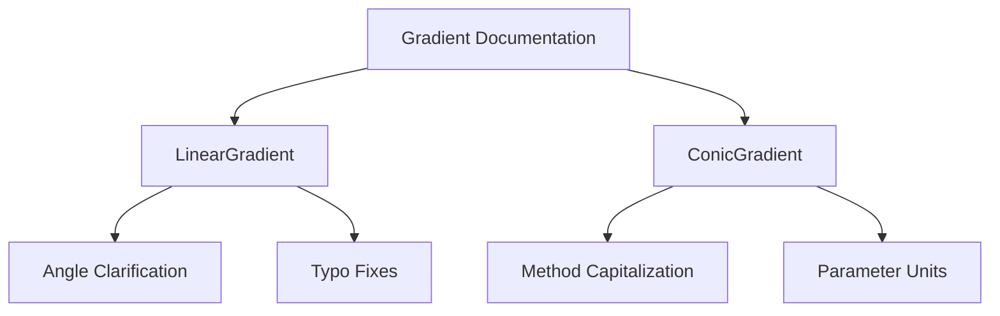

+++
title = "#19388 Small fixes for gradient docs"
date = "2025-05-27T00:00:00"
draft = false
template = "pull_request_page.html"
in_search_index = true

[taxonomies]
list_display = ["show"]

[extra]
current_language = "en"
available_languages = {"en" = { name = "English", url = "/pull_request/bevy/2025-05/pr-19388-en-20250527" }, "zh-cn" = { name = "中文", url = "/pull_request/bevy/2025-05/pr-19388-zh-cn-20250527" }}
labels = ["C-Docs", "D-Trivial", "A-UI"]
+++

# Title

## Basic Information
- **Title**: Small fixes for gradient docs
- **PR Link**: https://github.com/bevyengine/bevy/pull/19388
- **Author**: rparrett
- **Status**: MERGED
- **Labels**: C-Docs, D-Trivial, A-UI, S-Ready-For-Final-Review
- **Created**: 2025-05-26T23:00:10Z
- **Merged**: 2025-05-26T23:39:51Z
- **Merged By**: alice-i-cecile

## Description Translation
# Objective

Found a typo while looking at gradients in another issue and gave the docs a skim for more.

## Solution

A couple typo fixes and some tiny improvements

## The Story of This Pull Request

While investigating gradient-related functionality for another issue, the author noticed documentation inconsistencies in Bevy's UI gradient implementation. This PR addresses these quality-of-life improvements through targeted documentation fixes without altering any functional code.

The primary issues identified were:
1. Duplicated words in method comments
2. Missing units in parameter documentation
3. Inconsistent capitalization in method descriptions
4. Ambiguous directional descriptions for gradient angles

The changes focus on the gradient implementations in `bevy_ui`, specifically the `LinearGradient` and `ConicGradient` types. By clarifying documentation, these changes help developers correctly interpret angle parameters and understand method behaviors without consulting external resources.

Key documentation improvements include:
- Explicitly stating angle units as radians
- Clarifying directional semantics ("0.0 points upward, increasing clockwise")
- Fixing duplicated conjunction in method comments
- Standardizing method description capitalization

These changes follow Rust API documentation best practices by ensuring self-contained, precise documentation. The typo fixes prevent potential misinterpretation of method behaviors, while the parameter clarifications reduce the likelihood of usage errors related to angle units and directionality.

## Visual Representation



## Key Files Changed

### `crates/bevy_ui/src/gradients.rs` (+7/-7)

1. **Documentation Clarifications**:
```rust
// Before:
/// The direction of the gradient.
/// An angle of `0.` points upward, angles increasing clockwise.

// After:
/// The direction of the gradient in radians.
/// An angle of `0.` points upward, with the value increasing in the clockwise direction.
```
Adds explicit unit specification and clarifies direction semantics.

2. **Typo Fixes**:
```rust
// Before:
// Set the interpolation midpoint between this and and the following stop

// After:
// Set the interpolation midpoint between this and the following stop
```
Removes duplicated conjunction in method comments.

3. **Method Capitalization**:
```rust
// Before:
/// create a new conic gradient

// After:
/// Create a new conic gradient
```
Standardizes documentation capitalization to match Rust conventions.

## Further Reading

- [Rust API Documentation Guidelines](https://rust-lang.github.io/api-guidelines/documentation.html)
- [Bevy UI Component Documentation](https://bevyengine.org/learn/book/getting-started/ui/)
- [MDN Gradient Documentation](https://developer.mozilla.org/en-US/docs/Web/CSS/gradient) (for CSS gradient concepts that inspired Bevy's implementation)

# Full Code Diff
<details>
<summary>View full diff</summary>

```diff
diff --git a/crates/bevy_ui/src/gradients.rs b/crates/bevy_ui/src/gradients.rs
index a8dc670bc223e..bbccc6b62e428 100644
--- a/crates/bevy_ui/src/gradients.rs
+++ b/crates/bevy_ui/src/gradients.rs
@@ -43,7 +43,7 @@ impl ColorStop {
         }
     }
 
-    // Set the interpolation midpoint between this and and the following stop
+    // Set the interpolation midpoint between this and the following stop
     pub fn with_hint(mut self, hint: f32) -> Self {
         self.hint = hint;
         self
@@ -155,7 +155,7 @@ impl AngularColorStop {
         }
     }
 
-    // Set the interpolation midpoint between this and and the following stop
+    // Set the interpolation midpoint between this and the following stop
     pub fn with_hint(mut self, hint: f32) -> Self {
         self.hint = hint;
         self
@@ -213,8 +213,8 @@ impl Default for AngularColorStop {
     reflect(Serialize, Deserialize)
 )]
 pub struct LinearGradient {
-    /// The direction of the gradient.
-    /// An angle of `0.` points upward, angles increasing clockwise.
+    /// The direction of the gradient in radians.
+    /// An angle of `0.` points upward, with the value increasing in the clockwise direction.
     pub angle: f32,
     /// The list of color stops
     pub stops: Vec<ColorStop>,
@@ -376,7 +376,7 @@ pub struct ConicGradient {
 }
 
 impl ConicGradient {
-    /// create a new conic gradient
+    /// Create a new conic gradient
     pub fn new(position: Position, stops: Vec<AngularColorStop>) -> Self {
         Self {
             start: 0.,
@@ -385,7 +385,7 @@ impl ConicGradient {
         }
     }
 
-    /// Sets the starting angle of the gradient
+    /// Sets the starting angle of the gradient in radians
     pub fn with_start(mut self, start: f32) -> Self {
         self.start = start;
         self
@@ -430,7 +430,7 @@ impl Gradient {
         }
     }
 
-    /// If the gradient has only a single color stop `get_single` returns its color.
+    /// If the gradient has only a single color stop, `get_single` returns its color.
     pub fn get_single(&self) -> Option<Color> {
         match self {
             Gradient::Linear(gradient) => gradient
```

</details>