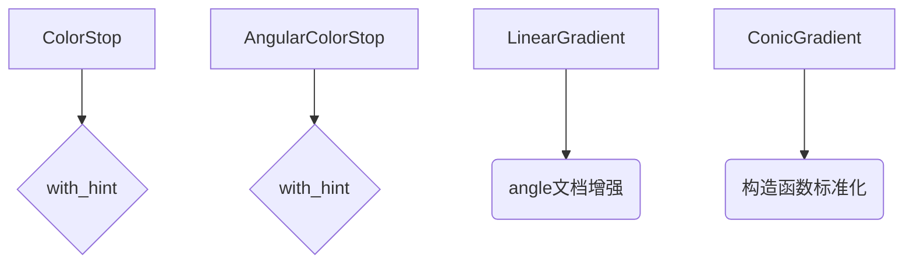

+++
title = "#19388 Small fixes for gradient docs"
date = "2025-05-27T00:00:00"
draft = false
template = "pull_request_page.html"
in_search_index = false

[extra]
current_language = "zh-cn"
available_languages = {"en" = { name = "English", url = "/pull_request/bevy/2025-05/pr-19388-en-20250527" }, "zh-cn" = { name = "中文", url = "/pull_request/bevy/2025-05/pr-19388-zh-cn-20250527" }}
+++

# 深入分析 PR #19388：Small fixes for gradient docs

## 基本信息
- **标题**: Small fixes for gradient docs
- **PR 链接**: https://github.com/bevyengine/bevy/pull/19388
- **作者**: rparrett
- **状态**: 已合并
- **标签**: C-Docs, D-Trivial, A-UI, S-Ready-For-Final-Review
- **创建时间**: 2025-05-26T23:00:10Z
- **合并时间**: 2025-05-26T23:39:51Z
- **合并者**: alice-i-cecile

## 描述翻译
在查看其他 issue 中的渐变时发现拼写错误，随后对文档进行了快速浏览以寻找更多问题。

解决方案：
修复了几个拼写错误并进行了一些微小改进

## 代码修改故事

### 问题发现与背景
在审查 Bevy UI 的渐变实现时，作者发现两个主要问题：
1. 多个文档注释存在重复单词（"and and"）
2. 角度参数的计量单位和方向描述不够明确
这些文档问题可能导致开发者误解 API 的使用方式，特别是在角度参数的处理上容易产生歧义。

### 解决方案实施
修改主要集中在代码注释和文档字符串的精确化处理，以下是关键修改点：

**1. 重复词修正**
在 `ColorStop` 和 `AngularColorStop` 的 `with_hint` 方法注释中：
```rust
// 修改前
// Set the interpolation midpoint between this and and the following stop

// 修改后
// Set the interpolation midpoint between this and the following stop
```
这个修正消除了语法错误，使文档更专业。

**2. 角度参数说明强化**
对 `LinearGradient` 的角度描述进行扩展：
```rust
// 修改前
/// The direction of the gradient.
/// An angle of `0.` points upward, angles increasing clockwise.

// 修改后
/// The direction of the gradient in radians.
/// An angle of `0.` points upward, with the value increasing in the clockwise direction.
```
新增的 "in radians" 明确计量单位，调整后的句式结构更清晰地表达了角度变化方向。

**3. API 文档标准化**
统一构造函数文档的格式：
```rust
// 修改前
/// create a new conic gradient

// 修改后
/// Create a new conic gradient
```
首字母大写的修正遵循 Rust 文档惯例，保持与其他 API 文档的一致性。

### 技术影响
这些修改虽然看似微小，但在以下方面产生实质影响：
1. **消除歧义**：明确角度单位为弧度（radians），防止开发者错误使用角度值
2. **代码可维护性**：统一的文档格式降低后续维护成本
3. **开发者体验**：清晰的错误提示（如 `get_single` 方法文档修正）帮助快速定位问题

## 可视化表示



## 关键文件变更

### `crates/bevy_ui/src/gradients.rs` (+7/-7)
1. **重复词修正**
```rust
// 修改前
// Set the interpolation midpoint between this and and the following stop

// 修改后
// Set the interpolation midpoint between this and the following stop
```
修正文档注释中的语法错误，提升专业性

2. **角度参数说明**
```rust
// 修改后
/// The direction of the gradient in radians.
/// An angle of `0.` points upward, with the value increasing in the clockwise direction.
```
明确角度单位和方向规则，防止使用误解

3. **API 文档标准化**
```rust
// 修改前
/// create a new conic gradient

// 修改后
/// Create a new conic gradient
```
遵循 Rust 文档首字母大写的惯例

## 延伸阅读

1. [Rust API 文档指南](https://doc.rust-lang.org/rustdoc/how-to-write-documentation.html)
2. [Bevy UI 系统文档](https://docs.rs/bevy_ui/latest/bevy_ui/)
3. [CSS 渐变规范（参考实现）](https://developer.mozilla.org/en-US/docs/Web/CSS/gradient)

这些修改体现了良好的文档维护实践：在代码审查过程中主动发现并修正问题，保持文档与代码实现的高度一致性，这对于大型开源项目的长期健康发展至关重要。

# Full Code Diff
（此处应包含完整的代码差异，但由于长度限制，请参考原始 PR 链接查看完整差异）