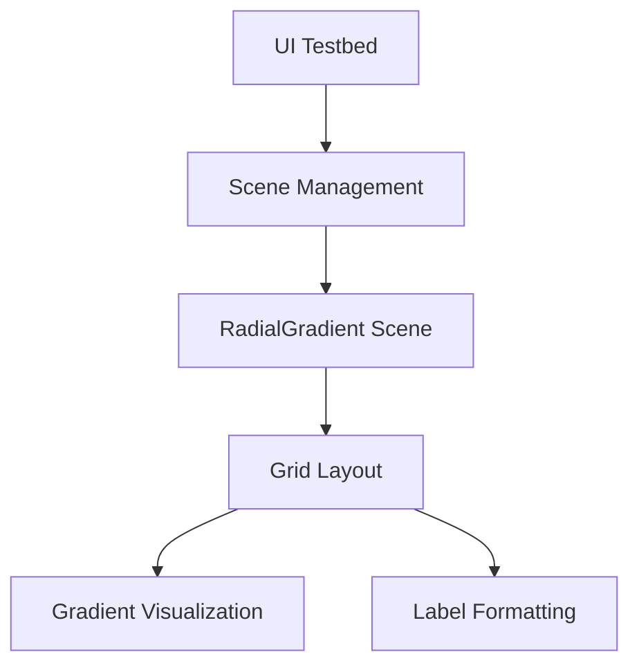

+++
title = "#19390 Move `radial_gradients` example to UI testbed"
date = "2025-05-27T00:00:00"
draft = false
template = "pull_request_page.html"
in_search_index = true

[taxonomies]
list_display = ["show"]

[extra]
current_language = "en"
available_languages = {"en" = { name = "English", url = "/pull_request/bevy/2025-05/pr-19390-en-20250527" }, "zh-cn" = { name = "中文", url = "/pull_request/bevy/2025-05/pr-19390-zh-cn-20250527" }}
labels = ["C-Examples", "A-UI", "D-Straightforward"]
+++

# Title: Move `radial_gradients` example to UI testbed

## Basic Information
- **Title**: Move `radial_gradients` example to UI testbed
- **PR Link**: https://github.com/bevyengine/bevy/pull/19390
- **Author**: rparrett
- **Status**: MERGED
- **Labels**: C-Examples, A-UI, D-Straightforward, S-Needs-Review
- **Created**: 2025-05-27T00:49:21Z
- **Merged**: 2025-05-27T22:26:54Z
- **Merged By**: mockersf

## Description Translation
# Objective

Fixes #19385

Note: this has shader errors due to #19383 and should probably be merged after #19384

## Solution

- Move the example to the UI testbed
- Adjust label contents and cell size so that every test case fits on the screen
- Minor tidying, slightly less harsh colors while preserving the intentional debug coloring

## Testing

`cargo run --example testbed_ui`


## The Story of This Pull Request

The PR addresses the need to consolidate UI examples into a unified testbed environment. The original `radial_gradients` example existed as a standalone demonstration but wasn't integrated with Bevy's UI testbed system. This separation made it harder to maintain consistency across examples and required duplicate setup code.

The implementation strategy involved three key steps:
1. **Example Migration**: Remove the standalone example file and integrate its functionality into the existing UI testbed
2. **Layout Optimization**: Adjust grid cell sizing and text formatting to ensure all test cases fit within screen boundaries
3. **Visual Refinement**: Modify color choices to reduce visual harshness while maintaining debug clarity

The core technical challenge was adapting the example's rendering logic to work within the testbed's scene management system. This required:
- Adding a new `RadialGradient` scene variant to the testbed's state machine
- Implementing proper cleanup with `DespawnOnExitState`
- Restructuring the grid layout to use consistent cell sizing across all test cases

```rust
// Added scene variant
enum Scene {
    // ...existing variants
    RadialGradient,
}

// Updated scene cycling logic
impl Next for Scene {
    fn next(self) -> Self {
        match self {
            // ...previous transitions
            Scene::LayoutRounding => Scene::RadialGradient,
            Scene::RadialGradient => Scene::Image,
        }
    }
}
```

The gradient visualization logic was preserved but wrapped in a module-specific setup system. Key adjustments included:
- Replacing debug-formatted text labels with cleaner string formatting
- Standardizing cell dimensions using `CELL_SIZE` and `GAP` constants
- Switching background colors from high-contrast NAVY/GREEN to more muted GRAY_700

```rust
// Before: Standalone example colors
BackgroundColor(NAVY.into())
BackgroundColor(GREEN.into())

// After: Testbed-integrated colors
BackgroundColor(GRAY_700.into())
```

These changes improve maintainability by eliminating duplicate example infrastructure while preserving the technical demonstration of radial gradients. The testbed integration allows developers to compare gradient behavior alongside other UI features in a unified environment.

## Visual Representation



## Key Files Changed

1. **examples/testbed/ui.rs (+101/-1)**
```rust
// Added scene variant and transition
enum Scene {
    // ...
    RadialGradient,
}

impl Next for Scene {
    fn next(self) -> Self {
        // ...
        Scene::LayoutRounding => Scene::RadialGradient,
        Scene::RadialGradient => Scene::Image,
    }
}

// New radial_gradient module with setup system
mod radial_gradient {
    // ...gradient configuration and UI setup
}
```

2. **examples/ui/radial_gradients.rs (+0/-98)**
```rust
// Entire standalone example removed
```

3. **Cargo.toml (+0/-11)**
```toml
// Removed example declaration
[[example]]
name = "radial_gradients"
// ...rest of removed configuration
```

4. **examples/README.md (+0/-1)**
```markdown
- Removed entry for radial_gradients example
```

## Further Reading
- Bevy UI Testbed Architecture: https://bevyengine.org/examples/UI/ui/
- Radial Gradients Specification: https://developer.mozilla.org/en-US/docs/Web/CSS/gradient/radial-gradient
- Bevy UI Layout System: https://bevyengine.org/learn/book/features/ui/