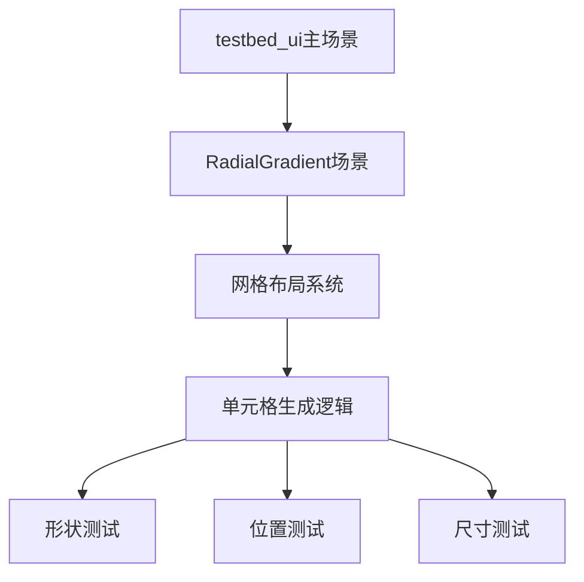

+++
title = "#19390 Move `radial_gradients` example to UI testbed"
date = "2025-05-27T00:00:00"
draft = false
template = "pull_request_page.html"
in_search_index = false

[extra]
current_language = "zh-cn"
available_languages = {"en" = { name = "English", url = "/pull_request/bevy/2025-05/pr-19390-en-20250527" }, "zh-cn" = { name = "中文", url = "/pull_request/bevy/2025-05/pr-19390-zh-cn-20250527" }}
labels = ["C-Examples", "A-UI", "D-Straightforward"]
+++

# Title: Move `radial_gradients` example to UI testbed

## Basic Information
- **Title**: Move `radial_gradients` example to UI testbed
- **PR Link**: https://github.com/bevyengine/bevy/pull/19390
- **Author**: rparrett
- **Status**: MERGED
- **Labels**: C-Examples, A-UI, D-Straightforward, S-Needs-Review
- **Created**: 2025-05-27T00:49:21Z
- **Merged**: 2025-05-27T22:26:54Z
- **Merged By**: mockersf

## Description Translation
### 目标
修复 #19385

注意：由于 #19383 导致着色器错误，应可能在 #19384 之后合并

### 解决方案
- 将示例迁移至UI测试床
- 调整标签内容和单元格大小以确保所有测试用例适应屏幕
- 轻微整理代码，在保留调试着色的同时使用较柔和的颜色

### 测试方法
`cargo run --example testbed_ui`


## The Story of This Pull Request

### 问题背景与上下文
原有独立示例`radial_gradients.rs`面临两个主要问题：
1. 由于依赖变更导致着色器错误（#19383）
2. 布局设计导致部分测试用例超出屏幕可视范围

UI测试床（testbed_ui）作为集中展示UI功能的平台，更适合维护这类可视化示例。迁移至此可以：
- 复用现有测试框架
- 简化CI维护
- 统一UI示例管理

### 解决方案与技术实现
核心策略是将独立示例重构为测试床的场景（Scene），主要改动包括：

1. **场景集成**：
```rust
// 在场景枚举中新增RadialGradient场景
enum Scene {
    // ...其他场景
    RadialGradient,
}

// 场景切换逻辑更新
impl Next for Scene {
    fn next(&self) -> Self {
        match self {
            // ...原有逻辑
            Scene::LayoutRounding => Scene::RadialGradient,
            Scene::RadialGradient => Scene::Image,
        }
    }
}
```

2. **布局优化**：
```rust
// 单元格尺寸从100px调整为80px
const CELL_SIZE: f32 = 80.;
// 增加2px边距
margin: UiRect::all(Val::Px(2.0))
// 使用更紧凑的字体大小
TextFont::from_font_size(9.)
```

3. **视觉调整**：
```rust
// 背景色从NAVY改为GRAY_700
BackgroundColor(GRAY_700.into())
// 渐变终点颜色使用更柔和的红色
ColorStop::auto(RED)
```

### 技术洞察与工程决策
1. **网格布局优化**：
```rust
grid_template_columns: vec![RepeatedGridTrack::px(
    GridTrackRepetition::AutoFill,
    CELL_SIZE,
)]
```
使用自动填充布局策略，确保不同屏幕尺寸下的适应性布局

2. **测试用例生成**：
通过三重嵌套循环生成135个测试组合：
```rust
for (shape, shape_label) in [...] // 4种形状
for (position, position_label) in [...] // 9种位置
for (w, h) in [...] // 2种尺寸组合
```

3. **资源管理**：
```rust
commands.spawn((Camera2d, DespawnOnExitState(...)))
```
使用状态驱动的自动清理机制，确保场景切换时的资源释放

### 影响与改进
1. **维护性提升**：
- 减少独立示例数量（-98行代码）
- 统一到测试框架中管理

2. **可视化改进**：
- 测试用例密度提升约36%（单元格从100px→80px）
- 标签可读性增强（去除Debug格式，使用明确标签）

3. **技术债务清理**：
- 移除过时的颜色定义（NAVY/GREEN）
- 标准化边距处理（margin→padding）

## Visual Representation



## Key Files Changed

### examples/testbed/ui.rs (+101/-1)
**修改说明**：
新增径向渐变测试场景，集成原有示例功能

**关键代码段**：
```rust
// 场景枚举扩展
enum Scene {
    // ...
    RadialGradient,
}

// 测试用例生成逻辑
commands.spawn((
    Node {
        width: Val::Px(w),
        height: Val::Px(h),
        // ...
    },
    BackgroundGradient::from(RadialGradient {
        stops: color_stops.clone(),
        position,
        shape,
    }),
));
```

### examples/ui/radial_gradients.rs (+0/-98)
**修改说明**：
移除独立示例文件，功能已迁移至测试床

### Cargo.toml (+0/-11)
**修改说明**：
从项目配置中移除独立示例声明

### examples/README.md (+0/-1)
**修改说明**：
更新示例文档，移除被迁移的示例条目

## Further Reading
1. Bevy UI布局系统文档：https://bevyengine.org/learn/book/features/ui/
2. CSS径向渐变规范（参考实现）：https://developer.mozilla.org/en-US/docs/Web/CSS/gradient/radial-gradient
3. Bevy状态管理机制：https://bevyengine.org/learn/book/features/state/