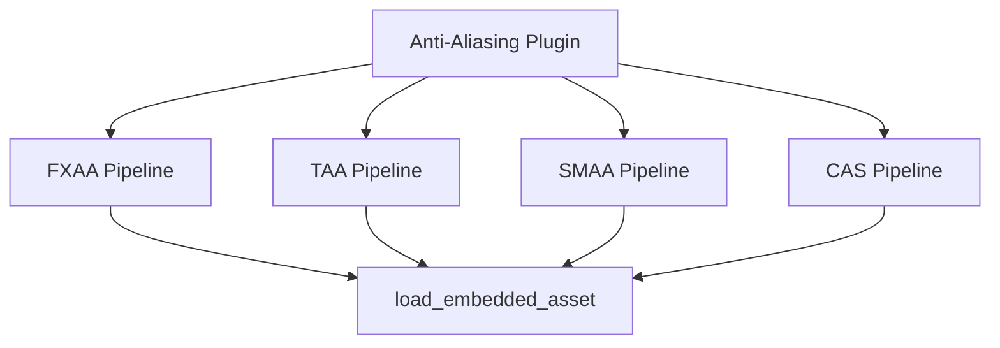

+++
title = "#19391 Remove Shader weak_handles from bevy_anti_aliasing."
date = "2025-05-27T00:00:00"
draft = false
template = "pull_request_page.html"
in_search_index = true

[taxonomies]
list_display = ["show"]

[extra]
current_language = "en"
available_languages = {"en" = { name = "English", url = "/pull_request/bevy/2025-05/pr-19391-en-20250527" }, "zh-cn" = { name = "中文", url = "/pull_request/bevy/2025-05/pr-19391-zh-cn-20250527" }}
labels = ["A-Rendering", "A-Assets", "D-Straightforward"]
+++

# Remove Shader weak_handles from bevy_anti_aliasing

## Basic Information
- **Title**: Remove Shader weak_handles from bevy_anti_aliasing.
- **PR Link**: https://github.com/bevyengine/bevy/pull/19391
- **Author**: andriyDev
- **Status**: MERGED
- **Labels**: A-Rendering, A-Assets, S-Ready-For-Final-Review, D-Straightforward
- **Created**: 2025-05-27T02:14:47Z
- **Merged**: 2025-05-27T03:34:09Z
- **Merged By**: alice-i-cecile

## Description Translation
# Objective

- Related to #19024

## Solution

- Use the new `load_shader_library` macro for the shader libraries and `embedded_asset`/`load_embedded_asset` for the "shader binaries" in `bevy_anti_aliasing`.

## Testing

- `anti_aliasing` example still works.

P.S. I don't think this needs a migration guide. Technically users could be using the `pub` weak handles, but there's no actual good use for them, so omitting it seems fine. Alternatively, we could mix this in with the migration guide notes for #19137.

## The Story of This Pull Request

The PR addresses technical debt in Bevy's anti-aliasing implementation by modernizing shader asset handling. Previously, various anti-aliasing techniques (FXAA, TAA, SMAA, CAS) used global weak handles to reference shader assets through UUIDs. This approach had several limitations:

1. **Global State Management**: Shader handles were stored as global constants using `weak_handle!` macros
2. **Decoupled Loading**: Shader loading happened separately from pipeline creation
3. **Asset System Limitations**: Didn't leverage newer embedded asset infrastructure

The solution migrates to Bevy's updated asset system using two key mechanisms:
- `embedded_asset!` for declaring embedded shader files
- `load_embedded_asset!` for runtime loading within pipeline setup

This change centralizes shader management while maintaining renderer performance. Each anti-aliasing pipeline now loads its shaders directly during initialization rather than relying on pre-registered global handles. The implementation preserves existing functionality while aligning with modern Bevy asset practices.

Key technical decisions:
1. **Pipeline-Centric Loading**: Shaders load during pipeline creation via `FromWorld` implementations
2. **Asset Isolation**: Each pipeline maintains its own shader handle reference
3. **Backward Compatibility**: Maintains public API surface for anti-aliasing configuration

The migration follows a consistent pattern across all anti-aliasing techniques. For example, in the FXAA implementation:

```rust
// Before: Global weak handle
const FXAA_SHADER_HANDLE: Handle<Shader> = weak_handle!("fc58c0a8...");

// After: Pipeline-local loading
FxaaPipeline {
    shader: load_embedded_asset!(render_world, "fxaa.wgsl")
}
```

This approach eliminates global state while keeping shader loading efficient. The renderer's architecture now better matches Bevy's asset lifecycle management, where resources load and unload with their dependent systems.

## Visual Representation



## Key Files Changed

### `crates/bevy_anti_aliasing/src/smaa/mod.rs` (+19/-10)
1. Replaced global shader handle with embedded asset loading
2. Added shader handle storage to pipeline structs
3. Updated render pipeline creation to use local shader references

```rust
// Before:
load_internal_asset!(app, SMAA_SHADER_HANDLE, "smaa.wgsl");

// After:
embedded_asset!(app, "smaa.wgsl");
let shader = load_embedded_asset!(world, "smaa.wgsl");
SmaaEdgeDetectionPipeline { shader }
```

### `crates/bevy_anti_aliasing/src/contrast_adaptive_sharpening/mod.rs` (+5/-11)
1. Removed global CONTRAST_ADAPTIVE_SHARPENING_SHADER_HANDLE
2. Implemented runtime shader loading in CasPipeline

```rust
// Before:
load_internal_asset!(app, CONTRAST_ADAPTIVE_SHARPENING_SHADER_HANDLE, ...);

// After:
embedded_asset!(app, "robust_contrast_adaptive_sharpening.wgsl");
shader: load_embedded_asset!(render_world, ...)
```

### `crates/bevy_anti_aliasing/src/fxaa/mod.rs` (+5/-5)
1. Migrated FXAA to embedded asset system
2. Added shader field to FxaaPipeline

```rust
// Pipeline struct update
pub struct FxaaPipeline {
    ...
    shader: Handle<Shader>,
}
```

### `crates/bevy_anti_aliasing/src/taa/mod.rs` (+5/-5)
1. Removed TAA_SHADER_HANDLE constant
2. Integrated embedded asset loading for TAA shader

```rust
// Before:
load_internal_asset!(app, TAA_SHADER_HANDLE, "taa.wgsl");

// After:
embedded_asset!(app, "taa.wgsl");
shader: load_embedded_asset!(world, "taa.wgsl")
```

## Further Reading
1. [Bevy Asset System Documentation](https://bevyengine.org/learn/book/assets/)
2. [WGSL Shader Language Spec](https://gpuweb.github.io/gpuweb/wgsl/)
3. [Bevy Render Pipeline Guide](https://bevyengine.org/learn/book/rendering/pipeline)
4. PR #19137 - Related asset system improvements
5. PR #19024 - Shader hot-reloading foundation