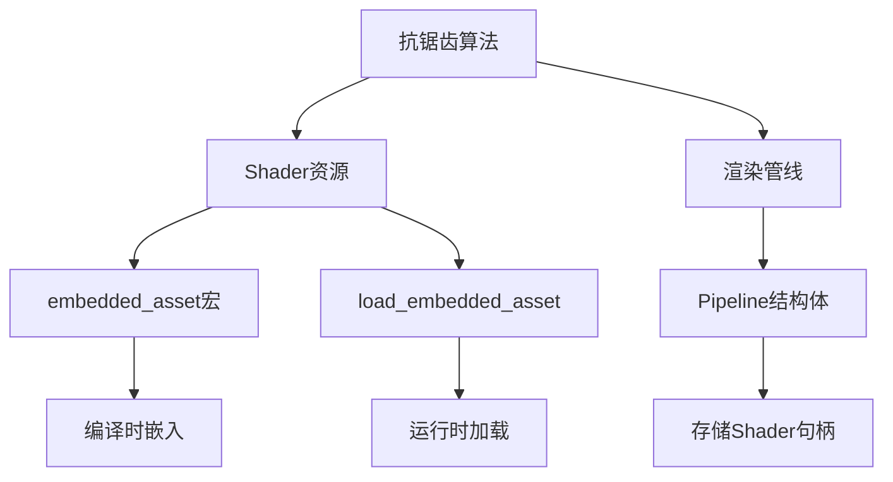

+++
title = "#19391 Remove Shader weak_handles from bevy_anti_aliasing."
date = "2025-05-27T00:00:00"
draft = false
template = "pull_request_page.html"
in_search_index = false

[extra]
current_language = "zh-cn"
available_languages = {"en" = { name = "English", url = "/pull_request/bevy/2025-05/pr-19391-en-20250527" }, "zh-cn" = { name = "中文", url = "/pull_request/bevy/2025-05/pr-19391-zh-cn-20250527" }}
labels = ["A-Rendering", "A-Assets", "D-Straightforward"]
+++

# Remove Shader weak_handles from bevy_anti_aliasing

## Basic Information
- **Title**: Remove Shader weak_handles from bevy_anti_aliasing.
- **PR Link**: https://github.com/bevyengine/bevy/pull/19391
- **Author**: andriyDev
- **Status**: MERGED
- **Labels**: A-Rendering, A-Assets, S-Ready-For-Final-Review, D-Straightforward
- **Created**: 2025-05-27T02:14:47Z
- **Merged**: 2025-05-27T03:34:09Z
- **Merged By**: alice-i-cecile

## Description Translation
该PR的目标是改进Bevy抗锯齿模块的着色器资源管理。解决方案包括：

- 使用新的`load_shader_library`宏管理着色器库
- 采用`embedded_asset`/`load_embedded_asset`处理着色器二进制资源
- 移除原有的weak_handles弱句柄实现
- 保持所有抗锯齿算法（FXAA、TAA、CAS、SMAA）的现有功能不变
- 确认`anti_aliasing`示例仍可正常工作

作者认为不需要专门的迁移指南，因为weak_handles原本就没有合理的公开使用场景。

## The Story of This Pull Request

### 问题背景
Bevy渲染系统中的抗锯齿模块（bevy_anti_aliasing）原本使用weak_handles机制管理着色器资源。这种实现方式存在以下问题：

1. **资源标识脆弱**：通过硬编码UUID（如`weak_handle!("ef83f0a5-51df-4b51-9ab7-b5fd1ae5a397")`）标识着色器资源，容易在资源变更时产生冲突
2. **全局状态依赖**：使用全局常量存储着色器句柄，不利于模块化设计
3. **与新资产系统不兼容**：Bevy在#19137等PR中引入了新的嵌入式资源管理方式，需要统一资源加载模式

### 解决方案
采用Bevy新引入的嵌入式资源API重构着色器管理：

```rust
// 旧实现
const SHADER_HANDLE: Handle<Shader> = weak_handle!("...");
load_internal_asset!(app, SHADER_HANDLE, "shader.wgsl");

// 新实现
embedded_asset!(app, "shader.wgsl"); // 声明嵌入式资源
let shader = load_embedded_asset!(world, "shader.wgsl"); // 运行时加载
```

### 具体实现
核心改动集中在各抗锯齿算法的Pipeline结构体中：

1. **移除全局句柄常量**
2. **在Pipeline中存储shader句柄**
3. **使用标准化资源路径替代UUID**
4. **保持渲染管线构建逻辑不变**

以CAS（对比度自适应锐化）为例：

```rust
// 修改前
const CONTRAST_ADAPTIVE_SHARPENING_SHADER_HANDLE: Handle<Shader> = 
    weak_handle!("ef83f0a5-51df-4b51-9ab7-b5fd1ae5a397");

// 修改后
pub struct CasPipeline {
    // ...
    shader: Handle<Shader>, // 句柄存储于Pipeline实例中
}

impl FromWorld for CasPipeline {
    fn from_world(world: &mut World) -> Self {
        let shader = load_embedded_asset!(world, "robust_contrast_adaptive_sharpening.wgsl");
        // ...
    }
}
```

### 技术考量
1. **资源生命周期管理**：将shader句柄与Pipeline绑定，确保资源生命周期与使用场景一致
2. **编译时验证**：`embedded_asset!`宏会在编译时检查资源文件存在性，避免运行时错误
3. **路径可维护性**：使用文件路径替代UUID，更直观且便于重构工具处理
4. **兼容性保障**：保持原有渲染管线接口不变，确保下游用户无感知升级

### 影响分析
1. **代码健壮性提升**：消除UUID冲突风险
2. **资源加载标准化**：与Bevy其他模块的资源管理方式统一
3. **内存优化**：嵌入式资源在编译时处理，减少运行时开销
4. **未来扩展性**：为后续的shader热重载等功能奠定基础

## Visual Representation



## Key Files Changed

### crates/bevy_anti_aliasing/src/smaa/mod.rs (+19/-10)
1. **改动原因**：适配SMAA算法的shader加载方式
2. **核心代码**：
```rust
// 修改前
load_internal_asset!(app, SMAA_SHADER_HANDLE, "smaa.wgsl");

// 修改后
embedded_asset!(app, "smaa.wgsl");
let shader = load_embedded_asset!(world, "smaa.wgsl");
```

### crates/bevy_anti_aliasing/src/contrast_adaptive_sharpening/mod.rs (+5/-11)
1. **改动原因**：重构CAS着色器管理
2. **管线结构变化**：
```rust
pub struct CasPipeline {
    // 新增shader字段
    shader: Handle<Shader>,
}
```

### crates/bevy_anti_aliasing/src/fxaa/mod.rs (+5/-5)
1. **统一资源加载**：
```rust
// 旧方式
const FXAA_SHADER_HANDLE: Handle<Shader> = weak_handle!("...");

// 新方式
embedded_asset!(app, "fxaa.wgsl");
```

### crates/bevy_anti_aliasing/src/taa/mod.rs (+5/-5)
1. **移除全局句柄**：
```rust
// 删除
const TAA_SHADER_HANDLE: Handle<Shader> = weak_handle!("...");
```

## Further Reading
1. [Bevy嵌入式资源文档](https://bevyengine.org/learn/book/assets/embedded-assets/)
2. [WGSL着色器语言规范](https://gpuweb.github.io/gpuweb/wgsl/)
3. [Bevy渲染管线架构](https://github.com/bevyengine/bevy/blob/main/docs/plugins_guidelines.md#rendering-plugins)