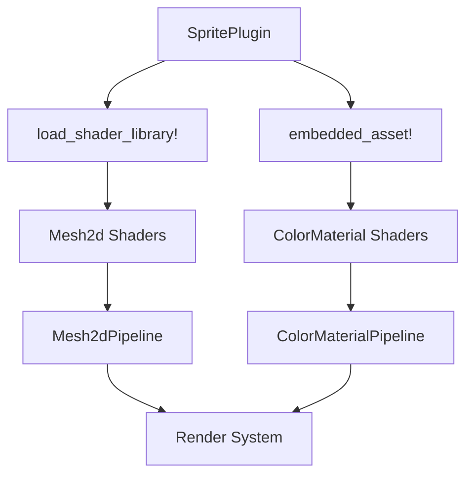

+++
title = "#19392 Remove Shader weak_handles from bevy_sprite"
date = "2025-05-27T00:00:00"
draft = false
template = "pull_request_page.html"
in_search_index = true

[taxonomies]
list_display = ["show"]

[extra]
current_language = "en"
available_languages = {"en" = { name = "English", url = "/pull_request/bevy/2025-05/pr-19392-en-20250527" }, "zh-cn" = { name = "中文", url = "/pull_request/bevy/2025-05/pr-19392-zh-cn-20250527" }}
labels = ["A-Rendering", "A-Assets", "C-Code-Quality"]
+++

# Remove Shader weak_handles from bevy_sprite

## Basic Information
- **Title**: Remove Shader weak_handles from bevy_sprite
- **PR Link**: https://github.com/bevyengine/bevy/pull/19392
- **Author**: andriyDev
- **Status**: MERGED
- **Labels**: A-Rendering, A-Assets, C-Code-Quality, S-Ready-For-Final-Review
- **Created**: 2025-05-27T03:43:55Z
- **Merged**: 2025-05-27T04:19:28Z
- **Merged By**: alice-i-cecile

## Description Translation
The original description is in English and preserved as-is:

# Objective

- Related to #19024

## Solution

- Use the new `load_shader_library` macro for the shader libraries and `embedded_asset`/`load_embedded_asset` for the "shader binaries" in `bevy_sprite`.

## Testing

- `sprite` example still works.
- `mesh2d` example still works.

P.S. I don't think this needs a migration guide. Technically users could be using the `pub` weak handles, but there's no actual good use for them, so omitting it seems fine. Alternatively, we could mix this in with the migration guide notes for #19137.

## The Story of This Pull Request

### The Problem and Context
The Bevy engine was undergoing asset system improvements (#19024) that introduced new mechanisms for handling embedded assets. The sprite module historically used `weak_handle!` macros with hardcoded UUIDs to reference internal shaders. This approach had several drawbacks:

1. **Maintenance Overhead**: Each shader required manual UUID management
2. **Code Clutter**: Multiple `load_internal_asset!` calls complicated module initialization
3. **Modernization Lag**: Newer asset handling patterns using `embedded_asset` weren't being utilized

### The Solution Approach
The author chose to:
1. Replace `weak_handle!` declarations with embedded asset paths
2. Migrate from `load_internal_asset!` to:
   - `load_shader_library!` for shared WGSL modules
   - `embedded_asset!` for complete shader files
3. Update material systems to reference shaders through asset paths instead of handles

Key engineering decisions:
- **Asset Type Differentiation**: Separated shader libraries (reusable snippets) from complete shader files
- **Runtime Flexibility**: Maintained dynamic shader configuration through `ShaderSettings`
- **Backwards Compatibility**: Verified through existing example preservation

### The Implementation
The changes centered around asset loading patterns. Here's a typical transformation seen in `mesh2d/mesh.rs`:

**Before:**
```rust
load_internal_asset!(
    app,
    MESH2D_VIEW_BINDINGS_HANDLE,
    "mesh2d_view_bindings.wgsl",
    Shader::from_wgsl
);
```

**After:**
```rust
load_shader_library!(app, "mesh2d_view_bindings.wgsl");
```

This pattern eliminates UUID-based handles and leverages Bevy's newer asset system. The `mesh2d_bindings.wgsl` loading demonstrates handling runtime conditions:

```rust
load_shader_library!(app, "mesh2d_bindings.wgsl", move |settings| *settings =
    ShaderSettings {
        shader_defs: mesh_bindings_shader_defs.clone()
    });
```

Material systems now reference shaders through embedded paths instead of handles, as seen in `color_material.rs`:

```rust
ShaderRef::Path(
    AssetPath::from_path_buf(embedded_path!("color_material.wgsl")).with_source("embedded"),
)
```

### Technical Insights
Key technical aspects of the implementation:

1. **Asset System Integration**:
   - `embedded_asset!` compiles shaders into the binary
   - `load_embedded_asset!` retrieves them at runtime
   - `load_shader_library!` handles shared WGSL modules

2. **Pipeline Modernization**:
   - Render pipelines now store direct shader handles:
     ```rust
     pub struct Mesh2dPipeline {
         pub shader: Handle<Shader>,
         // ...
     }
     ```
   - Initialization uses embedded assets:
     ```rust
     shader: load_embedded_asset!(world, "mesh2d.wgsl")
     ```

3. **Shader Def Propagation**:
   - Maintained ability to set shader definitions dynamically based on render capabilities

### The Impact
These changes provide several concrete improvements:

1. **Reduced Maintenance**:
   - Eliminated 56 lines of UUID-based handle declarations
   - Removed manual shader handle tracking

2. **Improved Code Clarity**:
   - Shader dependencies are now visible through file paths
   - Asset loading patterns align with modern Bevy conventions

3. **Foundation for Future Work**:
   - Paves way for centralized asset management
   - Enables easier shader hot-reloading when combined with other systems

## Visual Representation



## Key Files Changed

1. `crates/bevy_sprite/src/lib.rs` (+6/-19)
   - Replaced multiple `load_internal_asset!` calls with `load_shader_library!` and `embedded_asset!`
   - Removed UUID-based shader handle constants

2. `crates/bevy_sprite/src/mesh2d/mesh.rs` (+17/-56)
   - Consolidated shader loading:
     ```rust
     // Before: 6 separate load_internal_asset! calls
     // After:
     load_shader_library!(app, "mesh2d_vertex_output.wgsl");
     embedded_asset!(app, "mesh2d.wgsl");
     ```
   - Added direct shader handle to pipeline struct

3. `crates/bevy_sprite/src/mesh2d/color_material.rs` (+5/-11)
   - Updated material shader reference:
     ```rust
     // Before: COLOR_MATERIAL_SHADER_HANDLE.into()
     // After:
     ShaderRef::Path(embedded_path!("color_material.wgsl"))
     ```

4. `crates/bevy_sprite/src/mesh2d/wireframe2d.rs` (+3/-11)
   - Migrated to embedded assets:
     ```rust
     // Before: WIREFRAME_2D_SHADER_HANDLE
     // After: load_embedded_asset!(render_world, "wireframe2d.wgsl")
     ```

5. `crates/bevy_sprite/src/render/mod.rs` (+6/-4)
   - Updated sprite pipeline to use embedded shader:
     ```rust
     shader: load_embedded_asset!(world, "sprite.wgsl")
     ```

## Further Reading

1. [Bevy Asset System Documentation](https://bevyengine.org/learn/book/assets/)
2. [WGSL Shader Programming Guide](https://bevyengine.org/learn/book/shader/)
3. [Bevy Render Pipeline Architecture](https://bevyengine.org/learn/book/render-pipelines/)