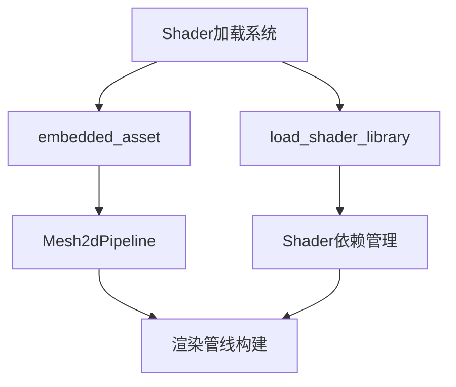

+++
title = "#19392 Remove Shader weak_handles from bevy_sprite."
date = "2025-05-27T00:00:00"
draft = false
template = "pull_request_page.html"
in_search_index = false

[extra]
current_language = "zh-cn"
available_languages = {"en" = { name = "English", url = "/pull_request/bevy/2025-05/pr-19392-en-20250527" }, "zh-cn" = { name = "中文", url = "/pull_request/bevy/2025-05/pr-19392-zh-cn-20250527" }}
labels = ["A-Rendering", "A-Assets", "C-Code-Quality"]
+++

# Remove Shader weak_handles from bevy_sprite

## Basic Information
- **Title**: Remove Shader weak_handles from bevy_sprite.
- **PR Link**: https://github.com/bevyengine/bevy/pull/19392
- **Author**: andriyDev
- **Status**: MERGED
- **Labels**: A-Rendering, A-Assets, C-Code-Quality, S-Ready-For-Final-Review
- **Created**: 2025-05-27T03:43:55Z
- **Merged**: 2025-05-27T04:19:28Z
- **Merged By**: alice-i-cecile

## Description Translation
### 目标
- 关联 #19024

### 解决方案
- 在 `bevy_sprite` 中使用新的 `load_shader_library` 宏处理 shader 库，使用 `embedded_asset`/`load_embedded_asset` 处理 "shader binaries"

### 测试
- `sprite` 示例仍然工作
- `mesh2d` 示例仍然工作

注：作者认为不需要迁移指南，因为用户理论上虽然可能使用公开的 weak handles，但实际没有合理的使用场景

## The Story of This Pull Request

### 问题背景
在 Bevy 的渲染系统中，shader 资源管理长期使用 `weak_handle!` 宏配合 UUID 进行弱引用管理。这种方式存在以下问题：
1. **维护成本高**：需要手动管理全局唯一的 UUID
2. **与新版资产系统不兼容**：新的 embedded asset 系统提供了更好的编译时保障
3. **代码冗余**：每个 shader 都需要单独声明 handle 并加载

### 解决方案
采用 Bevy 新引入的资产管理系统特性：
1. 使用 `load_shader_library!` 宏处理 shader 依赖库
2. 通过 `embedded_asset!` 将 shader 文件直接嵌入二进制
3. 使用 `load_embedded_asset` 在运行时加载嵌入的 shader

```rust
// 旧方式
load_internal_asset!(app, HANDLE, "shader.wgsl", Shader::from_wgsl);

// 新方式
embedded_asset!(app, "shader.wgsl");
let shader = load_embedded_asset!(world, "shader.wgsl");
```

### 关键技术实现
1. **Shader 加载标准化**：
   - 移除所有 `weak_handle!` 声明
   - 使用统一路径引用替代 UUID
   - 示例：color_material.rs 中的 shader 引用方式改造

```rust
// 修改前
COLOR_MATERIAL_SHADER_HANDLE.into()

// 修改后
ShaderRef::Path(
    AssetPath::from_path_buf(embedded_path!("color_material.wgsl")).with_source("embedded")
)
```

2. **渲染管线重构**：
   - 在 Mesh2dPipeline 中直接存储 shader handle
   - 消除对全局静态 handle 的依赖

```rust
// mesh.rs 修改片段
pub struct Mesh2dPipeline {
    pub shader: Handle<Shader>, // 新增字段
    // ...
}

impl FromWorld for Mesh2dPipeline {
    fn from_world(world: &mut World) -> Self {
        // 通过 embedded asset 加载
        shader: load_embedded_asset!(world, "mesh2d.wgsl")
    }
}
```

### 影响与改进
1. **代码质量提升**：
   - 删除 56 行旧式 handle 声明代码
   - 统一 5 个模块的 shader 加载方式
2. **维护性增强**：
   - 消除 UUID 冲突风险
   - 路径引用方式更易追踪 shader 来源
3. **与新资产系统集成**：
   - 为未来动态 shader 加载奠定基础
   - 支持热重载等现代资产特性

## Visual Representation



## Key Files Changed

### crates/bevy_sprite/src/lib.rs (+6/-19)
- 移除两个 shader handle 的全局声明
- 改用 `load_shader_library!` 和 `embedded_asset!`
```rust
// 修改前
load_internal_asset!(app, HANDLE, "sprite.wgsl", Shader::from_wgsl);

// 修改后
load_shader_library!(app, "render/sprite_view_bindings.wgsl");
embedded_asset!(app, "render/sprite.wgsl");
```

### crates/bevy_sprite/src/mesh2d/mesh.rs (+17/-56)
- 删除 6 个 shader handle 声明
- 重构 Mesh2dPipeline 的 shader 加载
```rust
// 修改后 shader 加载方式
load_shader_library!(app, "mesh2d_vertex_output.wgsl");
embedded_asset!(app, "mesh2d.wgsl");
```

### crates/bevy_sprite/src/render/mod.rs (+6/-4)
- 改用动态加载嵌入 shader
```rust
// 管线结构体新增字段
pub struct SpritePipeline {
    shader: Handle<Shader>,
}

// 加载方式
shader: load_embedded_asset!(world, "sprite.wgsl")
```

## Further Reading
1. [Bevy 嵌入式资产系统文档](https://bevyengine.org/learn/book/features/assets/embedded-assets)
2. [WGSL 着色器语言规范](https://www.w3.org/TR/WGSL/)
3. [现代图形管线设计模式](https://github.com/gpuweb/gpuweb/wiki/Implementation-Status)