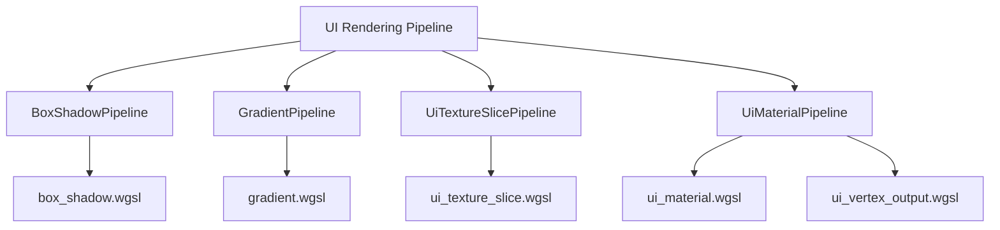

+++
title = "#19393 Remove Shader weak_handles from bevy_ui"
date = "2025-05-27T00:00:00"
draft = false
template = "pull_request_page.html"
in_search_index = true

[taxonomies]
list_display = ["show"]

[extra]
current_language = "en"
available_languages = {"en" = { name = "English", url = "/pull_request/bevy/2025-05/pr-19393-en-20250527" }, "zh-cn" = { name = "中文", url = "/pull_request/bevy/2025-05/pr-19393-zh-cn-20250527" }}
labels = ["A-Rendering", "A-Assets", "D-Straightforward"]
+++

# Title: Remove Shader weak_handles from bevy_ui

## Basic Information
- **Title**: Remove Shader weak_handles from bevy_ui
- **PR Link**: https://github.com/bevyengine/bevy/pull/19393
- **Author**: andriyDev
- **Status**: MERGED
- **Labels**: A-Rendering, A-Assets, S-Ready-For-Final-Review, D-Straightforward
- **Created**: 2025-05-27T05:22:25Z
- **Merged**: 2025-05-27T22:53:12Z
- **Merged By**: alice-i-cecile

## Description Translation
# Objective

- Related to #19024

## Solution

- Use the new `load_shader_library` macro for the shader libraries and `embedded_asset`/`load_embedded_asset` for the "shader binaries" in `bevy_ui`.

## Testing

- `box_shadow` example still works.
- `gradient` example is broken at head (see #19384) - but otherwise gives the same result in the console.
- `ui_materials` example still works.
- `ui_texture_slice` example still works.

P.S. I don't think this needs a migration guide. Technically users could be using the `pub` weak handles, but there's no actual good use for them, so omitting it seems fine. Alternatively, we could mix this in with the migration guide notes for #19137.

## The Story of This Pull Request

The PR addresses technical debt in Bevy's UI shader handling by eliminating legacy weak handle usage. Prior to this change, bevy_ui used global `weak_handle!` declarations for shader assets, which presented maintenance challenges and implicit dependencies between modules.

The core issue stemmed from how shader assets were loaded and referenced. Previous implementation used:

```rust
pub const UI_SHADER_HANDLE: Handle<Shader> = weak_handle!("7d190d05-545b-42f5-bd85-22a0da85b0f6");
load_internal_asset!(app, UI_SHADER_HANDLE, "ui.wgsl", Shader::from_wgsl);
```

This approach created publicly exposed handles that weren't truly necessary, and the weak handle system complicated asset loading. The new pattern using `embedded_asset` and `load_embedded_asset` macros centralizes shader management within pipeline initialization:

```rust
embedded_asset!(app, "box_shadow.wgsl");
// In pipeline construction:
shader: load_embedded_asset!(world, "box_shadow.wgsl"),
```

Key engineering decisions included:
1. Moving shader references into pipeline structs to encapsulate dependencies
2. Using the newer embedded asset system for clearer asset loading
3. Removing public handle exports to reduce API surface area

The changes affect multiple rendering subsystems including box shadows, gradients, and texture slicing. Each pipeline now explicitly loads its required shaders during initialization rather than relying on global handles. This improves encapsulation and makes the asset loading flow more explicit.

Testing confirmed existing functionality remained intact across core UI examples. The migration aligns with broader Bevy asset system improvements from #19137, though the author considered whether to include migration notes for users potentially accessing the removed handles.

## Visual Representation



## Key Files Changed

### crates/bevy_ui/src/render/box_shadow.rs (+8/-12)
**Before:**
```rust
pub const BOX_SHADOW_SHADER_HANDLE: Handle<Shader> = 
    weak_handle!("d2991ecd-134f-4f82-adf5-0fcc86f02227");

load_internal_asset!(
    app,
    BOX_SHADOW_SHADER_HANDLE,
    "box_shadow.wgsl",
    Shader::from_wgsl
);
```

**After:**
```rust
embedded_asset!(app, "box_shadow.wgsl");

// In BoxShadowPipeline construction:
shader: load_embedded_asset!(world, "box_shadow.wgsl"),
```

### crates/bevy_ui/src/render/ui_material_pipeline.rs (+20/-36)
**Key Change:**
```rust
// Before: Separate shader handles
pub const UI_MATERIAL_SHADER_HANDLE: Handle<Shader> = 
    weak_handle!("b5612b7b-aed5-41b4-a930-1d1588239fcd");

// After: Direct embedded asset loading
embedded_asset!(app, "ui_material.wgsl");
shader: load_embedded_asset!(asset_server, "ui_material.wgsl")
```

### crates/bevy_ui/src/render/mod.rs (+3/-4)
**Structural Change:**
```rust
// Before: Weak handle-based loading
load_internal_asset!(app, UI_SHADER_HANDLE, "ui.wgsl", Shader::from_wgsl);

// After: Macro-based library loading
load_shader_library!(app, "ui.wgsl");
```

## Further Reading
1. [Bevy Asset System Migration Guide](https://bevyengine.org/learn/migration-guides/0.13-0.14/assets/)
2. [Embedded Assets Documentation](https://github.com/bevyengine/bevy/pull/19137)
3. [WGSL Shader Programming in Bevy](https://bevy-cheatbook.github.io/features/shader.html)

# Full Code Diff
[See original PR diff at https://github.com/bevyengine/bevy/pull/19393/files]