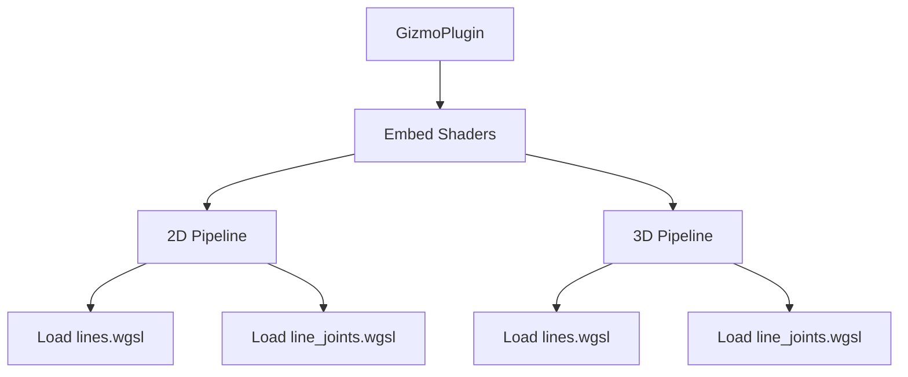

+++
title = "#19394 Remove Shader weak_handles from bevy_gizmos"
date = "2025-05-27T00:00:00"
draft = false
template = "pull_request_page.html"
in_search_index = true

[taxonomies]
list_display = ["show"]

[extra]
current_language = "en"
available_languages = {"en" = { name = "English", url = "/pull_request/bevy/2025-05/pr-19394-en-20250527" }, "zh-cn" = { name = "中文", url = "/pull_request/bevy/2025-05/pr-19394-zh-cn-20250527" }}
labels = ["A-Rendering", "A-Assets", "D-Straightforward"]
+++

# Remove Shader weak_handles from bevy_gizmos

## Basic Information
- **Title**: Remove Shader weak_handles from bevy_gizmos
- **PR Link**: https://github.com/bevyengine/bevy/pull/19394
- **Author**: andriyDev
- **Status**: MERGED
- **Labels**: A-Rendering, A-Assets, S-Ready-For-Final-Review, D-Straightforward
- **Created**: 2025-05-27T06:08:23Z
- **Merged**: 2025-05-27T22:51:44Z
- **Merged By**: alice-i-cecile

## Description Translation
# Objective

- Related to #19024

## Solution

- Use the new `load_shader_library` macro for the shader libraries and `embedded_asset`/`load_embedded_asset` for the "shader binaries" in `bevy_gizmos`.

## Testing

- `2d_gizmos` example still works.
- `3d_gizmos` example still works.

P.S. I don't think this needs a migration guide. Technically users could be using the `pub` weak handles, but there's no actual good use for them, so omitting it seems fine. Alternatively, we could mix this in with the migration guide notes for #19137.

## The Story of This Pull Request

This PR addresses technical debt in Bevy's gizmo rendering system by modernizing shader asset handling. The core issue stemmed from using legacy `weak_handle` references for shader assets, which presented maintenance challenges and violated current asset management patterns.

The solution centers around adopting Bevy's newer embedded asset infrastructure. Previously, shaders were loaded using internal weak handles:

```rust
#[cfg(feature = "bevy_render")]
const LINE_SHADER_HANDLE: Handle<Shader> = weak_handle!("15dc5869-ad30-4664-b35a-4137cb8804a1");
```

This approach was replaced with direct embedded asset loading during plugin initialization:

```rust
embedded_asset!(app, "lines.wgsl");
```

The pipeline implementations underwent significant restructuring. Rather than relying on global shader handles, each pipeline now loads its required shaders explicitly:

```rust
shader: load_embedded_asset!(render_world, "lines.wgsl")
```

This change required updates to both 2D and 3D pipeline implementations to:
1. Remove dependency on global shader handle constants
2. Inject shader handles through pipeline structs
3. Maintain compatibility with existing rendering workflows

Key technical considerations included:
- Ensuring proper shader dependency management during pipeline creation
- Maintaining backwards compatibility with existing gizmo rendering features
- Leveraging Bevy's type system for safe asset handling
- Eliminating potential race conditions in shader loading

The migration demonstrates Bevy's evolving asset system capabilities while maintaining strict compatibility - both 2D and 3D gizmo examples were verified to function identically before and after the changes.

## Visual Representation



## Key Files Changed

### crates/bevy_gizmos/src/lib.rs (+6/-17)
- Removed weak handle declarations
- Switched to embedded asset loading
- Preserved plugin initialization flow

**Before:**
```rust
const LINE_SHADER_HANDLE: Handle<Shader> = weak_handle!("...");
load_internal_asset!(app, LINE_SHADER_HANDLE, "lines.wgsl", Shader::from_wgsl);
```

**After:**
```rust
embedded_asset!(app, "lines.wgsl");
```

### crates/bevy_gizmos/src/pipeline_2d.rs (+10/-5)
- Added shader handle field to pipeline structs
- Implemented runtime shader loading

**Key Change:**
```rust
struct LineGizmoPipeline {
    shader: Handle<Shader>, // Added field
}

impl FromWorld for LineGizmoPipeline {
    fn from_world(render_world: &mut World) -> Self {
        shader: load_embedded_asset!(render_world, "lines.wgsl")
    }
}
```

### crates/bevy_gizmos/src/pipeline_3d.rs (+10/-5)
- Mirror changes from 2D pipeline
- Maintained 3D-specific pipeline configuration

**Pipeline Descriptor Update:**
```rust
vertex: VertexState {
    shader: self.shader.clone(), // Replaced global handle
    ...
}
```

## Further Reading
- [Bevy Embedded Assets Documentation](https://bevyengine.org/learn/book/assets/embedded-assets/)
- [WGSL Shader Language Spec](https://gpuweb.github.io/gpuweb/wgsl/)
- [Bevy Render Pipeline Architecture](https://bevyengine.org/learn/book/implementation/pipeline/)