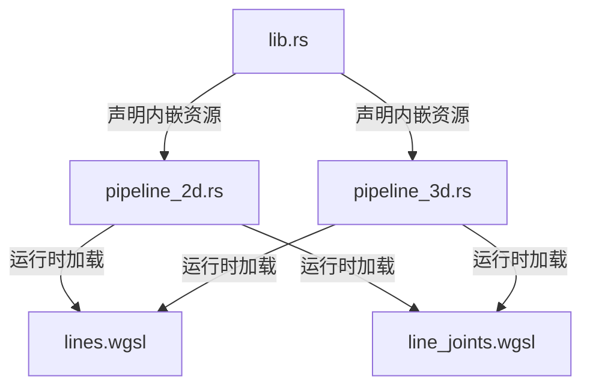

+++
title = "#19394 Remove Shader weak_handles from bevy_gizmos"
date = "2025-05-27T00:00:00"
draft = false
template = "pull_request_page.html"
in_search_index = false

[extra]
current_language = "zh-cn"
available_languages = {"en" = { name = "English", url = "/pull_request/bevy/2025-05/pr-19394-en-20250527" }, "zh-cn" = { name = "中文", url = "/pull_request/bevy/2025-05/pr-19394-zh-cn-20250527" }}
labels = ["A-Rendering", "A-Assets", "D-Straightforward"]
+++

# Remove Shader weak_handles from bevy_gizmos

## Basic Information
- **Title**: Remove Shader weak_handles from bevy_gizmos
- **PR Link**: https://github.com/bevyengine/bevy/pull/19394
- **Author**: andriyDev
- **Status**: MERGED
- **Labels**: A-Rendering, A-Assets, S-Ready-For-Final-Review, D-Straightforward
- **Created**: 2025-05-27T06:08:23Z
- **Merged**: 2025-05-27T22:51:44Z
- **Merged By**: alice-i-cecile

## Description Translation
该 PR 的目标是移除 `bevy_gizmos` 中使用的 Shader weak_handles，改用新的资源加载方式：

### 目标
- 关联 issue #19024

### 解决方案
- 使用新的 `load_shader_library` 宏处理 shader 库
- 使用 `embedded_asset`/`load_embedded_asset` 处理 `bevy_gizmos` 的 shader 二进制文件

### 测试验证
- `2d_gizmos` 示例仍正常工作
- `3d_gizmos` 示例仍正常工作

作者认为不需要迁移指南，因为理论上用户可能在使用公开的 weak handles，但实际上没有合理的用例，因此直接移除是可行的。

## The Story of This Pull Request

### 问题背景
在 Bevy 的渲染系统中，`weak_handle!` 传统上用于引用内嵌的 shader 资源。这种方式存在两个主要问题：
1. 使用全局静态句柄可能带来维护复杂性
2. 不符合 Bevy 最新的资源加载最佳实践（如 #19137 引入的改进）

具体到 `bevy_gizmos` 模块，原有的实现通过硬编码的 UUID 创建 weak handles 来加载 lines.wgsl 和 line_joints.wgsl 两个 shader：

```rust
#[cfg(feature = "bevy_render")]
const LINE_SHADER_HANDLE: Handle<Shader> = weak_handle!("15dc5869-ad30-4664-b35a-4137cb8804a1");
```

这种方式存在潜在风险，因为 UUID 需要人工维护，且不符合 Bevy 新引入的嵌入式资源管理规范。

### 解决方案
采用 Bevy 0.14 引入的 `embedded_asset` 宏和 `load_embedded_asset!` 方法来实现更规范的 shader 加载。主要变化包括：

1. **资源声明方式改进**：
   - 使用 `embedded_asset!` 宏声明内嵌资源路径
   - 移除原有的全局 weak handle 定义

2. **运行时加载优化**：
   - 在渲染管线初始化时动态加载 shader
   - 通过 `load_embedded_asset!` 获取实际的 shader 句柄

### 实现细节
在 `lib.rs` 中，资源加载逻辑被重构：

```rust
// Before:
load_internal_asset!(app, LINE_SHADER_HANDLE, "lines.wgsl", Shader::from_wgsl);

// After:
embedded_asset!(app, "lines.wgsl");
```

这种改变将资源路径声明与实际加载解耦，符合 Bevy 的资源系统设计哲学。

在渲染管线（`pipeline_2d.rs` 和 `pipeline_3d.rs`）中，增加了动态加载逻辑：

```rust
struct LineGizmoPipeline {
    shader: Handle<Shader>, // 新增 shader 句柄字段
}

impl FromWorld for LineGizmoPipeline {
    fn from_world(render_world: &mut World) -> Self {
        Self {
            shader: load_embedded_asset!(render_world, "lines.wgsl"),
            // ...其他字段保持不变
        }
    }
}
```

这种改进使得：
1. 资源加载延迟到实际需要时
2. 消除对全局静态句柄的依赖
3. 更好地与 Bevy 的资源热重载机制集成

### 技术洞察
1. **嵌入式资源管理**：
   - `embedded_asset!` 将文件内容直接编译进二进制
   - `load_embedded_asset!` 在运行时按需创建 AssetPath

2. **渲染管线初始化优化**：
   - 在 FromWorld 实现中加载资源，保证单例性
   - 保持渲染管线的纯数据状态，不持有复杂资源

3. **兼容性处理**：
   - 保持原有 shader 的接口不变（lines.wgsl 和 line_joints.wgsl）
   - 仅修改资源加载路径，不改变渲染逻辑

### 影响分析
1. **代码质量提升**：
   - 减少全局状态（移除两个 weak handle 常量）
   - 代码行数净减少（+26/-27）

2. **维护性增强**：
   - 消除人工维护 UUID 的需求
   - 统一资源加载方式，降低认知负担

3. **架构一致性**：
   - 与 #19137 的改动保持同步
   - 为未来可能的资源系统改进铺平道路

## Visual Representation



## Key Files Changed

### crates/bevy_gizmos/src/lib.rs (+6/-17)
- **主要变更**：重构资源声明方式
- **代码示例**：
```rust
// 移除 weak handle 定义
-const LINE_SHADER_HANDLE: Handle<Shader> = weak_handle!("...");

// 改用 embedded_asset 声明
+embedded_asset!(app, "lines.wgsl");
```

### crates/bevy_gizmos/src/pipeline_2d.rs (+10/-5)
- **核心改动**：渲染管线增加动态加载逻辑
- **关键代码**：
```rust
struct LineGizmoPipeline {
+    shader: Handle<Shader>,  // 新增 shader 句柄
}

impl FromWorld for LineGizmoPipeline {
    fn from_world(render_world: &mut World) -> Self {
+        shader: load_embedded_asset!(render_world, "lines.wgsl"),
    }
}
```

### crates/bevy_gizmos/src/pipeline_3d.rs (+10/-5)
- **变更模式**：与 2D 管线保持对称修改
- **架构影响**：确保 2D/3D 管线使用相同的资源加载机制

## Further Reading
1. [Bevy 嵌入式资源文档](https://bevyengine.org/learn/book/assets/embedded/)
2. [PR #19137 - 资源系统重构](https://github.com/bevyengine/bevy/pull/19137)
3. [WGSL Shader 开发指南](https://bevyengine.org/learn/book/shader/)