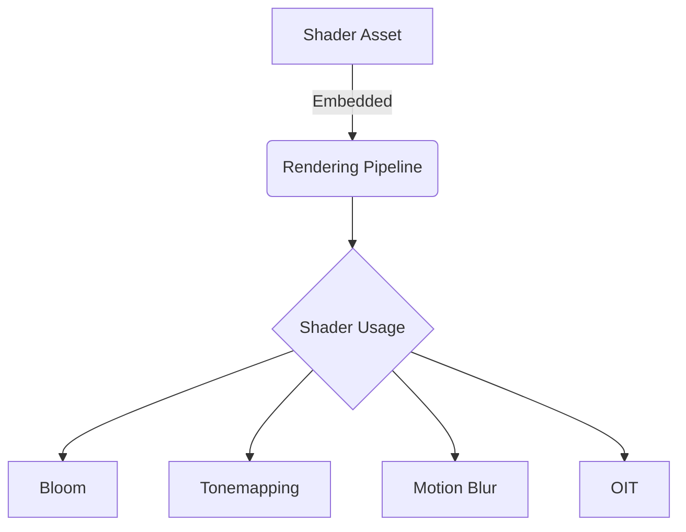

+++
title = "#19395 Remove Shader weak_handles from bevy_core_pipeline (except two)"
date = "2025-05-27T00:00:00"
draft = false
template = "pull_request_page.html"
in_search_index = true

[taxonomies]
list_display = ["show"]

[extra]
current_language = "en"
available_languages = {"en" = { name = "English", url = "/pull_request/bevy/2025-05/pr-19395-en-20250527" }, "zh-cn" = { name = "中文", url = "/pull_request/bevy/2025-05/pr-19395-zh-cn-20250527" }}
labels = ["A-Rendering", "A-Assets", "D-Straightforward"]
+++

# Remove Shader weak_handles from bevy_core_pipeline (except two)

## Basic Information
- **Title**: Remove Shader weak_handles from bevy_core_pipeline (except two)
- **PR Link**: https://github.com/bevyengine/bevy/pull/19395
- **Author**: andriyDev
- **Status**: MERGED
- **Labels**: A-Rendering, A-Assets, S-Ready-For-Final-Review, D-Straightforward
- **Created**: 2025-05-27T06:34:42Z
- **Merged**: 2025-05-27T22:51:43Z
- **Merged By**: alice-i-cecile

## Description Translation
# Objective

- Related to #19024

## Solution

- Use the new `load_shader_library` macro for the shader libraries and `embedded_asset`/`load_embedded_asset` for the "shader binaries" in `bevy_core_pipeline`.

## Testing

- `bloom_3d` example still works.
- `motion_blur` example still works.
- `meshlet` example still works (it uses a shader from core).

P.S. I don't think this needs a migration guide. Technically users could be using the `pub` weak handles, but there's no actual good use for them, so omitting it seems fine. Alternatively, we could mix this in with the migration guide notes for #19137.

## The Story of This Pull Request

This PR addresses technical debt in Bevy's rendering pipeline by modernizing shader asset handling. The core issue stemmed from using weak handles (weak_handle!) for internal shaders, which created maintenance challenges and potential runtime issues. These weak handles represented indirect references to shader assets that weren't properly tracked by Bevy's asset system.

The solution adopts Bevy's newer embedded asset system through two key changes:
1. Replaced weak_handle! declarations with embedded_asset! macros
2. Transitioned to runtime shader loading via load_embedded_asset!

For example, in the tonemapping module:
```rust
// Before:
load_internal_asset!(app, TONEMAPPING_SHADER_HANDLE, "tonemapping.wgsl");

// After:
embedded_asset!(app, "tonemapping.wgsl");
```

This approach provides several technical benefits:
1. Stronger asset tracking through proper handle management
2. Elimination of global static handles that could become stale
3. Better alignment with Bevy's modern asset pipeline
4. Reduced risk of shader loading failures at runtime

The implementation required updating 16 files across various rendering subsystems. Each pipeline now carries its shader reference explicitly, as seen in the Bloom pipeline changes:

```rust
// Added to pipeline struct
pub shader: Handle<Shader>,

// During pipeline creation
shader: load_embedded_asset!(world, "bloom.wgsl")
```

This pattern ensures shaders are loaded through the asset system while maintaining pipeline-specific references. The changes maintain backward compatibility through Bevy's asset hot-reloading capabilities while improving long-term maintainability.

## Visual Representation



## Key Files Changed

1. `crates/bevy_core_pipeline/src/tonemapping/mod.rs` (+9/-29)
- Removed weak handle declarations
- Transitioned to embedded asset loading
- Updated pipeline creation to load shader at runtime

```rust
// Before:
load_internal_asset!(app, TONEMAPPING_SHADER_HANDLE, ...);

// After:
embedded_asset!(app, "tonemapping.wgsl");
```

2. `crates/bevy_core_pipeline/src/post_process/mod.rs` (+9/-21)
- Consolidated shader loading approaches
- Removed legacy handle declarations
- Integrated with new asset system

3. `crates/bevy_core_pipeline/src/skybox/mod.rs` (+11/-15)
- Unified shader handling between main pass and prepass
- Added direct shader references to pipeline structs

4. `crates/bevy_core_pipeline/src/motion_blur/pipeline.rs` (+12/-7)
- Removed global shader handle
- Added shader field to pipeline struct
- Implemented runtime shader loading

```rust
// Pipeline struct update
pub struct MotionBlurPipeline {
    ...
    pub(crate) shader: Handle<Shader>,
}

// Initialization
shader: load_embedded_asset!(render_world, "motion_blur.wgsl")
```

## Further Reading
- [Bevy Embedded Assets Documentation](https://bevyengine.org/learn/book/assets/embedded-assets/)
- [Bevy Shader Hot Reloading Guide](https://bevyengine.org/learn/book/shader/hot-reloading/)
- [WGSL Shader Language Specification](https://gpuweb.github.io/gpuweb/wgsl/)