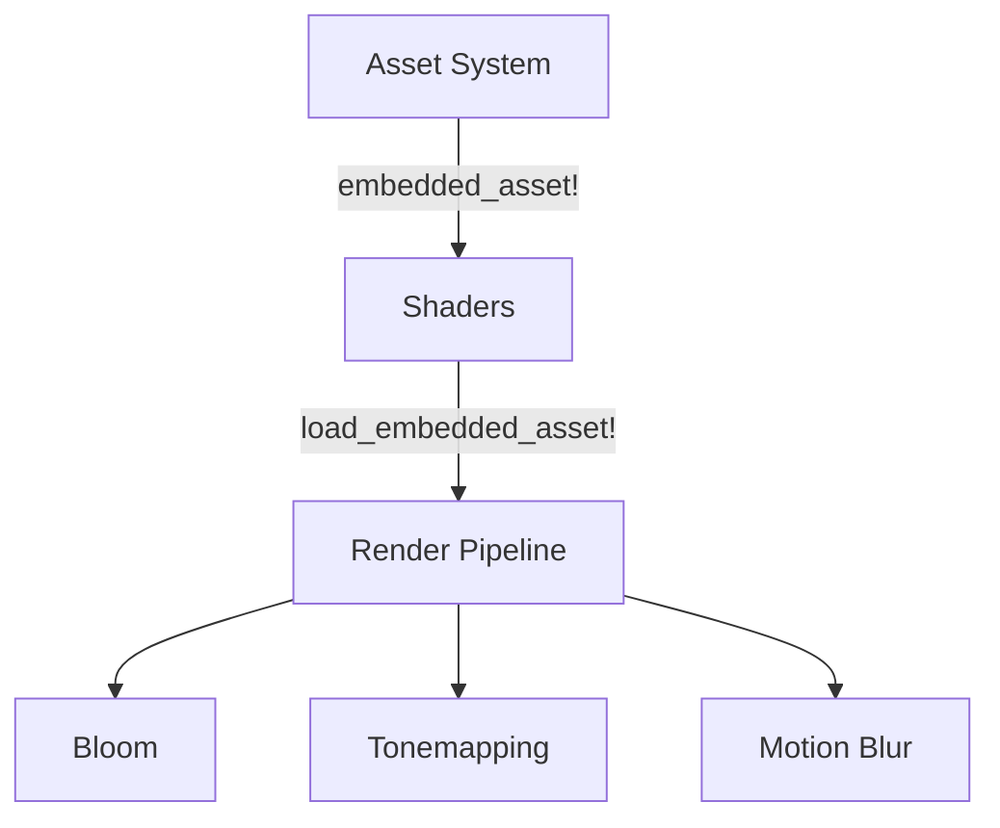

+++
title = "#19395 Remove Shader weak_handles from bevy_core_pipeline (except two)"
date = "2025-05-27T00:00:00"
draft = false
template = "pull_request_page.html"
in_search_index = false

[extra]
current_language = "zh-cn"
available_languages = {"en" = { name = "English", url = "/pull_request/bevy/2025-05/pr-19395-en-20250527" }, "zh-cn" = { name = "中文", url = "/pull_request/bevy/2025-05/pr-19395-zh-cn-20250527" }}
labels = ["A-Rendering", "A-Assets", "D-Straightforward"]
+++

# Remove Shader weak_handles from bevy_core_pipeline (except two)

## Basic Information
- **Title**: Remove Shader weak_handles from bevy_core_pipeline (except two)
- **PR Link**: https://github.com/bevyengine/bevy/pull/19395
- **Author**: andriyDev
- **Status**: MERGED
- **Labels**: A-Rendering, A-Assets, S-Ready-For-Final-Review, D-Straightforward
- **Created**: 2025-05-27T06:34:42Z
- **Merged**: 2025-05-27T22:51:43Z
- **Merged By**: alice-i-cecile

## Description Translation
### 目标
- 关联问题 #19024

### 解决方案
- 在 `bevy_core_pipeline` 中使用新的 `load_shader_library` 宏处理着色器库，使用 `embedded_asset`/`load_embedded_asset` 处理"着色器二进制文件"

### 测试验证
- `bloom_3d` 示例仍正常工作
- `motion_blur` 示例仍正常工作
- `meshlet` 示例仍正常工作（使用核心模块的着色器）

注：开发者认为无需迁移指南，因弱句柄的实际使用场景有限

## The Story of This Pull Request

### 问题背景与上下文
Bevy 引擎的渲染管线长期使用 `weak_handle!` 宏配合 UUID 来管理内置着色器资源。这种方式存在以下痛点：
1. **维护困难**：每个着色器需要手动分配 UUID，增加维护成本
2. **潜在冲突**：UUID 可能重复导致资源冲突
3. **编译时验证缺失**：路径错误只能在运行时发现
4. **代码冗余**：每个着色器需要单独声明句柄常量

随着 Bevy 资产系统引入 `embedded_asset` 机制，现在可以通过文件路径直接嵌入和加载着色器资源，实现更可靠的编译时验证和简化管理。

### 解决方案与技术实现
该 PR 采用系统化的方式重构着色器加载流程：

1. **替换资源声明方式**
```rust
// Before
load_internal_asset!(app, HANDLE, "shader.wgsl", Shader::from_wgsl);

// After
embedded_asset!(app, "shader.wgsl");
```

2. **动态加载机制**
```rust
// 旧方式使用预定义句柄
shader: METERING_SHADER_HANDLE.clone()

// 新方式运行时加载
shader: load_embedded_asset!(world, "auto_exposure.wgsl")
```

3. **管线重构模式**
- 移除全局静态句柄常量
- 在管线结构中存储着色器句柄
- 使用 `load_embedded_asset!` 宏在初始化时加载

### 关键技术点
1. **编译时资源验证**：通过文件路径引用着色器，编译器可验证文件存在性
2. **资源生命周期管理**：着色器句柄现在与管线生命周期绑定
3. **模块化改进**：每个管线明确声明其依赖的着色器资源
4. **跨平台兼容**：保持与 Bevy 的嵌入式资产系统兼容

### 影响与改进
1. **代码可维护性提升**：消除 14 个 weak_handle 声明
2. **错误预防**：减少运行时加载失败的可能性
3. **资源加载标准化**：统一使用 Bevy 的嵌入式资产工作流
4. **内存优化**：按需加载着色器，减少不必要的资源保留

典型修改示例（tonemapping/mod.rs）：
```rust
// 移除旧式资源声明
-load_internal_asset!(app, TONEMAPPING_SHADER_HANDLE, ...)

// 新增嵌入资产声明
+embedded_asset!(app, "tonemapping.wgsl");

// 管线初始化时加载
+shader: load_embedded_asset!(render_world, "tonemapping.wgsl")
```

## Visual Representation



## Key Files Changed

### crates/bevy_core_pipeline/src/tonemapping/mod.rs (+9/-29)
**变更内容**：
- 移除静态着色器句柄声明
- 改用 `embedded_asset` 宏嵌入资源
- 在管线初始化时动态加载

**代码片段**：
```rust
// 初始化管线时加载着色器
shader: load_embedded_asset!(render_world, "tonemapping.wgsl")
```

### crates/bevy_core_pipeline/src/motion_blur/pipeline.rs (+12/-7)
**变更内容**：
- 重构运动模糊管线结构体
- 添加运行时着色器加载
- 更新管线初始化逻辑

**代码片段**：
```rust
// 管线构造函数新增着色器参数
pub(crate) fn new(..., shader: Handle<Shader>) -> Self {
    Self { ..., shader }
}
```

### crates/bevy_core_pipeline/src/bloom/mod.rs (+0/-3)
**变更内容**：
- 移除全局 BLOOM_SHADER_HANDLE 声明
- 使用嵌入资产宏替代

**代码片段**：
```rust
- const BLOOM_SHADER_HANDLE: Handle<Shader> = ...;
+ embedded_asset!(app, "bloom.wgsl");
```

## Further Reading
1. [Bevy 嵌入式资产文档](https://bevyengine.org/learn/book/assets/embedded-assets/)
2. [WGSL 着色器规范](https://www.w3.org/TR/WGSL/)
3. [Bevy 渲染管线架构](https://bevyengine.org/learn/book/rendering/pipelines)