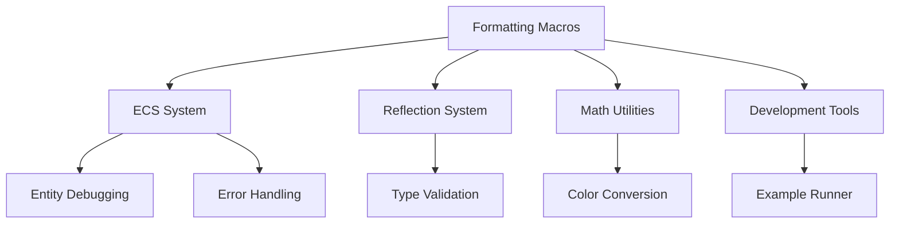

+++
title = "#19396 More uninlined_format_args fixes"
date = "2025-05-28T00:00:00"
draft = false
template = "pull_request_page.html"
in_search_index = true

[taxonomies]
list_display = ["show"]

[extra]
current_language = "en"
available_languages = {"en" = { name = "English", url = "/pull_request/bevy/2025-05/pr-19396-en-20250528" }, "zh-cn" = { name = "中文", url = "/pull_request/bevy/2025-05/pr-19396-zh-cn-20250528" }}
labels = ["D-Trivial", "C-Code-Quality"]
+++

# More uninlined_format_args fixes

## Basic Information
- **Title**: More uninlined_format_args fixes
- **PR Link**: https://github.com/bevyengine/bevy/pull/19396
- **Author**: SpecificProtagonist
- **Status**: MERGED
- **Labels**: D-Trivial, C-Code-Quality, S-Ready-For-Final-Review
- **Created**: 2025-05-27T07:54:53Z
- **Merged**: 2025-05-28T02:55:13Z
- **Merged By**: alice-i-cecile

## Description Translation
The original description is in English and remains unchanged:

# Objective

There are several uninlined format args (seems to be in more formatting macros and in more crates) that are not detected on stable, but are on nightly.

## Solution

Fix them.

## The Story of This Pull Request

This PR addresses a widespread code quality issue across the Bevy engine's codebase related to Rust's format string handling. The core problem stemmed from using uninlined format arguments - a pattern where variables are passed as separate arguments to formatting macros rather than being directly embedded in the format string. While functionally equivalent, this approach can impact readability and potentially generate suboptimal code.

The changes were motivated by Clippy's `uninlined_format_args` lint, which became more aggressive in nightly Rust versions. Although not yet enabled on stable Rust, the author proactively addressed these warnings to future-proof the codebase and maintain consistency with Rust's idiomatic formatting practices.

The implementation strategy involved systematically converting format strings across multiple crates to use inline variable syntax. This required modifying over 30 files spanning core engine components like ECS, reflection system, math utilities, and development tools. The changes follow a consistent pattern of replacing positional or named arguments with directly embedded variables in format strings.

Key technical aspects of the implementation include:
1. Conversion of `format!` calls from separated arguments to inline syntax
2. Updating `write!`/`writeln!` macros in display implementations
3. Modernizing `println!` debugging statements
4. Improving error message formatting in ECS systems

For example, in the color handling code:
```rust
// Before: Positional arguments
format!("#{:02X}{:02X}{:02X}", r, g, b)

// After: Inline variables
format!("#{r:02X}{g:02X}{b:02X}")
```

These changes don't alter runtime behavior but significantly improve code readability and maintainability. The inline syntax makes the relationship between format specifiers and variables more explicit, reducing cognitive load when scanning code.

The PR demonstrates several important Rust patterns:
1. Leveraging Clippy lints for code quality improvements
2. Proactive maintenance against upcoming compiler changes
3. Consistent application of formatting conventions across a large codebase

While mechanically simple, these changes touch critical systems including entity management, reflection, and serialization. The widespread nature of the modifications required careful verification to ensure no functional changes were introduced.

## Visual Representation



## Key Files Changed

### `crates/bevy_color/src/srgba.rs` (+6/-6)
**Change**: Updated color-to-hex conversion formatting  
**Before**:
```rust
format!("#{:02X}{:02X}{:02X}", r, g, b)
```
**After**:
```rust
format!("#{r:02X}{g:02X}{b:02X}")
```
**Impact**: More readable color string formatting

### `tools/example-showcase/src/main.rs` (+5/-5)
**Change**: Improved error reporting in example runner  
**Before**:
```rust
println!("Failed to rename screenshot: {}", err);
```
**After**:
```rust
println!("Failed to rename screenshot: {err}");
```
**Impact**: Cleaner error output formatting

### `crates/bevy_ecs/src/entity/mod.rs` (+4/-4)
**Change**: Simplified entity display implementations  
**Before**:
```rust
format!("{:?}", entity)
```
**After**:
```rust
format!("{entity:?}")
```
**Impact**: More idiomatic debug formatting

### `crates/bevy_reflect/src/func/dynamic_function.rs` (+6/-6)
**Change**: Updated reflection system debug output  
**Before**:
```rust
format!("Mismatch at {} value {}", name, i)
```
**After**:
```rust
format!("Mismatch at {name} value {i}")
```
**Impact**: Clearer validation error messages

## Further Reading
- [Rust Formatting Syntax](https://doc.rust-lang.org/std/fmt/)
- [Clippy's uninlined_format_args lint](https://rust-lang.github.io/rust-clippy/master/index.html#uninlined_format_args)
- [Bevy Engine Code Style Guide](https://github.com/bevyengine/bevy/blob/main/CODE_STYLE.md)