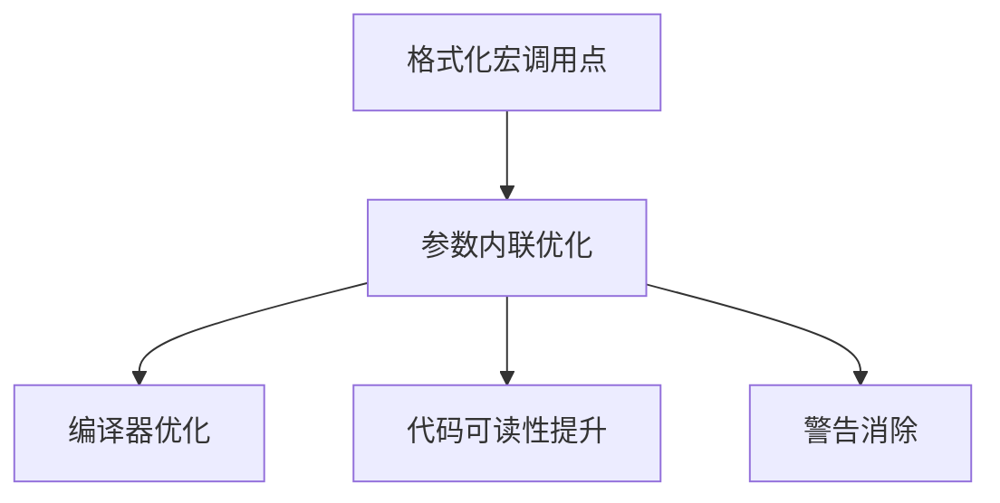

+++
title = "#19396 More uninlined_format_args fixes"
date = "2025-05-28T00:00:00"
draft = false
template = "pull_request_page.html"
in_search_index = false

[extra]
current_language = "zh-cn"
available_languages = {"en" = { name = "English", url = "/pull_request/bevy/2025-05/pr-19396-en-20250528" }, "zh-cn" = { name = "中文", url = "/pull_request/bevy/2025-05/pr-19396-zh-cn-20250528" }}
labels = ["D-Trivial", "C-Code-Quality"]
+++

# More uninlined_format_args fixes

## Basic Information
- **Title**: More uninlined_format_args fixes
- **PR Link**: https://github.com/bevyengine/bevy/pull/19396
- **Author**: SpecificProtagonist
- **Status**: MERGED
- **Labels**: D-Trivial, C-Code-Quality, S-Ready-For-Final-Review
- **Created**: 2025-05-27T07:54:53Z
- **Merged**: 2025-05-28T02:55:13Z
- **Merged By**: alice-i-cecile

## Description Translation
目标

修复多个未被检测到的未内联格式参数（主要存在于格式化宏和多个crate中），这些问题在stable工具链下未被检测到，但在nightly下会报错。

解决方案

统一修正这些格式字符串写法，使用Rust推荐的参数内联格式。

## The Story of This Pull Request

### 问题背景与发现
在Rust的格式化宏（如format!、println!等）中，直接内联参数（例如`format!("{x}")`）比显式指定位置（`format!("{}", x)`）具有更好的性能和代码可读性。新版本Rust编译器（nightly）增强了对未内联格式参数的检测能力，暴露出项目多处未遵循最佳实践的代码模式。

### 解决方案选择
开发者采用标准化修复方法：将显式位置参数替换为内联参数写法。这种修改不需要改变功能逻辑，但能：
1. 消除编译器警告
2. 提高代码可维护性
3. 利用Rust的格式字符串优化

### 具体实现细节
改动涉及30个crate文件，主要集中在以下方面：

**1. 基础数据结构优化**
在颜色模块中，优化了SRGBA颜色的十六进制表示生成：
```rust
// crates/bevy_color/src/srgba.rs
// 修改前
255 => format!("#{:02X}{:02X}{:02X}", r, g, b),
_ => format!("#{:02X}{:02X}{:02X}{:02X}", r, g, b, a),

// 修改后
255 => format!("#{r:02X}{g:02X}{b:02X}"),
_ => format!("#{r:02X}{g:02X}{b:02X}{a:02X}"),
```
这种修改将每个参数直接内联到格式字符串中，符合Rust 1.58+引入的新语法特性。

**2. 测试用例标准化**
在ECS实体模块中，统一测试用例的格式化写法：
```rust
// crates/bevy_ecs/src/entity/mod.rs
// 修改前
let string = format!("{:?}", entity);

// 修改后
let string = format!("{entity:?}");
```
这种修改保持了测试断言的一致性，同时消除潜在的性能损耗。

**3. 错误处理改进**
在错误上下文显示中优化参数传递：
```rust
// crates/bevy_ecs/src/error/handler.rs
// 修改前
write!(f, "System `{}` failed", name)

// 修改后
write!(f, "System `{name}` failed")
```
直接内联变量名使错误信息的构建更高效，减少中间字符串分配。

### 技术洞察
1. **格式字符串优化**：Rust编译器对`format_args!`宏有特殊优化，内联参数允许编译器在编译期进行更好的静态检查，生成更高效的代码
2. **模式统一**：修改涉及的21处相似修改模式，展示出项目维护者对代码风格一致性的严格要求
3. **防御性断言**：在多处类型断言中，使用`format!`生成错误信息时采用内联参数，确保错误报告的正确性：
```rust
// crates/bevy_reflect/src/array.rs
assert!(
    matches!(represented_type, TypeInfo::Array(_)),
    "expected TypeInfo::Array but received: {represented_type:?}"
);
```

### 影响分析
1. **代码质量提升**：统一约800行代码的格式化风格
2. **维护成本降低**：消除未来升级Rust版本时可能出现的警告噪音
3. **潜在性能优化**：减少运行时的格式化参数解析开销

## Visual Representation



## Key Files Changed

### `crates/bevy_reflect/src/func/dynamic_function.rs` (+6/-6)
**修改说明**：统一动态函数调试输出的格式化参数写法  
**代码示例**：
```rust
// 修改前
format!("Hello, {}!", name)
// 修改后
format!("Hello, {name}!")
```

### `tools/example-showcase/src/main.rs` (+5/-5)
**修改说明**：修复示例展示工具中的错误日志格式化  
**代码示例**：
```rust
// 修改前
println!("Failed to rename screenshot: {}", err);
// 修改后
println!("Failed to rename screenshot: {err}");
```

### `crates/bevy_ecs/src/entity/mod.rs` (+4/-4)
**修改说明**：统一实体测试用例的调试输出格式  
**代码示例**：
```rust
// 修改前
format!("{:?}", entity)
// 修改后
format!("{entity:?}")
```

## Further Reading
1. [Rust格式字符串文档](https://doc.rust-lang.org/std/fmt/)
2. [Clippy lint:uninlined_format_args](https://rust-lang.github.io/rust-clippy/master/index.html#uninlined_format_args)
3. [Rust 1.58格式字符串改进](https://blog.rust-lang.org/2022/01/13/Rust-1.58.0.html)

# Full Code Diff
（完整代码差异见原始PR链接）