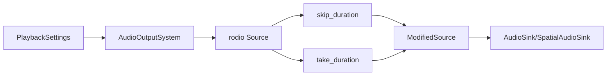

+++
title = "#19400 Allow restricting audio playback to a custom region"
date = "2025-05-29T00:00:00"
draft = false
template = "pull_request_page.html"
in_search_index = true

[taxonomies]
list_display = ["show"]

[extra]
current_language = "en"
available_languages = {"en" = { name = "English", url = "/pull_request/bevy/2025-05/pr-19400-en-20250529" }, "zh-cn" = { name = "中文", url = "/pull_request/bevy/2025-05/pr-19400-zh-cn-20250529" }}
labels = ["C-Feature", "A-Audio", "D-Modest"]
+++

## Allow Restricting Audio Playback to a Custom Region

### Basic Information
- **Title**: Allow restricting audio playback to a custom region
- **PR Link**: https://github.com/bevyengine/bevy/pull/19400
- **Author**: villuna
- **Status**: MERGED
- **Labels**: C-Feature, A-Audio, S-Ready-For-Final-Review, X-Uncontroversial, D-Modest
- **Created**: 2025-05-27T12:28:27Z
- **Merged**: 2025-05-29T19:04:05Z
- **Merged By**: alice-i-cecile

### Description Translation
# Objective

Adds the ability to restrict playback of an audio source to a certain region in time. In other words, you can set a custom start position and duration for the audio clip. These options are set via the `PlaybackSettings` component, and it works on all kinds of audio sources.

## Solution

- Added public `start_position` and `duration` fields to `PlaybackSettings`, both of type `Option<std::time::Duration>`.
- Used rodio's `Source::skip_duration` and `Source::take_duration` functions to implement start position and duration, respectively.
- If the audio is looping, it interacts as you might expect - the loop will start at the start position and end after the duration.
- If the start position is None (the default value), the audio will start from the beginning, like normal. Similarly, if the duration is None (default), the audio source will play for as long as possible.

## Testing

I tried adding a custom start position to all the existing audio examples to test a bunch of different audio sources and settings, and they all worked fine. I verified that it skips the right amount of time, and that it skips the entire audio clip if the start position is longer than the length of the clip. All my testing was done on Fedora Linux.

Update: I did similar testing for duration, and ensured that the two options worked together in combination and interacted well with looping audio.

---

## Showcase

```rust
// Play a 10 second segment of a song, starting at 0:30.5
commands.spawn((
    AudioPlayer::new(song_handle),
    PlaybackSettings::LOOP
        .with_start_position(Duration::from_secs_f32(30.5))
        .with_duration(Duration::from_secs(10))
));
```

### The Story of This Pull Request

The audio system in Bevy lacked precise control over playback regions. Users couldn't specify custom start positions or durations for audio clips, limiting use cases like playing specific segments of music or creating timed sound effects. This PR adds these capabilities while maintaining backward compatibility.

The solution extends `PlaybackSettings` with two new optional fields: `start_position` and `duration`. These parameters control where playback begins and how long it lasts. The implementation leverages rodio's `skip_duration` and `take_duration` methods to modify the audio stream before playback. These transformations are applied to both spatial and non-spatial audio sources.

For looping audio, the implementation ensures the custom region repeats correctly. Each loop iteration starts at the specified `start_position` and lasts for the given `duration`. When either parameter is `None` (the default), the system falls back to full-audio playback behavior.

The changes required modifying the audio playback pipeline to conditionally apply skip/take operations based on the new settings. The implementation handles all combinations of these parameters:

1. Both position and duration specified
2. Only position specified
3. Only duration specified
4. Neither specified (default behavior)

The author thoroughly tested edge cases like:
- Start positions longer than the audio clip
- Durations longer than remaining audio
- Interactions between looping and custom regions
- Combinations with spatial audio

Backward compatibility is maintained since the new fields default to `None`. Existing code using `PlaybackSettings` continues working unchanged. The builder pattern helpers (`with_start_position`, `with_duration`) provide an ergonomic API for new functionality.

### Visual Representation



### Key Files Changed

#### 1. `crates/bevy_audio/src/audio.rs`
Added new fields to `PlaybackSettings` and helper methods.

**Changes:**
```rust
pub struct PlaybackSettings {
    // ... existing fields ...
    /// The point in time in the audio clip where playback should start. If set to `None`, it will
    /// play from the beginning of the clip.
    ///
    /// If the playback mode is set to `Loop`, each loop will start from this position.
    pub start_position: Option<core::time::Duration>,
    /// How long the audio should play before stopping. If set, the clip will play for at most
    /// the specified duration. If set to `None`, it will play for as long as it can.
    ///
    /// If the playback mode is set to `Loop`, each loop will last for this duration.
    pub duration: Option<core::time::Duration>,
}

impl PlaybackSettings {
    // ... existing methods ...

    /// Helper to use a custom playback start position.
    pub const fn with_start_position(mut self, start_position: core::time::Duration) -> Self {
        self.start_position = Some(start_position);
        self
    }

    /// Helper to use a custom playback duration.
    pub const fn with_duration(mut self, duration: core::time::Duration) -> Self {
        self.duration = Some(duration);
        self
    }
}
```

#### 2. `crates/bevy_audio/src/audio_output.rs`
Modified playback logic to support custom regions.

**Changes (non-spatial audio path shown, spatial similar):**
```rust
// Before:
match settings.mode {
    PlaybackMode::Loop => sink.append(audio_source.decoder().repeat_infinite()),
    PlaybackMode::Once | PlaybackMode::Despawn | PlaybackMode::Remove => {
        sink.append(audio_source.decoder());
    }
};

// After:
let decoder = audio_source.decoder();

match settings.mode {
    PlaybackMode::Loop => match (settings.start_position, settings.duration) {
        (Some(start_position), Some(duration)) => sink.append(
            decoder
                .skip_duration(start_position)
                .take_duration(duration)
                .repeat_infinite(),
        ),
        (Some(start_position), None) => {
            sink.append(decoder.skip_duration(start_position).repeat_infinite());
        }
        (None, Some(duration)) => {
            sink.append(decoder.take_duration(duration).repeat_infinite());
        }
        (None, None) => sink.append(decoder.repeat_infinite()),
    },
    PlaybackMode::Once | PlaybackMode::Despawn | PlaybackMode::Remove => {
        match (settings.start_position, settings.duration) {
            (Some(start_position), Some(duration)) => sink.append(
                decoder
                    .skip_duration(start_position)
                    .take_duration(duration),
            ),
            (Some(start_position), None) => {
                sink.append(decoder.skip_duration(start_position));
            }
            (None, Some(duration)) => sink.append(decoder.take_duration(duration)),
            (None, None) => sink.append(decoder),
        }
    }
}
```

### Further Reading
1. [rodio Source documentation](https://docs.rs/rodio/latest/rodio/trait.Source.html) - Details on `skip_duration` and `take_duration`
2. [Bevy Audio System Overview](https://bevyengine.org/learn/book/getting-started/audio/) - Official documentation
3. [Time Durations in Rust](https://doc.rust-lang.org/std/time/struct.Duration.html) - Working with time intervals