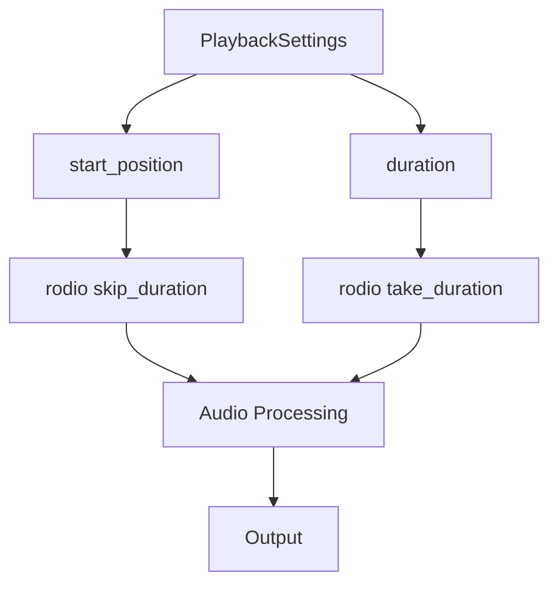

+++
title = "#19400 Allow restricting audio playback to a custom region"
date = "2025-05-29T00:00:00"
draft = false
template = "pull_request_page.html"
in_search_index = false

[extra]
current_language = "zh-cn"
available_languages = {"en" = { name = "English", url = "/pull_request/bevy/2025-05/pr-19400-en-20250529" }, "zh-cn" = { name = "中文", url = "/pull_request/bevy/2025-05/pr-19400-zh-cn-20250529" }}
labels = ["C-Feature", "A-Audio", "D-Modest"]
+++

# PR 分析报告：Allow restricting audio playback to a custom region

## Basic Information
- **Title**: Allow restricting audio playback to a custom region
- **PR Link**: https://github.com/bevyengine/bevy/pull/19400
- **Author**: villuna
- **Status**: MERGED
- **Labels**: C-Feature, A-Audio, S-Ready-For-Final-Review, X-Uncontroversial, D-Modest
- **Created**: 2025-05-27T12:28:27Z
- **Merged**: 2025-05-29T19:04:05Z
- **Merged By**: alice-i-cecile

## Description Translation
# 目标

添加将音频播放限制在特定时间区域的能力。换句话说，可以为音频片段设置自定义的起始位置和持续时间。这些选项通过 `PlaybackSettings` 组件设置，并且适用于所有类型的音频源。

## 解决方案

- 在 `PlaybackSettings` 中新增公共字段 `start_position` 和 `duration`，类型均为 `Option<std::time::Duration>`。
- 使用 rodio 的 `Source::skip_duration` 和 `Source::take_duration` 函数分别实现起始位置和持续时间的功能。
- 如果音频是循环播放的，它会按预期交互——循环将从起始位置开始，并在持续时间结束后结束。
- 如果起始位置为 None（默认值），音频将从开头正常播放。同样，如果持续时间为 None（默认），音频源将尽可能长地播放。

## 测试

我尝试在所有现有的音频示例中添加自定义起始位置，以测试各种音频源和设置，它们都工作正常。我验证了它会跳过正确的时间长度，并且如果起始位置超过音频片段的长度，它会跳过整个音频片段。所有测试在 Fedora Linux 上进行。

更新：我对持续时间进行了类似的测试，并确保这两个选项在组合使用时能正常工作，并且与循环音频交互良好。

---

## 展示

```rust
// 播放歌曲的10秒片段，从0:30.5开始
commands.spawn((
    AudioPlayer::new(song_handle),
    PlaybackSettings::LOOP
        .with_start_position(Duration::from_secs_f32(30.5))
        .with_duration(Duration::from_secs(10))
));
```

## The Story of This Pull Request

### 问题背景
Bevy 的音频系统缺乏精确控制播放时间区域的能力。开发者只能播放整个音频文件或循环播放，但无法指定从特定时间点开始播放或限制播放时长。这限制了音频在游戏中的使用场景，比如：
- 播放长音频中的特定片段
- 创建精确的音效序列
- 实现音乐过渡效果

现有系统基于 `PlaybackSettings` 组件控制播放行为，但只支持播放模式（循环/单次）和音量等基本设置，缺少时间控制功能。

### 解决方案选择
实现方案需要满足几个要求：
1. 向后兼容：现有代码不应受到影响
2. 灵活性：支持起始位置和持续时间任意组合
3. 正确处理循环场景

rodio 音频库提供了 `skip_duration` 和 `take_duration` 方法，正好满足这些需求：
- `skip_duration`: 跳过指定时间开始播放
- `take_duration`: 只播放指定时长

这些方法可以组合使用，并且与循环播放兼容。方案选择扩展 `PlaybackSettings` 而不是创建新组件，因为时间控制是播放行为的自然扩展。

### 实现细节
实现分为两个主要部分：

1. **扩展 PlaybackSettings 结构体**
在 `audio.rs` 中为 `PlaybackSettings` 添加两个新字段：
```rust
pub struct PlaybackSettings {
    // ...现有字段...
    /// 音频剪辑中播放应开始的时间点
    pub start_position: Option<core::time::Duration>,
    /// 音频在停止前应播放的时长
    pub duration: Option<core::time::Duration>,
}
```
同时添加了辅助方法 `with_start_position()` 和 `with_duration()` 用于链式配置：
```rust
pub const fn with_start_position(mut self, start_position: core::time::Duration) -> Self {
    self.start_position = Some(start_position);
    self
}
```

2. **修改音频播放逻辑**
在 `audio_output.rs` 中，修改音频处理逻辑以支持新功能。核心变化是处理四种可能的组合场景：
```rust
match (settings.start_position, settings.duration) {
    // 同时指定起始位置和持续时间
    (Some(start_position), Some(duration)) => sink.append(
        decoder
            .skip_duration(start_position)
            .take_duration(duration)
    ),
    
    // 仅指定起始位置
    (Some(start_position), None) => {
        sink.append(decoder.skip_duration(start_position));
    }
    
    // 仅指定持续时间
    (None, Some(duration)) => sink.append(decoder.take_duration(duration)),
    
    // 都不指定，默认行为
    (None, None) => sink.append(decoder),
}
```
对于循环播放模式，需要额外调用 `repeat_infinite()`：
```rust
decoder
    .skip_duration(start_position)
    .take_duration(duration)
    .repeat_infinite()
```

### 技术考量
1. **Option 类型的使用**：使用 `Option<Duration>` 确保向后兼容。当值为 `None` 时保持原有行为
2. **循环播放处理**：循环边界被重新定义为自定义区域而非整个音频长度
3. **错误处理**：当起始时间超过音频长度时，会跳过整个音频（符合预期行为）
4. **性能影响**：这些操作在音频解码流上执行，内存开销最小

### 测试验证
作者进行了全面测试：
1. 在所有音频示例中添加自定义起始位置
2. 验证了边界情况（起始时间超过音频长度）
3. 测试了起始位置和持续时间的各种组合
4. 验证了与循环播放的交互
测试环境为 Fedora Linux，覆盖了多种音频源和设置

### 影响总结
此 PR 为 Bevy 音频系统添加了关键功能：
1. 支持音频片段精确播放
2. 保持向后兼容
3. 为游戏音频设计提供更多灵活性
实现简洁高效，利用 rodio 现有功能避免重复造轮子

## Visual Representation



## Key Files Changed

### 1. `crates/bevy_audio/src/audio.rs`
**修改原因**：扩展 `PlaybackSettings` 结构体以支持新的时间控制参数

**关键代码**：
```rust
pub struct PlaybackSettings {
    // ...现有字段...
    pub start_position: Option<core::time::Duration>,
    pub duration: Option<core::time::Duration>,
}

impl Default for PlaybackSettings {
    fn default() -> Self {
        // ...现有字段初始化...
        start_position: None,
        duration: None,
    }
}

impl PlaybackSettings {
    pub const fn with_start_position(mut self, start_position: core::time::Duration) -> Self {
        self.start_position = Some(start_position);
        self
    }

    pub const fn with_duration(mut self, duration: core::time::Duration) -> Self {
        self.duration = Some(duration);
        self
    }
}
```

### 2. `crates/bevy_audio/src/audio_output.rs`
**修改原因**：实现新的时间控制功能到音频播放逻辑中

**关键代码**：
```rust
let decoder = audio_source.decoder();

match settings.mode {
    PlaybackMode::Loop => match (settings.start_position, settings.duration) {
        (Some(start_position), Some(duration)) => sink.append(
            decoder
                .skip_duration(start_position)
                .take_duration(duration)
                .repeat_infinite(),
        ),
        (Some(start_position), None) => {
            sink.append(decoder.skip_duration(start_position).repeat_infinite());
        }
        (None, Some(duration)) => {
            sink.append(decoder.take_duration(duration).repeat_infinite());
        }
        (None, None) => sink.append(decoder.repeat_infinite()),
    },
    PlaybackMode::Once | PlaybackMode::Despawn | PlaybackMode::Remove => {
        match (settings.start_position, settings.duration) {
            (Some(start_position), Some(duration)) => sink.append(
                decoder
                    .skip_duration(start_position)
                    .take_duration(duration),
            ),
            (Some(start_position), None) => {
                sink.append(decoder.skip_duration(start_position));
            }
            (None, Some(duration)) => sink.append(decoder.take_duration(duration)),
            (None, None) => sink.append(decoder),
        }
    }
}
```

## Further Reading
1. rodio 的 `Source` trait 文档：https://docs.rs/rodio/latest/rodio/trait.Source.html
2. Bevy 音频系统概览：https://bevy-cheatbook.github.io/features/audio.html
3. Rust 的 `std::time::Duration` 文档：https://doc.rust-lang.org/std/time/struct.Duration.html
4. PR 讨论区：https://github.com/bevyengine/bevy/pull/19400