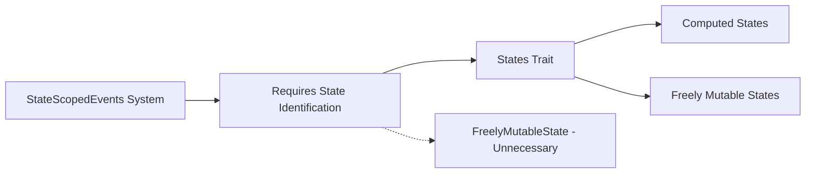

+++
title = "#19401 Loosen `add_state_scoped_event` trait bound."
date = "2025-05-29T00:00:00"
draft = false
template = "pull_request_page.html"
in_search_index = true

[taxonomies]
list_display = ["show"]

[extra]
current_language = "en"
available_languages = {"en" = { name = "English", url = "/pull_request/bevy/2025-05/pr-19401-en-20250529" }, "zh-cn" = { name = "中文", url = "/pull_request/bevy/2025-05/pr-19401-zh-cn-20250529" }}
labels = ["C-Bug", "D-Straightforward", "A-States"]
+++

## Loosen `add_state_scoped_event` trait bound.

### Basic Information
- **Title**: Loosen `add_state_scoped_event` trait bound.
- **PR Link**: https://github.com/bevyengine/bevy/pull/19401
- **Author**: AlephCubed
- **Status**: MERGED
- **Labels**: C-Bug, S-Ready-For-Final-Review, X-Uncontroversial, D-Straightforward, A-States
- **Created**: 2025-05-27T18:16:29Z
- **Merged**: 2025-05-29T21:54:45Z
- **Merged By**: alice-i-cecile

### Description Translation
Fixes #18623, allowing `add_state_scoped_event` to work with computed states.

As a side note, should state scoped events be updated to match the recently changed [state scoped entities](https://github.com/bevyengine/bevy/blob/main/release-content/migration-guides/rename_StateScoped.md)?

### The Story of This Pull Request

#### The Problem and Context
The `add_state_scoped_event` API had an overly restrictive trait bound requiring `FreelyMutableState`. This prevented its use with computed states that implement the `States` trait but not `FreelyMutableState`. The limitation surfaced in issue #18623 where users couldn't create state-scoped events for computed states. This was inconsistent with other state-related APIs that accept the broader `States` trait bound.

#### The Solution Approach
The solution involved relaxing the trait bound from `FreelyMutableState` to `States` throughout the state-scoped event implementation. This change maintains all existing functionality while extending compatibility to computed states. The approach was straightforward since state-scoped events only require state identification for cleanup operations, not state mutation capabilities.

#### The Implementation
The implementation required systematic replacement of `FreelyMutableState` with `States` across all relevant structs and functions. Key changes include:

1. Updated imports to use `States` instead of `FreelyMutableState`:
```rust
use crate::state::{OnExit, StateTransitionEvent, States};
```

2. Modified struct definitions to use the broader trait:
```rust
struct StateScopedEvents<S: States> { /* ... */ }
impl<S: States> StateScopedEvents<S> { /* ... */ }
impl<S: States> Default for StateScopedEvents<S> { /* ... */ }
```

3. Updated function signatures to accept `States`:
```rust
fn cleanup_state_scoped_event<S: States>(/* ... */) { /* ... */ }
fn add_state_scoped_event_impl<E: Event, S: States>(/* ... */) { /* ... */ }
```

4. Extended public API interfaces:
```rust
pub trait StateScopedEventsAppExt {
    fn add_state_scoped_event<E: Event>(&mut self, state: impl States) -> &mut Self;
}
```

The implementation maintains identical cleanup behavior - events are still cleared during state transitions using the same `OnExit` schedule and `StateTransition` systems.

#### Technical Insights
The key insight was recognizing that state-scoped events only require:
1. State identification (via `States` trait)
2. Cleanup hook registration (via `OnExit` schedule)

The `FreelyMutableState` requirement was unnecessary since event cleanup doesn't involve state mutation. This aligns with Bevy's trend toward more flexible trait bounds, as seen in the recent state-scoped entities renaming.

#### The Impact
This change:
1. Fixes #18623 by enabling state-scoped events for computed states
2. Maintains backward compatibility with existing uses
3. Reduces API fragmentation between state types
4. Aligns with Bevy's principle of minimizing unnecessary trait constraints

The solution demonstrates how auditing trait bounds can reveal opportunities to increase API flexibility without compromising functionality.

### Visual Representation



### Key Files Changed

- `crates/bevy_state/src/state_scoped_events.rs` (+9/-9)

The key changes in this file relax the trait bound throughout the state-scoped events implementation:

```rust
// Before:
use crate::state::{FreelyMutableState, OnExit, StateTransitionEvent};
struct StateScopedEvents<S: FreelyMutableState> { /* ... */ }
impl<S: FreelyMutableState> StateScopedEvents<S> { /* ... */ }
fn add_state_scoped_event_impl<E: Event, S: FreelyMutableState>(/* ... */) { /* ... */ }

// After:
use crate::state::{OnExit, StateTransitionEvent, States};
struct StateScopedEvents<S: States> { /* ... */ }
impl<S: States> StateScopedEvents<S> { /* ... */ }
fn add_state_scoped_event_impl<E: Event, S: States>(/* ... */) { /* ... */ }
```

The public API surface now accepts any type implementing `States`:
```rust
pub trait StateScopedEventsAppExt {
    fn add_state_scoped_event<E: Event>(&mut self, state: impl States) -> &mut Self;
}
```

### Further Reading
1. [Bevy States Documentation](https://docs.rs/bevy_ecs/latest/bevy_ecs/schedule/trait.States.html)
2. [State Scoped Entities Migration Guide](https://github.com/bevyengine/bevy/blob/main/release-content/migration-guides/rename_StateScoped.md)
3. [Original Issue #18623](https://github.com/bevyengine/bevy/issues/18623)