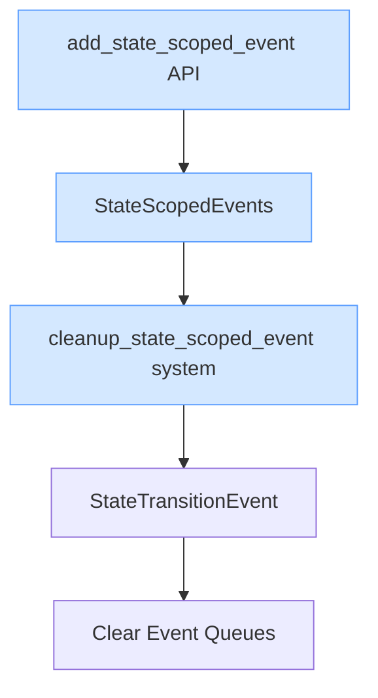

+++
title = "#19401 Loosen `add_state_scoped_event` trait bound"
date = "2025-05-29T00:00:00"
draft = false
template = "pull_request_page.html"
in_search_index = false

[extra]
current_language = "zh-cn"
available_languages = {"en" = { name = "English", url = "/pull_request/bevy/2025-05/pr-19401-en-20250529" }, "zh-cn" = { name = "中文", url = "/pull_request/bevy/2025-05/pr-19401-zh-cn-20250529" }}
labels = ["C-Bug", "D-Straightforward", "A-States"]
+++

# Loosen `add_state_scoped_event` trait bound

## Basic Information
- **Title**: Loosen `add_state_scoped_event` trait bound
- **PR Link**: https://github.com/bevyengine/bevy/pull/19401
- **Author**: AlephCubed
- **Status**: MERGED
- **Labels**: C-Bug, S-Ready-For-Final-Review, X-Uncontroversial, D-Straightforward, A-States
- **Created**: 2025-05-27T18:16:29Z
- **Merged**: 2025-05-29T21:54:45Z
- **Merged By**: alice-i-cecile

## Description Translation
修复 #18623，允许 `add_state_scoped_event` 支持 computed states。

附带问题：state scoped events 是否应该更新以匹配最近修改的 [state scoped entities](https://github.com/bevyengine/bevy/blob/main/release-content/migration-guides/rename_StateScoped.md)？

## The Story of This Pull Request

### 问题背景
在 Bevy 引擎的状态管理系统中，`add_state_scoped_event` 方法存在一个类型约束问题。该方法原本要求状态类型必须实现 `FreelyMutableState` trait，这导致其无法兼容 computed states（计算状态）。具体问题记录在 issue #18623 中，当开发者尝试为 computed state 添加状态作用域事件时，类型系统会阻止该操作。

`FreelyMutableState` 是 Bevy 状态系统中表示可直接修改状态的 trait，而 computed states 作为派生状态，并不实现此 trait。这种设计限制不符合状态系统的最新演进方向，因为 computed states 在复杂状态机中具有重要应用价值。

### 解决方案
核心解决方案是放宽类型约束：将 `FreelyMutableState` 替换为更基础的 `States` trait。`States` 是 Bevy 状态系统的基础 trait，所有状态类型（包括 computed states）都实现该 trait。这个修改保持了原有功能，同时扩展了方法的适用范围。

修改涉及多个关联定义：
1. `StateScopedEvents` 结构体及其实现
2. 事件清理函数 `cleanup_state_scoped_event`
3. 内部实现函数 `add_state_scoped_event_impl`
4. 公共 API 的 `StateScopedEventsAppExt` trait

### 实现细节
关键修改是将所有泛型约束从 `S: FreelyMutableState` 替换为 `S: States`。以下对比展示主要变更：

```rust
// Before:
use crate::state::{FreelyMutableState, OnExit, StateTransitionEvent};

struct StateScopedEvents<S: FreelyMutableState> { ... }
impl<S: FreelyMutableState> StateScopedEvents<S> { ... }
fn cleanup_state_scoped_event<S: FreelyMutableState>( ... ) { ... }
fn add_state_scoped_event_impl<E: Event, S: FreelyMutableState>( ... ) { ... }

// After:
use crate::state::{OnExit, StateTransitionEvent, States};

struct StateScopedEvents<S: States> { ... }
impl<S: States> StateScopedEvents<S> { ... }
fn cleanup_state_scoped_event<S: States>( ... ) { ... }
fn add_state_scoped_event_impl<E: Event, S: States>( ... ) { ... }
```

公共 API 接口同步更新：
```rust
// Before:
fn add_state_scoped_event<E: Event>(&mut self, state: impl FreelyMutableState) -> &mut Self;

// After:
fn add_state_scoped_event<E: Event>(&mut self, state: impl States) -> &mut Self;
```

这些修改保持了原有的事件清理机制：当状态转换发生时，系统仍会通过 `StateTransitionEvent` 捕获退出状态，并执行对应的清理函数清除事件队列。事件作用域管理逻辑本身没有变化，只是放宽了可接受的状态类型范围。

### 技术影响
1. **兼容性扩展**：computed states 现在可以正常使用状态作用域事件
2. **零运行时开销**：修改仅涉及编译期类型约束，不改变运行时行为
3. **API 一致性**：与状态系统的其他组件（如 state scoped entities）保持同步演进
4. **向后兼容**：所有原来可用的状态类型仍然有效，因为 `FreelyMutableState` 是 `States` 的子 trait

### 未来考量
PR 描述中提出的附带问题值得注意：state scoped events 的命名和设计是否需要与最近重构的 state scoped entities 保持一致。虽然本次 PR 不解决该问题，但它为后续可能的统一重构奠定了基础。

## Visual Representation



## Key Files Changed

### crates/bevy_state/src/state_scoped_events.rs
**修改原因**：放宽 trait 约束以支持 computed states  
**关键变更**：将所有 `FreelyMutableState` 约束替换为 `States`

```rust
// 导入修改
- use crate::state::{FreelyMutableState, OnExit, StateTransitionEvent};
+ use crate::state::{OnExit, StateTransitionEvent, States};

// 结构体定义修改
- struct StateScopedEvents<S: FreelyMutableState> {
+ struct StateScopedEvents<S: States> {

// 实现修改
- impl<S: FreelyMutableState> StateScopedEvents<S> {
+ impl<S: States> StateScopedEvents<S> {

// 清理函数修改
- fn cleanup_state_scoped_event<S: FreelyMutableState>(
+ fn cleanup_state_scoped_event<S: States>(

// 内部实现修改
- fn add_state_scoped_event_impl<E: Event, S: FreelyMutableState>(
+ fn add_state_scoped_event_impl<E: Event, S: States>(

// 公共API修改
- fn add_state_scoped_event<E: Event>(&mut self, state: impl FreelyMutableState) -> &mut Self;
+ fn add_state_scoped_event<E: Event>(&mut self, state: impl States) -> &mut Self;
```

## Further Reading
1. [Bevy States Documentation](https://docs.rs/bevy/latest/bevy/ecs/schedule/trait.States.html)
2. [Computed States RFC](https://github.com/bevyengine/rfcs/blob/main/rfcs/45-state-systems.md)
3. [State Scoped Entities Migration Guide](https://github.com/bevyengine/bevy/blob/main/release-content/migration-guides/rename_StateScoped.md)